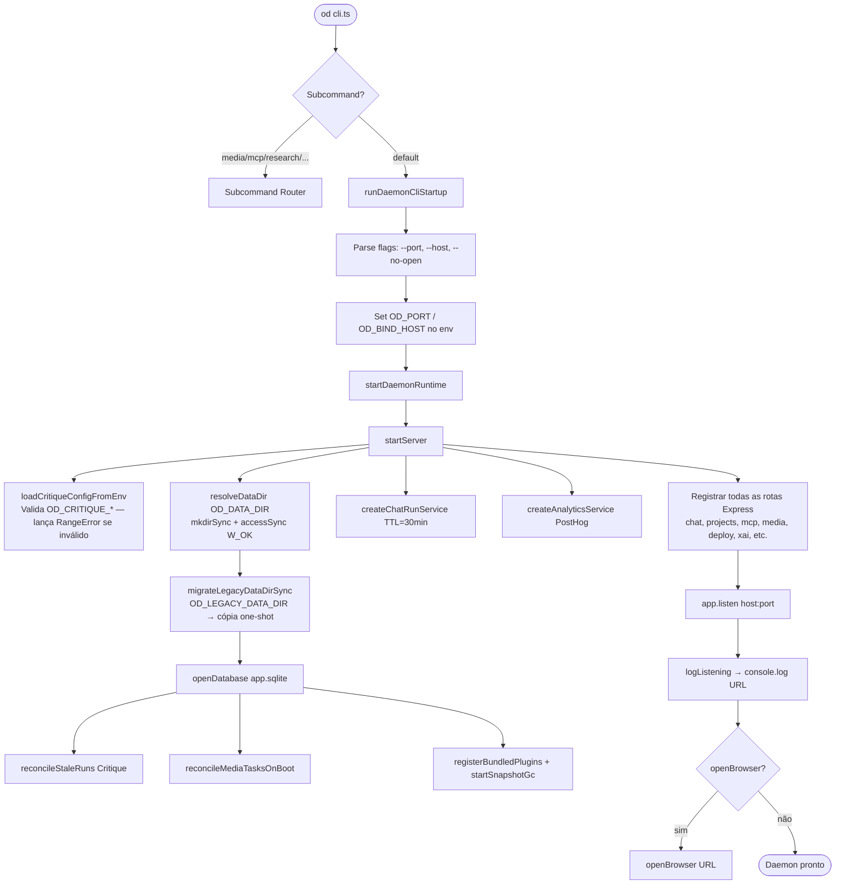
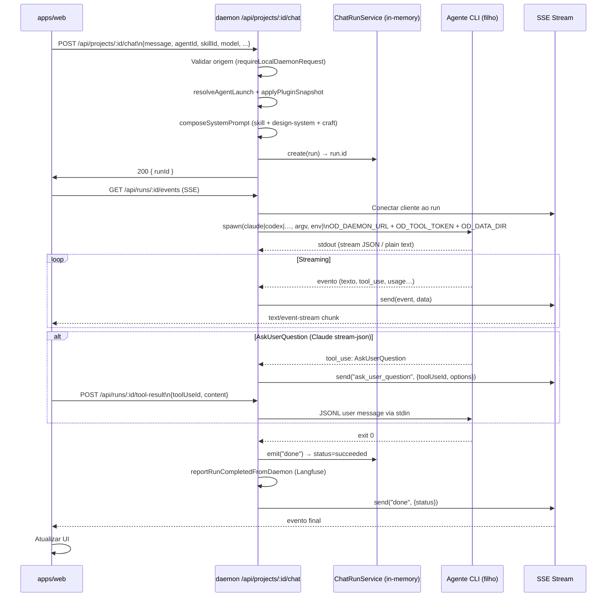
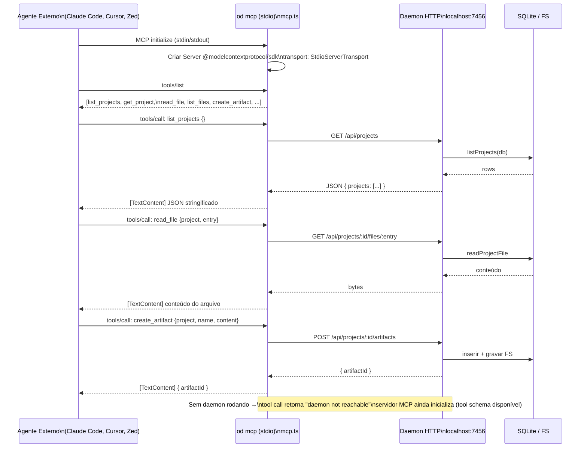
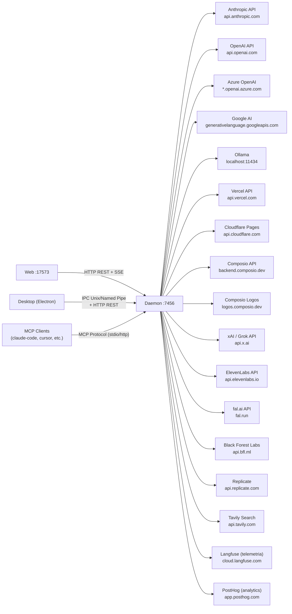

# Daemon — Especificação Técnica Visual 360°`n> Documento unificado. Cobertura completa sem abreviações.`n`n
# Daemon — Especificação Visual 360° (Parte A)

> Baseado no código-fonte em `apps/daemon/src/` — gerado em 2026-05-19.

---

## 1. Variáveis de Ambiente

### 1.1 Rede e Binding

| Variável | Tipo | Padrão | Obrigatória | Descrição |
|----------|------|--------|-------------|-----------|
| `OD_PORT` | number | `7456` | Não | Porta TCP em que o daemon escuta. Lida em `cli.ts` e `daemon-startup.ts`. Pode ser sobrescrita pelo flag `--port`. |
| `OD_BIND_HOST` | string | `127.0.0.1` | Não | Endereço de interface de rede em que o servidor HTTP faz bind. `0.0.0.0` expõe na rede local; requer token quando não for loopback. |
| `OD_WEB_PORT` | number | — | Não | Porta do frontend Next.js. Usada por `origin-validation.ts` para permitir CORS do frontend mesmo quando diferente de `OD_PORT`. |
| `OD_ALLOWED_ORIGINS` | string | — | Não | Lista de origens permitidas separadas por vírgula (ex.: `https://app.example.com`). Suporta apenas `http://` e `https://`. |
| `OD_PUBLIC_BASE_URL` | string (url) | — | Não | URL pública do daemon para callbacks OAuth (`/api/mcp/oauth/callback`). Quando ausente, `req.protocol://req.get('host')` é usado como fallback. |

### 1.2 Armazenamento e Caminhos

| Variável | Tipo | Padrão | Obrigatória | Descrição |
|----------|------|--------|-------------|-----------|
| `OD_DATA_DIR` | string (path) | `<projectRoot>/.od` | Não | Raiz de todos os dados de runtime: `app.sqlite`, projetos, artefatos, credenciais. Suporta `~/`, `$HOME`, `${HOME}`. Testada com `W_OK` na inicialização. |
| `OD_MEDIA_CONFIG_DIR` | string (path) | `OD_DATA_DIR` | Não | Override estreito para `media-config.json` apenas. Útil em setups que isolam chaves de API do restante dos dados de runtime. |
| `OD_RESOURCE_ROOT` | string (path) | — | Não | Raiz de recursos estáticos para builds empacotados (skills, design-systems, craft, frames). Deve estar sob `PROJECT_ROOT` ou `process.resourcesPath`. |
| `OD_DAEMON_CLI_PATH` | string (path) | — | Não | Caminho absoluto ao `cli.js` do daemon. Alias: `OD_BIN`. Se ausente, resolve via `require.resolve('@open-design/daemon/package.json')`. |
| `OD_BIN` | string (path) | — | Não | Alias de `OD_DAEMON_CLI_PATH`. O agente usa `"$OD_NODE_BIN" "$OD_BIN" tools ...` para invocar wrappers de projeto. |
| `OD_LEGACY_DATA_DIR` | string (path) | — | Não | Diretório legado `.od/` da versão 0.3.x para migração one-shot. Copiado para `OD_DATA_DIR` antes da abertura do SQLite se o destino estiver vazio. |

### 1.3 Critique Theater

| Variável | Tipo | Padrão | Obrigatória | Descrição |
|----------|------|--------|-------------|-----------|
| `OD_CRITIQUE_ENABLED` | boolean | `false` | Não | Ativa o Critique Theater globalmente (M0 dark-launch). Valores aceitos: `true`, `1`, `yes`. |
| `OD_CRITIQUE_ROLLOUT_PHASE` | string | `M0` | Não | Fase de rollout. Valores: `M0` (dark), `M1` (toggle manual), `M2` (default-on por skill), `M3` (global). |
| `OD_CRITIQUE_MAX_ROUNDS` | number | `3` | Não | Número máximo de rodadas de crítica por run. Deve ser inteiro positivo. |
| `OD_CRITIQUE_SCORE_THRESHOLD` | number | `0.7` | Não | Pontuação mínima (float ≥ 0) para o agente ser aprovado. Não pode exceder `OD_CRITIQUE_SCORE_SCALE`. |
| `OD_CRITIQUE_SCORE_SCALE` | number | `1` | Não | Escala máxima de pontuação composta. Deve ser inteiro positivo. |
| `OD_CRITIQUE_PER_ROUND_TIMEOUT_MS` | number | `120000` | Não | Timeout em milissegundos por rodada individual de crítica. |
| `OD_CRITIQUE_TOTAL_TIMEOUT_MS` | number | `360000` | Não | Timeout total em milissegundos para todo o ciclo de crítica de um run. |
| `OD_CRITIQUE_PARSER_MAX_BLOCK_BYTES` | number | `65536` | Não | Tamanho máximo em bytes de um bloco `<ROUND_END>` / `<SHIP>` do protocolo de critique. |
| `OD_CRITIQUE_FALLBACK_POLICY` | string | `ship` | Não | O que fazer quando o critique falha ou atinge timeout. Valores válidos: `ship`, `fail`. |

### 1.4 Plugin System / Snapshots

| Variável | Tipo | Padrão | Obrigatória | Descrição |
|----------|------|--------|-------------|-----------|
| `OD_MAX_DEVLOOP_ITERATIONS` | number | `10` | Não | Limite de iterações de devloop por stage no sistema de plugins (spec §10.2). |
| `OD_SNAPSHOT_UNREFERENCED_TTL_DAYS` | number | `30` | Não | Dias antes de uma linha `applied_plugin_snapshots` sem referências ser elegível para GC. `0` = manter para sempre. |
| `OD_SNAPSHOT_RETENTION_DAYS` | number | `null` | Não | Cap opcional de retenção de snapshots referenciados após término do run/conversation/project. Ausente = ilimitado. |
| `OD_SNAPSHOT_GC_INTERVAL_MS` | number | `21600000` | Não | Intervalo do worker GC de snapshots em ms (padrão: 6 horas). |

### 1.5 Mídia e Modelos

| Variável | Tipo | Padrão | Obrigatória | Descrição |
|----------|------|--------|-------------|-----------|
| `OD_MEDIA_MODEL_ALIASES` | string (JSON) | — | Não | JSON com aliases de modelos de mídia. Ex.: `{"doubao-seedream-3-0-t2i":"doubao-seedream-5-0"}`. Sobrescreve mapeamento interno em `media-config.ts`. |

### 1.6 Analytics e Telemetria

| Variável | Tipo | Padrão | Obrigatória | Descrição |
|----------|------|--------|-------------|-----------|
| `POSTHOG_KEY` | string | — | Não | Chave de API do PostHog para captura de eventos de uso. Ausente = sem-op completo; nenhuma requisição de rede é feita. |
| `POSTHOG_HOST` | string (url) | `https://us.i.posthog.com` | Não | Host do PostHog. Permite apontar para instância self-hosted. |
| `OPEN_DESIGN_TELEMETRY_RELAY_URL` | string (url) | — | Não | URL do relay de telemetria Open Design para Langfuse. Quando presente, os traces de runs concluídos são enviados via relay em vez de direto ao Langfuse. |
| `LANGFUSE_PUBLIC_KEY` | string | — | Não | Chave pública do Langfuse para envio direto de traces (usado quando `OPEN_DESIGN_TELEMETRY_RELAY_URL` está ausente). |
| `LANGFUSE_SECRET_KEY` | string | — | Não | Chave secreta do Langfuse. Combinada com a pública para formar o `Authorization: Basic` header. |

### 1.7 Chaves de Provedores de Mídia

| Variável | Tipo | Padrão | Obrigatória | Descrição |
|----------|------|--------|-------------|-----------|
| `OD_OPENAI_API_KEY` / `OPENAI_API_KEY` | string | — | Não | Chave OpenAI padrão. `OD_*` tem precedência. Também aceita chaves Azure via `AZURE_API_KEY` / `AZURE_OPENAI_API_KEY`. |
| `OD_GROK_API_KEY` / `XAI_API_KEY` | string | — | Não | Chave xAI/Grok para geração de imagem com Grok. |
| `OD_NANOBANANA_API_KEY` / `GOOGLE_API_KEY` / `GEMINI_API_KEY` | string | — | Não | Chave Google/Gemini para o provedor NanoBanana. |
| `OD_GOOGLE_API_KEY` / `GOOGLE_API_KEY` / `GEMINI_API_KEY` | string | — | Não | Chave Google genérica (provedor `google`). |
| `OD_VOLCENGINE_API_KEY` / `ARK_API_KEY` / `VOLCENGINE_API_KEY` | string | — | Não | Chave Volcengine/Ark para modelos Doubao. |
| `OD_IMAGEROUTER_API_KEY` / `IMAGEROUTER_API_KEY` | string | — | Não | Chave para o roteador de imagens. |
| `OD_BFL_API_KEY` / `BFL_API_KEY` | string | — | Não | Chave Black Forest Labs (Flux). |
| `OD_FAL_KEY` / `FAL_KEY` | string | — | Não | Chave fal.ai para geração de imagem/vídeo. |
| `OD_REPLICATE_API_TOKEN` / `REPLICATE_API_TOKEN` | string | — | Não | Token da API Replicate. |
| `OD_KLING_API_KEY` / `KLING_API_KEY` | string | — | Não | Chave Kling AI para vídeo. |
| `OD_MIDJOURNEY_API_KEY` | string | — | Não | Chave Midjourney (apenas override `OD_*`). |
| `OD_MINIMAX_API_KEY` / `MINIMAX_API_KEY` | string | — | Não | Chave MiniMax para geração de mídia. |
| `OD_SUNO_API_KEY` | string | — | Não | Chave Suno para geração de áudio musical. |
| `OD_UDIO_API_KEY` | string | — | Não | Chave Udio para geração de áudio musical. |
| `OD_ELEVENLABS_API_KEY` / `ELEVENLABS_API_KEY` | string | — | Não | Chave ElevenLabs para síntese de voz. |
| `OD_FISHAUDIO_API_KEY` / `FISH_AUDIO_API_KEY` | string | — | Não | Chave Fish Audio para TTS. |
| `OD_SENSEAUDIO_API_KEY` / `SENSEAUDIO_API_KEY` | string | — | Não | Chave SenseAudio. |
| `OD_TAVILY_API_KEY` / `TAVILY_API_KEY` | string | — | Não | Chave Tavily para busca web em Research. |
| `OD_LEONARDO_API_KEY` / `LEONARDO_API_KEY` | string | — | Não | Chave Leonardo.ai para geração de imagem. |
| `OD_CUSTOM_IMAGE_API_KEY` / `CUSTOM_IMAGE_API_KEY` | string | — | Não | Chave para provedor de imagem customizado. |

### 1.8 Agentes de Codificação (CLI Env)

| Variável | Tipo | Padrão | Obrigatória | Descrição |
|----------|------|--------|-------------|-----------|
| `ANTHROPIC_API_KEY` | string | — | Não | Chave Anthropic passada para o Claude Code via `agentCliEnv`. |
| `ANTHROPIC_BASE_URL` | string (url) | — | Não | Base URL customizada para a API Anthropic (proxy, ambientes corporativos). |
| `CLAUDE_CONFIG_DIR` | string (path) | — | Não | Diretório de configuração do Claude Code CLI. |
| `CLAUDE_BIN` | string (path) | — | Não | Caminho ao binário `claude` (override). |
| `OPENAI_BASE_URL` | string (url) | — | Não | Base URL OpenAI para o Codex CLI (proxy ou Azure). |
| `CODEX_API_KEY` | string | — | Não | Chave de API para o Codex CLI (override do `OPENAI_API_KEY`). |
| `CODEX_HOME` | string (path) | `~/.codex` | Não | Diretório home do Codex. Usado para resolver `generated_images/` e configurações do agente. |
| `CODEX_BIN` | string (path) | — | Não | Caminho ao binário `codex` (override). |
| `OD_TOOL_TOKEN` | string | — | Não | Token de ferramenta gerado por run. Injetado no ambiente do agente via `createAgentRuntimeEnv`. Autoriza chamadas a `/api/tools/*`. |

---

## 2. Workflows — Diagramas Mermaid

### 2.1 Inicialização do Daemon



### 2.2 Ciclo de Vida de um Run de Chat



### 2.3 Critique Theater (Design Jury)

```mermaid
flowchart TD
    A([Chat Run iniciado]) --> B{isCritiqueEnabled?\nskillPolicy + projectOverride + envOverride + phase}
    B -- Não --> C[Fluxo padrão single-pass]
    B -- Sim --> D[runOrchestrator]

    D --> E[insertCritiqueRun SQLite\nstatus=running]
    D --> F[spawn Adapter CLI\nex.: claude --output-format stream-json]
    F --> G[parseCritiqueStream\nasync iterable de linhas stdout]

    G --> H{Bloco recebido?}
    H -- ROUND_START --> I[Iniciar round N\nreseta state parcial]
    H -- SCORE panelista --> J[scoreboard.decideRound\ncomputa composite score]
    H -- ROUND_END --> K{score >= threshold?}
    K -- Sim → aprovado --> L[emit critique.round_passed SSE]
    K -- Não → mais rodadas? --> M{N < maxRounds?}
    M -- Sim --> N[Próxima rodada de crítica]
    M -- Não --> O[selectFallbackRound\nfallbackPolicy: ship ou fail]
    H -- SHIP --> P[writeShipArtifact\nvalida tamanho + conteúdo]
    P --> Q[emit critique.completed SSE]

    J --> R[emit critique.score SSE]
    L --> S[continuar geração normal]
    O --> T{fallbackPolicy}
    T -- ship --> S
    T -- fail --> U[emit critique.failed SSE]

    Q --> V[updateCritiqueRun status=succeeded]
    U --> V
    V --> W[writeTranscript JSON]

    alt Abort/Timeout
        D --> X[handleCritiqueInterrupt\nAbortController.abort]
        X --> Y[child.kill SIGTERM]
        Y --> Z[emit critique.interrupted SSE]
        Z --> V
    end
```

### 2.4 Workflow de MCP (Model Context Protocol)



### 2.5 Workflow de Importação de Arquivo

```mermaid
flowchart TD
    A([Upload ZIP / Folder]) --> B{Tipo de importação}

    B -- ZIP Claude Design --> C[POST /api/import/claude-design\nmulter diskStorage UPLOAD_DIR\nlimite: 100 MB]
    C --> D[Verificar extensão .zip]
    D --> E[importClaudeDesignZip\nextrai + detecta entryFile]
    E --> F{Token HMAC válido?\nverifyDesktopImportToken}
    F -- Gate ativo + token inválido --> G[401 UNAUTHORIZED]
    F -- OK --> H[insertProject SQLite\nkind=prototype, importedFrom=claude-design]
    H --> I[insertConversation]
    I --> J[setTabs entryFile]
    J --> K[200 { project, conversationId, files }]

    B -- Pasta local --> L[POST /api/import/folder\n{ baseDir, name, skillId, designSystemId }]
    L --> M[Validar baseDir não vazio]
    M --> N[insertProject\nmetadata.baseDir = caminho real]
    N --> O[Sem cópia de arquivos\ndaemon trabalha diretamente no baseDir]
    O --> P[200 { project }]

    B -- Arquivo único --> Q[POST /api/projects/:id/files/:name\nmulter projectUpload 200 MB]
    Q --> R[ensureProject PROJECTS_DIR\nou metadata.baseDir para folder-imports]
    R --> S[sanitizeName + timestamp base36]
    S --> T[Gravar em disco]
    T --> U[200 { file }]
```

---

## 3. JTBDs — Jobs To Be Done

| ID | Persona | Quando... | Quero... | Para que... | Prioridade |
|----|---------|-----------|----------|-------------|------------|
| JTBD-01 | Designer / Product Manager | Tenho uma ideia de interface mas não sei codificar | Iniciar uma conversa de chat com um agente de IA que gere o código HTML/CSS | Obter um protótipo funcional em minutos sem depender de um dev | Alta |
| JTBD-02 | Desenvolvedor frontend | Terminei uma geração com o Claude e quero garantir a qualidade do design antes de entregar | Rodar o Critique Theater automaticamente após cada geração | Receber um júri de perspectivas diversas que aponte problemas antes que o cliente veja | Alta |
| JTBD-03 | Desenvolvedor usando Claude Code / Cursor | Trabalho num repositório separado e preciso acessar os artefatos de design | Conectar meu agente de codificação ao daemon via MCP stdio | Ler arquivos, criar artefatos e navegar projetos sem exportar ZIPs manualmente | Alta |
| JTBD-04 | Usuário com subscrição Midjourney / Suno / ElevenLabs | Quero gerar imagens, vídeos e áudios dentro do contexto do meu projeto | Configurar minhas chaves de API dos provedores preferidos | Usar os modelos de mídia mais avançados sem sair do fluxo de design | Alta |
| JTBD-05 | Administrador / Power user | Migrei de uma versão antiga do Open Design com dados em `.od/` legado | Executar o daemon com `OD_LEGACY_DATA_DIR` apontando para o diretório antigo | Ter meus projetos, conversas e artefatos anteriores disponíveis na nova versão sem perda | Alta |
| JTBD-06 | Engenheiro de infraestrutura / DevOps | Deployei o daemon numa VM com root em filesystem read-only | Redirecionar todos os dados runtime para um volume writável via `OD_DATA_DIR` | O daemon inicializar corretamente sem erros de permissão | Alta |
| JTBD-07 | Designer iterando num protótipo | Quero publicar meu design diretamente na internet para validar com usuários | Usar o endpoint de deploy para Cloudflare Pages ou Vercel | Obter uma URL pública sem sair do Open Design e sem configurar CI/CD manualmente | Média |
| JTBD-08 | Líder técnico com compliance de qualidade | Preciso garantir que cada skill de design passe por revisão estruturada antes de ser aprovada | Configurar `OD_CRITIQUE_ENABLED=1` e definir `OD_CRITIQUE_SCORE_THRESHOLD` | Rejeitar automaticamente gerações que não atingem o padrão mínimo sem revisão manual | Média |
| JTBD-09 | Desenvolvedor de extensões / skill authors | Criei uma skill personalizada e quero conectar um servidor MCP externo ao ciclo de geração | Configurar servidores MCP via `POST /api/mcp/config` com autenticação OAuth 2.0 | Injetar ferramentas externas (banco de dados, APIs, Git) nos runs dos agentes | Média |
| JTBD-10 | Usuário com múltiplas instâncias do daemon | Preciso rodar ambientes isolados (dev, staging, test) na mesma máquina | Iniciar instâncias com `OD_PORT` e `OD_DATA_DIR` distintos | Cada namespace ter seu próprio SQLite, projetos e artefatos sem colisão | Média |
| JTBD-11 | Arquiteto de software gerenciando uma equipe | Quero rastrear a qualidade das gerações de IA ao longo do tempo para tomada de decisão | Integrar o daemon ao Langfuse via `LANGFUSE_PUBLIC_KEY` / `LANGFUSE_SECRET_KEY` | Ter traces de cada run com métricas de tokens, duração e qualidade por skill | Baixa |
| JTBD-12 | Usuário migrando de plataforma | Tenho um projeto exportado do Claude Desktop (.zip) e quero continuá-lo no Open Design | Importar o ZIP via interface web sem configurações manuais | Manter todo o histórico de arquivos e continuar a edição com qualquer agente compatível | Média |

---

## 4. 5 Casos de Uso Principais

### UC-01: Iniciar Sessão de Chat com Agente de IA

**Ator**: Usuário (via `apps/web`)
**Pré-condição**: Daemon rodando na porta configurada; provedor de IA configurado (CLI instalado ou chave de API presente); projeto criado no SQLite.
**Fluxo Principal**:
1. Usuário digita uma mensagem no chat composer e envia.
2. `apps/web` faz `POST /api/projects/:id/chat` com `{ message, agentId, skillId, designSystemId, model, conversationId }`.
3. Daemon valida origem via `requireLocalDaemonRequest` (loopback peer + host header).
4. Daemon resolve a skill selecionada, compõe o system prompt via `composeSystemPrompt` (skill + design system + craft sections).
5. Daemon aplica snapshot de plugin via `applyPlugin` e persiste `appliedPluginSnapshotId` no run.
6. `ChatRunService.create()` cria um run em memória com status `queued`.
7. Daemon responde `200 { runId }` antes de spawnar o agente.
8. `apps/web` abre conexão SSE `GET /api/runs/:runId/events`.
9. Daemon spawna o agente CLI filho com `OD_DAEMON_URL`, `OD_TOOL_TOKEN`, `OD_DATA_DIR` no env.
10. Stdout do agente é parseado e reemitido como eventos SSE ao cliente.
11. Ao término (exit 0), run recebe status `succeeded` e telemetria é enviada ao Langfuse.

**Fluxo Alternativo — Agente pede input do usuário (Claude)**:
- Agente emite `tool_use: AskUserQuestion` via stream-json.
- Daemon mantém stdin aberto e envia evento SSE `ask_user_question` com as opções.
- Usuário seleciona uma opção na UI; `apps/web` posta `POST /api/runs/:id/tool-result`.
- Daemon escreve JSONL `tool_result` no stdin do agente e remove o `toolUseId` de `pendingHostAnswers`.
- Agente continua a geração.

**Fluxo Alternativo — Cancelamento**:
- Usuário clica "Stop"; `apps/web` faz `DELETE /api/runs/:runId`.
- Daemon chama `child.kill('SIGTERM')` e marca run como `canceled`.

**Pós-condição**: Run em estado terminal (`succeeded`, `failed` ou `canceled`). Artefatos gerados persistidos em `.od/artifacts/`. Mensagem gravada no SQLite via `upsertMessage`.

---

### UC-02: Critique Theater — Revisão Automática de Geração

**Ator**: Sistema (disparo automático pós-geração quando `isCritiqueEnabled` retorna `true`)
**Pré-condição**: `OD_CRITIQUE_ENABLED=1` (ou skill com `od.critique.policy: required`); agente suporta `streamFormat: 'plain'`; run recém-concluído com artefato.
**Fluxo Principal**:
1. Após geração, daemon chama `isCritiqueEnabled({ phase, skillPolicy, projectOverride, envOverride })`.
2. Critica configurada: `loadCritiqueConfigFromEnv()` retorna `CritiqueConfig`.
3. Daemon chama `runOrchestrator({ runId, artifactId, cfg, bus, stdout, child })`.
4. `insertCritiqueRun` persiste novo registro no SQLite com status `running`.
5. Orchestrator inicia round 1: spawna adapter CLI em modo stream-json.
6. `parseCritiqueStream` processa blocos `<ROUND_START>`, `<SCORE>`, `<ROUND_END>`, `<SHIP>`.
7. Para cada `<SCORE>`, `scoreboard.decideRound()` calcula composite score.
8. Se `composite >= scoreThreshold`: round aprovado → `emit critique.round_passed`.
9. Se reprovado e `N < maxRounds`: inicia próxima rodada.
10. Ao `<SHIP>`: `writeShipArtifact()` valida e persiste o artefato final.
11. `updateCritiqueRun` → status `succeeded`; `writeTranscript` salva o histórico.

**Fluxo Alternativo — Timeout**:
- `AbortSignal` disparado por `OD_CRITIQUE_TOTAL_TIMEOUT_MS`.
- `handleCritiqueInterrupt` → `child.kill('SIGTERM')`.
- Emit `critique.interrupted`; `fallbackPolicy` decide se o run é `shipped` ou `failed`.

**Pós-condição**: Artefato de critique salvo em `.od/critique-artifacts/`. Metrics Prometheus atualizadas (`critiqueRunsTotal`, `critiqueCompositeScore`). Evento SSE `critique.completed` enviado ao cliente.

---

### UC-03: Importar Design do Claude Desktop (ZIP)

**Ator**: Usuário
**Pré-condição**: Usuário possui exportação `.zip` do Claude Desktop; daemon com `isDesktopAuthGateActive` ativo (gate HMAC opcional no packaged build).
**Fluxo Principal**:
1. Usuário arrasta o arquivo `.zip` para a UI de importação.
2. `apps/web` faz `POST /api/import/claude-design` com `multipart/form-data` (campo `file`).
3. Multer salva temporariamente em `UPLOAD_DIR` (limite 100 MB).
4. Daemon verifica extensão `.zip`; caso contrário, remove o temp e retorna `400`.
5. Se gate ativo: `verifyDesktopImportToken(token, secret)` valida assinatura HMAC-SHA256 e verifica que o nonce não foi consumido.
6. `importClaudeDesignZip(tempPath, projectDir)` extrai o ZIP e detecta `entryFile`.
7. Temp file removido com `fs.unlink`.
8. `insertProject(db, { id, name, kind: 'prototype', importedFrom: 'claude-design', entryFile })`.
9. `insertConversation(db, { projectId: id })`.
10. `setTabs(db, id, [entryFile], entryFile)`.
11. Responde `200 { project, conversationId, entryFile, files }`.

**Fluxo Alternativo — Token inválido**:
- `verifyDesktopImportToken` lança erro.
- Daemon remove o temp file e retorna `401 UNAUTHORIZED`.

**Pós-condição**: Projeto disponível em `/api/projects`. Usuário redirecionado ao chat com prompt `Imported from Claude Design ZIP: <filename>. Continue editing <entryFile>.`.

---

### UC-04: Configurar Provedor de Mídia e Gerar Imagem

**Ator**: Usuário
**Pré-condição**: Daemon rodando; chave de API do provedor escolhido disponível.
**Fluxo Principal**:
1. Usuário acessa Settings → Media e insere a chave de API do provedor (ex.: OpenAI).
2. `apps/web` faz `PUT /api/media/config` com `{ provider: 'openai', apiKey: '...' }`.
3. Daemon chama `writeConfig(dataDir, { openai: { OPENAI_API_KEY: '...' } })`.
4. Chave armazenada em `media-config.json` sob `OD_MEDIA_CONFIG_DIR`.
5. Usuário na interface de chat usa o comando `/media generate --surface image --model dall-e-3 --prompt "..."`.
6. Agente invoca `"$OD_NODE_BIN" "$OD_BIN" media generate --surface image --model dall-e-3 --prompt "..."`.
7. `od media generate` valida flags contra `MEDIA_GENERATE_STRING_FLAGS` e posta `POST /api/media/generate` ao daemon.
8. Daemon chama `generateMedia({ surface, model, prompt, projectId })`.
9. `readMaskedConfig` resolve a chave via `ENV_KEYS['openai']` (prioridade: `OD_OPENAI_API_KEY` > `OPENAI_API_KEY` > config persisted).
10. Task criada com `createMediaTask(db, taskId, projectId)`.
11. Geração assíncrona; progresso via SSE em `GET /api/media/tasks/:id/wait`.
12. Ao término: `task.status = 'done'`, `task.file` aponta para o arquivo gerado.

**Fluxo Alternativo — Chave ausente**:
- `readMaskedConfig` não encontra chave em env nem em arquivo.
- Daemon retorna `400 MEDIA_PROVIDER_NOT_CONFIGURED`.

**Pós-condição**: Imagem gerada disponível como artefato de projeto. Task no SQLite com status `done` e path do arquivo.

---

### UC-05: Deploy do Projeto para Cloudflare Pages

**Ator**: Usuário
**Pré-condição**: Projeto com artefatos HTML estáticos; conta Cloudflare com API token e Account ID configurados; `wrangler` ou API token disponível.
**Fluxo Principal**:
1. Usuário clica "Deploy" na UI.
2. `apps/web` faz `POST /api/projects/:id/deploy` com `{ providerId: 'cloudflare-pages' }`.
3. Daemon chama `prepareDeployPreflight(db, projectId)` — lista arquivos, valida entry point.
4. `buildDeployFileSet(projectDir, entryFile)` coleta os arquivos do projeto.
5. `cloudflarePagesProjectNameForProject(projectId, projectName)` deriva o nome do projeto CF.
6. `deployToCloudflarePages({ files, token, accountId, projectName })` usando a API Cloudflare.
7. `upsertDeployment(db, { providerId, projectId, url, status: 'deploying' })`.
8. Daemon retorna `200 { deployment }` com URL provisória.
9. Polling via `GET /api/projects/:id/deployments/:deployId/check`:
   - `checkCloudflarePagesDeploymentLinks` verifica `pagesDev.url` e eventual custom domain.
   - `aggregateCloudflarePagesStatus` calcula status agregado.
10. Quando `status = 'ready'`: URL pública confirmada e exibida na UI.

**Fluxo Alternativo — Re-deploy (projeto já publicado)**:
- Daemon detecta `priorName` de deployment anterior via `cloudflarePagesProjectNameFromDeployment`.
- Usa o mesmo `projectName` para publicar nova versão (sobrescreve em vez de criar novo projeto CF).

**Pós-condição**: Deployment persistido no SQLite. URL pública disponível em `deployment.url`. Custom domain opcional configurável via settings de deployment.

---

## 5. FAZ / NÃO FAZ

| ✅ FAZ | ❌ NÃO FAZ |
|--------|-----------|
| Serve o frontend Next.js como conteúdo estático de `apps/web/out/` via Express | Compilar ou fazer build do frontend (isso é papel de `apps/web`) |
| Spawna processos filho de agentes de IA (Claude, Codex, Gemini, Cursor, etc.) e faz streaming de SSE ao cliente | Executar código de agente dentro do próprio processo Node.js |
| Persiste projetos, conversações, mensagens, artefatos e media tasks no SQLite local via `better-sqlite3` | Expor o SQLite diretamente via API — todos os acessos passam por funções tipadas em `db.ts` |
| Valida e roteia requisições somente de origens loopback ou `OD_ALLOWED_ORIGINS` | Aceitar requisições de origens externas sem configuração explícita |
| Gerencia o ciclo de vida completo de runs: criação, SSE fan-out, cancelamento, TTL e cleanup | Armazenar histórico de runs entre reinicializações (runs são in-memory com TTL de 30 min) |
| Expõe servidor MCP stdio (`od mcp`) que proxy-eia chamadas HTTP ao daemon para agentes externos | Expor o daemon como servidor MCP sobre TCP/WebSocket diretamente |
| Orquestra o Critique Theater com múltiplas rodadas, scoring composto e fallback configurable | Revisar código de maneira sícrona — o orchestrator roda totalmente assíncrono |
| Gera, renova e valida tokens de ferramenta (`OD_TOOL_TOKEN`) escopados por endpoint e operação | Permitir que um agente use tokens de ferramentas de outros runs |
| Realiza migração one-shot de dados legados de `.od/` (v0.3.x) quando `OD_LEGACY_DATA_DIR` está configurado | Migrar dados de versões anteriores de forma automática sem `OD_LEGACY_DATA_DIR` explícito |
| Gera imagens, vídeos e áudios através de >15 provedores externos (OpenAI, Fal, Replicate, ElevenLabs, etc.) | Processar mídia localmente — toda geração delega para APIs externas |
| Faz deploy de artefatos estáticos para Cloudflare Pages e Vercel via APIs dos provedores | Fazer deploy para plataformas além de Cloudflare Pages e Vercel (sem suporte nativo a outras) |
| Serve previews de design systems com assets inline e showcases renderizados server-side | Editar ou versionar design systems — eles são somente leitura pelo daemon |
| Aplica snapshots imutáveis de plugins a cada run para garantir replay byte-igual | Atualizar plugins em runs já em andamento — snapshots são frozen no momento do spawn |
| Exporta PDFs via IPC com o Electron desktop quando disponível (`DesktopPdfExporter`) | Exportar PDFs no modo headless sem Electron (sem renderer disponível) |
| Expõe métricas Prometheus em `/metrics` via `prom-client` | Persistir histórico de métricas — são apenas contadores/gauges in-process |

---

# Daemon — Especificação Visual 360° (Parte B)

> **Fonte:** código real extraído de `src/server.ts`, `src/*-routes.ts`, `src/db.ts`, `src/critique/persistence.ts`, `src/media-tasks.ts`, `src/plugins/persistence.ts`.  
> **Porta padrão:** 7456 (configurável via `--daemon-port`).  
> **Base URL:** `http://127.0.0.1:<porta>`

---

## 6. User Inputs → System Outputs → Outcomes Esperados

| User Input | Endpoint | System Output | Outcome Esperado |
|------------|----------|---------------|-----------------|
| Usuário envia mensagem no chat | `POST /api/runs` | `202 { runId }` + SSE via `/api/runs/:id/events` | Run criado e agent spawned; eventos SSE entregues ao cliente em tempo real |
| Usuário cancela geração em andamento | `POST /api/runs/:id/cancel` | `200 { ok: true }` | Processo filho do agente recebe sinal de cancelamento; run.status → `canceled` |
| Usuário responde AskUserQuestion | `POST /api/runs/:id/tool-result` | `200 { ok: true }` | `tool_result` JSONL escrito no stdin ainda aberto do Claude; agente continua geração |
| Usuário cria novo projeto | `POST /api/projects` | `200 { project, conversationId }` | Registro persistido no SQLite, conversa padrão criada, diretório no disco provisionado |
| Usuário renomeia ou edita projeto | `PATCH /api/projects/:id` | `200 { project }` | Campo `name`, `skillId`, `customInstructions`, `metadata` atualizados no SQLite |
| Usuário deleta projeto | `DELETE /api/projects/:id` | `200 { ok: true }` | Registro removido via cascade (convs, msgs, tabs, deployments); pasta `.od/projects/<id>` removida do disco |
| Usuário faz upload de arquivo | `POST /api/upload` | `200 { files[] }` | Arquivo salvo em `.od/projects/<id>/`; metadados retornados para staging como `ChatAttachment` |
| Usuário importa ZIP do Claude Design | `POST /api/import/claude-design` | `200 { project, conversationId, entryFile, files[] }` | ZIP extraído, projeto criado com `importedFrom: 'claude-design'`, tabs configuradas |
| Usuário importa pasta local | `POST /api/import/folder` | `200 { project, conversationId }` | `realpath()` resolve symlinks, projeto criado com `baseDir` persistido; OD trabalha diretamente na pasta do usuário |
| Usuário faz deploy para Vercel | `POST /api/projects/:id/deploy` | `200 { deployment }` | Arquivos enviados à API da Vercel; deployment upserted no SQLite com URL e status |
| Usuário faz deploy para Cloudflare Pages | `POST /api/projects/:id/deploy` com `providerId: "cloudflare-pages"` | `200 { deployment }` | Arquivos enviados à API CF Pages; metadados de zona/domínio preservados |
| Usuário configura provedor de mídia (ex: OpenAI) | `PUT /api/media/config` | `200 { config (masked) }` | `apiKey` escrita em `.od/media-config.json`; env vars têm precedência sobre arquivo |
| Usuário gera imagem/vídeo/áudio | `POST /api/projects/:id/media/generate` | `202 { taskId, status }` | `MediaTask` criado no SQLite, geração assíncrona iniciada; cliente aguarda via `POST /api/media/tasks/:id/wait` |
| Usuário adiciona servidor MCP | `PUT /api/mcp/servers` | `200 { servers, templates }` | Config escrita em `<dataDir>/mcp-config.json`; próximo run incorpora servidores ao ambiente do agente |
| Usuário inicia OAuth de servidor MCP | `POST /api/mcp/oauth/start` | `200 { authorizeUrl, state }` | PKCE state gerado, usuário redirecionado ao provedor; token salvo em `mcp-tokens.json` no callback |
| Usuário ativa routine diária | `POST /api/routines` | `201 { routine }` | Routine persistida no SQLite; `RoutineService` agenda próximo disparo via cron interno |
| Usuário executa routine manualmente | `POST /api/routines/:id/run` | `202 { routine, run, projectId }` | Run de agente disparado imediatamente; `routine_runs` registra o disparo com `trigger: 'manual'` |
| Agente cria live artifact | `POST /api/tools/live-artifacts/create` | `200 { artifact }` | Arquivo HTML gerado em `.od/projects/<id>/live-artifacts/`; evento `created` emitido ao cliente |
| Agente atualiza live artifact | `POST /api/tools/live-artifacts/update` | `200 { artifact }` | Conteúdo HTML reescrito no disco; evento `updated` emitido |
| Usuário conecta conector (ex: GitHub) | `POST /api/connectors/:connectorId/connect` | `200 { connector }` | OAuth flow iniciado via Composio; credenciais salvas no `ConnectorCredentialStore` |
| Usuário inicia critique de artefato | Interno via `runOrchestrator` | Registro em `critique_runs` + transcrição | Agente avalia qualidade; score + rounds salvos; status final: `shipped` \| `below_threshold` \| `failed` |
| Usuário exporta projeto como PDF | `POST /api/projects/:id/export/pdf` | `200 { file }` | Desktop sidecar executa exportação PDF via `DesktopExportPdfInput`; arquivo retornado em base64 |
| Usuário pesquisa X (xAI/Grok) | `POST /api/xai/search` | `200 { results }` | Autenticação Bearer verificada; query encaminhada ao endpoint `x_search` da Grok API |
| Usuário testa conexão de provedor | `POST /api/test/connection` | `200 { ok, error? }` | Sempre retorna HTTP 200; campo `ok: false` indica falha upstream com categoria de erro |

---

## 7. CRUD Completo

### Matriz CRUD por Recurso

| Recurso | CREATE (POST) | READ (GET) | UPDATE (PUT/PATCH) | DELETE | Notas |
|---------|--------------|------------|---------------------|--------|-------|
| **Projects** | `POST /api/projects` | `GET /api/projects`, `GET /api/projects/:id` | `PATCH /api/projects/:id` | `DELETE /api/projects/:id` | Cascade apaga convs, msgs, tabs, deployments |
| **Conversations** | `POST /api/projects/:id/conversations` | `GET /api/projects/:id/conversations` | `PATCH /api/projects/:id/conversations/:cid` | `DELETE /api/projects/:id/conversations/:cid` | FK → projects ON DELETE CASCADE |
| **Messages** | Via run SSE (`upsertMessage`) | `GET /api/projects/:id/conversations/:cid/messages` | `PUT /api/projects/:id/conversations/:cid/messages/:mid` | — | Inclui feedback_json, run_status |
| **Preview Comments** | `POST /api/projects/:id/conversations/:cid/comments` | `GET /api/projects/:id/conversations/:cid/comments` | Via `PATCH` do status | `DELETE` via endpoint de comment | Único por `(project, conv, file, element)` |
| **Tabs** | Via PUT | `GET /api/projects/:id/tabs` | `PUT /api/projects/:id/tabs` | — | Substituição total da lista |
| **Templates** | `POST /api/templates` | `GET /api/templates`, `GET /api/templates/:id` | Via update (PUT) | `DELETE /api/templates/:id` | Clona arquivos do projeto fonte |
| **Deployments** | Implícito em `POST /api/projects/:id/deploy` | `GET /api/projects/:id/deployments` | UPSERT em cada deploy | — | Único por `(project, fileName, provider)` |
| **Routines** | `POST /api/routines` | `GET /api/routines`, `GET /api/routines/:id` | `PATCH /api/routines/:id` | `DELETE /api/routines/:id` | Schedule persiste em `schedule_json` |
| **Routine Runs** | Automático no disparo | `GET /api/routines/:id/runs` | — | — | FK → routines ON DELETE CASCADE |
| **Runs (Chat)** | `POST /api/runs` | `GET /api/runs`, `GET /api/runs/:id` | Cancela via POST cancel | — | In-memory; reconciliado em `messages` |
| **Live Artifacts** | `POST /api/tools/live-artifacts/create` | `GET /api/live-artifacts`, `GET /api/live-artifacts/:artifactId` | `PATCH /api/live-artifacts/:artifactId`, `POST /api/tools/live-artifacts/update` | `DELETE /api/live-artifacts/:artifactId` | Arquivo HTML em disco |
| **MCP Servers** | Via PUT (substitui lista) | `GET /api/mcp/servers` | `PUT /api/mcp/servers` | Via PUT (remove da lista) | Config em `mcp-config.json` |
| **Critique Runs** | Interno via orchestrator | Via `readConformanceHistory` | Reconciliado em boot | — | FK → projects CASCADE |
| **Media Tasks** | `POST /api/projects/:id/media/generate` | `GET /api/projects/:id/media/tasks` | Interno (status updates) | — | FK → projects CASCADE |
| **Media Config** | Implícito em PUT | `GET /api/media/config` | `PUT /api/media/config` | — | `media-config.json` |
| **App Config** | Implícito em PUT | `GET /api/app-config` | `PUT /api/app-config` | — | `app-config.json` |
| **Active Context** | `POST /api/active` | `GET /api/active` | `POST /api/active` | `POST /api/active` `{active: false}` | In-memory; TTL automático |
| **Connectors** | `POST /api/connectors/:id/connect` | `GET /api/connectors`, `GET /api/connectors/:id` | — | `DELETE /api/connectors/:id/connection` | Credenciais via Composio |
| **Installed Plugins** | Via `POST /api/skills/install` | `GET /api/skills`, `GET /api/skills/:id` | `PUT /api/skills/:id` | `DELETE /api/skills/:id` | SQLite: `installed_plugins` |
| **Applied Snapshots** | Implícito ao criar projeto | — | — | Cascade do projeto | SQLite: `applied_plugin_snapshots` |
| **Skills (user)** | `POST /api/skills/import` | `GET /api/skills`, `GET /api/skills/:id` | `PUT /api/skills/:id` | `DELETE /api/skills/:id` | Arquivo SKILL.md em disco |
| **Design Systems** | `POST /api/design-systems/import` | `GET /api/design-systems`, `GET /api/design-systems/:id` | — | — | DESIGN.md em disco |
| **Project Files** | Via run / `POST /api/upload` | `GET /api/projects/:id/files`, `GET /api/projects/:id/files/*` | PUT direto no conteúdo | `DELETE /api/projects/:id/files/:name` | Sistema de arquivos direto |

---

### GETs

| Path | Query Params | Resposta | Descrição |
|------|-------------|----------|-----------|
| `GET /api/projects` | — | `{ projects[] }` | Lista todos os projetos com status calculado a partir dos runs ativos |
| `GET /api/projects/:id` | — | `{ project, resolvedDir }` | Projeto único com diretório resolvido no disco |
| `GET /api/projects/:id/events` | — | SSE stream | Eventos de arquivo em tempo real via `subscribeFileEvents` |
| `GET /api/projects/:id/conversations` | — | `{ conversations[] }` | Conversas do projeto ordenadas por `updated_at DESC` |
| `GET /api/projects/:id/conversations/:cid/messages` | — | `{ messages[] }` | Mensagens da conversa com eventos, attachments e feedback |
| `GET /api/projects/:id/conversations/:cid/comments` | — | `{ comments[] }` | Comentários de preview associados à conversa |
| `GET /api/projects/:id/tabs` | — | `{ tabs[], activeTab }` | Abas abertas no file viewer |
| `GET /api/projects/:id/files` | — | `{ files[] }` | Listagem de arquivos do projeto |
| `GET /api/projects/:id/search` | `q`, `limit` | `{ files[] }` | Busca textual nos arquivos do projeto |
| `GET /api/projects/:id/raw/*` | — | binário | Conteúdo bruto do arquivo (range requests suportados) |
| `GET /api/projects/:id/files/:name/preview` | — | `text/html` | Preview renderizado do artefato com inlining de assets relativos |
| `GET /api/projects/:id/files/*` | — | binário ou texto | Conteúdo do arquivo com MIME adequado |
| `GET /api/projects/:id/deployments` | — | `{ deployments[] }` | Histórico de deploys do projeto |
| `GET /api/projects/:id/media/tasks` | `includeDone` | `{ tasks[] }` | Tarefas de geração de mídia do projeto |
| `GET /api/projects/:id/archive` | — | `application/zip` | Exporta projeto como ZIP |
| `GET /api/projects/:id/export/*` | — | binário | Export de arquivo específico com headers adequados |
| `GET /api/runs` | `projectId`, `conversationId`, `status` | `{ runs[] }` | Runs em memória filtrados por parâmetros |
| `GET /api/runs/:id` | — | run status body | Status atual e metadados do run |
| `GET /api/runs/:id/events` | — | SSE stream | Eventos do agente (texto, tool_use, usage, etc.) em tempo real |
| `GET /api/templates` | — | `{ templates[] }` | Templates disponíveis globalmente |
| `GET /api/templates/:id` | — | `{ template }` | Template por ID com lista de arquivos |
| `GET /api/live-artifacts` | `projectId` | `{ artifacts[] }` | Live artifacts do projeto |
| `GET /api/live-artifacts/:artifactId` | `projectId` | `{ artifact }` | Artifact individual |
| `GET /api/live-artifacts/:artifactId/preview` | `projectId`, `variant` | `text/html` | HTML renderizado do artifact (`rendered`, `template`, `rendered-source`) |
| `GET /api/live-artifacts/:artifactId/refreshes` | `projectId` | `{ refreshes[] }` | Log de refreshes do artifact |
| `GET /api/tools/live-artifacts/list` | — | `{ artifacts[] }` | Lista via tool token (autenticado por bearer) |
| `GET /api/mcp/install-info` | — | `{ cliPath, execPath, … }` | Informações para snippets de configuração de cliente MCP |
| `GET /api/mcp/servers` | — | `{ servers[], templates[] }` | Servidores MCP configurados + templates built-in |
| `GET /api/mcp/oauth/callback` | `code`, `state` | redirect/HTML | Callback OAuth do servidor MCP; salva token e redireciona |
| `GET /api/mcp/oauth/status` | `serverId` | `{ connected, expiresAt, … }` | Status do token OAuth de um servidor MCP |
| `GET /api/deploy/config` | `providerId` | deploy config (masked) | Configuração de deploy do provedor |
| `GET /api/deploy/cloudflare-pages/zones` | — | `{ zones[] }` | Zonas disponíveis no Cloudflare Pages |
| `GET /api/media/models` | — | `{ providers, image, video, audio, … }` | Catálogo de modelos de mídia disponíveis |
| `GET /api/media/config` | — | config com keys mascaradas | Configuração de provedores de mídia (API keys mascaradas) |
| `GET /api/media/providers/elevenlabs/voices` | `limit` | `{ voices[] }` | Vozes disponíveis no ElevenLabs |
| `GET /api/app-config` | — | `{ config }` | Configuração geral do app (orbit, agentCliEnv, etc.) |
| `GET /api/orbit/status` | — | `{ status }` | Status do serviço Orbit |
| `GET /api/active` | — | `{ active, projectId, fileName, … }` | Contexto ativo atual (TTL: `ACTIVE_CONTEXT_TTL_MS`) |
| `GET /api/routines` | — | `{ routines[] }` | Todas as routines com `nextRunAt` e `lastRun` |
| `GET /api/routines/:id` | — | `{ routine }` | Routine por ID |
| `GET /api/routines/:id/runs` | `limit` | `{ runs[] }` | Histórico de execuções da routine (padrão: 20, máx: 100) |
| `GET /api/xai/auth/status` | — | `{ connected, expiresAt, … }` | Status do token OAuth da xAI |
| `GET /api/agents` | — | `{ agents[] }` | Agentes detectados no sistema (claude, cursor, copilot, etc.) |
| `GET /api/skills` | — | `{ skills[] }` | Catálogo de skills (sem body; use `:id` para detalhe) |
| `GET /api/skills/:id` | — | skill completa | Skill com body SKILL.md |
| `GET /api/skills/:id/files` | — | `{ files[] }` | Arquivos side-car da skill |
| `GET /api/skills/:id/example` | — | conteúdo do exemplo | Arquivo de exemplo da skill |
| `GET /api/skills/:id/assets/*` | — | binário | Assets referenciados pela skill |
| `GET /api/design-templates` | — | `{ designTemplates[] }` | Catálogo de design templates |
| `GET /api/design-templates/:id` | — | design template | Template individual com body |
| `GET /api/design-systems` | — | `{ designSystems[] }` | Design systems disponíveis |
| `GET /api/design-systems/:id` | — | design system | Design system com DESIGN.md |
| `GET /api/design-systems/:id/preview` | — | `text/html` | Preview renderizado do design system |
| `GET /api/design-systems/:id/showcase` | — | `text/html` | Showcase de componentes do design system |
| `GET /api/prompt-templates` | — | `{ promptTemplates[] }` | Templates de prompt por surface |
| `GET /api/prompt-templates/:surface/:id` | — | template | Prompt template específico |
| `GET /api/codex-pets` | — | `{ pets[] }` | Lista de Codex Pets |
| `GET /api/codex-pets/:id/spritesheet` | — | imagem PNG | Spritesheet do pet |
| `GET /api/connectors` | — | `{ connectors[] }` | Conectores disponíveis no catálogo |
| `GET /api/connectors/status` | — | `{ statuses[] }` | Status de conexão de todos os conectores |
| `GET /api/connectors/discovery` | — | `{ results[] }` | Descoberta de conectores via Composio |
| `GET /api/connectors/logos/:slug` | `theme` | imagem | Logo do conector (proxy Composio com cache 24h) |
| `GET /api/connectors/composio/config` | — | config pública | Configuração pública do Composio |
| `GET /api/connectors/:connectorId` | — | `{ connector }` | Conector por ID |
| `GET /api/tools/connectors/list` | `projectId`, `useCase` | `{ tools[] }` | Ferramentas disponíveis dos conectores (autenticado por tool token) |

---

### POSTs

| Path | Payload Principal | Resposta | Descrição |
|------|-----------------|----------|-----------|
| `POST /api/runs` | `{ projectId, conversationId, message, skillId, agentId, model, … }` | `202 { runId }` | Cria e inicia run de chat; agent spawned em background |
| `POST /api/runs/:id/cancel` | — | `{ ok: true }` | Cancela run em andamento |
| `POST /api/runs/:id/tool-result` | `{ toolUseId, content, isError? }` | `{ ok: true }` | Injeta resultado de tool no stdin do agente stream-json |
| `POST /api/chat` | mesmo que /api/runs | SSE stream | Endpoint legado; run criado e stream retornado diretamente |
| `POST /api/projects` | `{ id, name, skillId, designSystemId, metadata, customInstructions, … }` | `{ project, conversationId }` | Cria projeto + conversa padrão |
| `POST /api/projects/:id/conversations` | `{ title? }` | `{ conversation }` | Nova conversa no projeto |
| `POST /api/projects/:id/conversations/:cid/comments` | `{ filePath, elementId, label, text, … }` | `{ comment }` | Cria comentário de preview |
| `POST /api/projects/:id/deploy` | `{ fileName, providerId, cloudflarePages? }` | `{ deployment }` | Deploy para Vercel ou Cloudflare Pages |
| `POST /api/projects/:id/deploy/preflight` | `{ fileName, providerId }` | `{ ok, warnings[] }` | Validação pré-deploy sem efetuar o deploy |
| `POST /api/projects/:id/export/pdf` | `{ fileName }` | `{ file (base64) }` | Exporta artefato HTML como PDF via sidecar desktop |
| `POST /api/projects/:id/archive/batch` | `{ fileNames[] }` | `application/zip` | Exporta múltiplos arquivos em um ZIP |
| `POST /api/projects/:id/finalize/:provider` | `{ … }` | `{ result }` | Finaliza pacote de design via protocolo do provedor |
| `POST /api/projects/:id/media/generate` | `{ surface, model, prompt, aspect, … }` | `202 { taskId, status }` | Inicia geração assíncrona de imagem/vídeo/áudio |
| `POST /api/media/tasks/:id/wait` | `{ since?, timeoutMs? }` | `{ task snapshot }` | Long-poll para progresso da tarefa de mídia (máx 25 s) |
| `POST /api/upload` | `multipart/form-data` images[] | `{ files[] }` | Upload de até 8 arquivos para o projeto |
| `POST /api/artifacts/save` | `{ projectId, fileName, content }` | `{ ok }` | Salva artefato gerado pelo agente em disco |
| `POST /api/artifacts/lint` | `{ projectId, fileName }` | `{ findings[] }` | Análise de qualidade do artefato HTML |
| `POST /api/projects/:id/files/rename` | `{ from, to }` | `{ ok }` | Renomeia arquivo no projeto |
| `POST /api/import/claude-design` | `multipart/form-data` file (ZIP) | `{ project, conversationId, … }` | Importa projeto exportado pelo Claude Design |
| `POST /api/import/folder` | `{ baseDir, name, skillId }` | `{ project, conversationId }` | Importa pasta local existente como projeto |
| `POST /api/templates` | `{ name, description, sourceProjectId, files[] }` | `{ template }` | Cria template a partir de arquivos |
| `POST /api/routines` | `{ name, prompt, schedule, target, skillId, agentId }` | `201 { routine }` | Cria nova routine agendada |
| `POST /api/routines/:id/run` | — | `202 { routine, run, projectId }` | Disparo manual imediato da routine |
| `POST /api/mcp/oauth/start` | `{ serverId }` | `{ authorizeUrl, state }` | Inicia fluxo OAuth PKCE para servidor MCP |
| `POST /api/mcp/oauth/disconnect` | `{ serverId }` | `{ ok }` | Remove token OAuth do servidor MCP |
| `POST /api/xai/oauth/start` | — | `{ authorizeUrl, state, callback }` | Inicia OAuth xAI; abre listener loopback :56121 |
| `POST /api/xai/oauth/complete` | `{ state, code }` | `{ ok }` | Paste-back manual do code xAI |
| `POST /api/xai/oauth/cancel` | — | `{ ok }` | Cancela listener OAuth xAI em andamento |
| `POST /api/xai/oauth/disconnect` | — | `{ ok }` | Remove token xAI armazenado |
| `POST /api/xai/search` | `{ query, … }` | `{ results }` | Busca posts no X via Grok (requer SuperGrok) |
| `POST /api/provider/models` | `{ protocol, baseUrl, apiKey, apiVersion? }` | `{ models[] }` | Lista modelos disponíveis no provedor configurado |
| `POST /api/test/connection` | `{ mode, protocol, baseUrl, apiKey, model }` | `{ ok, error? }` | Testa conectividade com provedor (sempre HTTP 200) |
| `POST /api/proxy/anthropic/stream` | `{ messages, model, … }` | SSE stream | Proxy direto para API da Anthropic |
| `POST /api/proxy/openai/stream` | `{ messages, model, … }` | SSE stream | Proxy direto para API da OpenAI |
| `POST /api/proxy/azure/stream` | `{ messages, model, … }` | SSE stream | Proxy direto para Azure OpenAI |
| `POST /api/proxy/google/stream` | `{ messages, model, … }` | SSE stream | Proxy direto para Google AI |
| `POST /api/proxy/ollama/stream` | `{ messages, model, … }` | SSE stream | Proxy direto para Ollama local |
| `POST /api/active` | `{ projectId, fileName?, active? }` | `{ active, projectId, … }` | Define contexto ativo (only loopback) |
| `POST /api/orbit/run` | — | `{ status }` | Disparo manual do serviço Orbit |
| `POST /api/dialog/open-folder` | — | `{ path }` | Abre diálogo nativo de seleção de pasta (only loopback) |
| `POST /api/research/search` | `{ query, maxSources?, providers? }` | `{ results }` | Pesquisa web via Tavily/outros (only loopback) |
| `POST /api/skills/import` | `{ id, body, … }` | `201 { skill }` | Importa skill do usuário para `USER_SKILLS_DIR` |
| `POST /api/skills/install` | `{ target }` | `{ ok }` | Instala skill de repositório remoto |
| `POST /api/codex-pets/sync` | `{ force? }` | `{ synced }` | Sincroniza pets da comunidade |
| `POST /api/connectors/auth-configs/prepare` | `{ connectorId }` | `{ authConfig }` | Prepara configuração OAuth do conector |
| `POST /api/connectors/:connectorId/connect` | `{ redirectUri? }` | `{ authorizeUrl? }` | Inicia conexão OAuth do conector via Composio |
| `POST /api/connectors/:connectorId/authorization/cancel` | — | `{ ok }` | Cancela fluxo de autorização em andamento |
| `POST /api/tools/connectors/execute` | `{ connectorId, toolName, input }` | `{ output }` | Executa ferramenta do conector (autenticado por tool token) |
| `POST /api/tools/live-artifacts/create` | `{ projectId, input, templateHtml, … }` | `{ artifact }` | Cria live artifact (autenticado por tool token) |
| `POST /api/tools/live-artifacts/update` | `{ projectId, artifactId, input, … }` | `{ artifact }` | Atualiza live artifact (autenticado por tool token) |
| `POST /api/tools/live-artifacts/refresh` | `{ projectId, artifactId }` | `{ artifact }` | Força refresh do artifact via LLM (autenticado por tool token) |
| `POST /api/live-artifacts/:artifactId/refresh` | `{ projectId }` | `{ artifact }` | Refresh direto (only loopback) |

---

### PUTs/PATCHes

| Método | Path | Payload | Resposta | Descrição |
|--------|------|---------|----------|-----------|
| `PATCH` | `/api/projects/:id` | `{ name?, metadata?, customInstructions?, skillId?, designSystemId? }` | `{ project }` | Atualização parcial de projeto; `baseDir` imutável pós-import |
| `PATCH` | `/api/projects/:id/conversations/:cid` | `{ title }` | `{ conversation }` | Renomeia conversa |
| `PUT` | `/api/projects/:id/conversations/:cid/messages/:mid` | `{ role, content, events, feedback, … }` | `{ message }` | Upsert de mensagem (sincronização web→daemon) |
| `PUT` | `/api/projects/:id/tabs` | `{ tabs[], activeTab }` | `{ tabs[] }` | Substitui lista de abas abertas |
| `PUT` | `/api/deploy/config` | `{ providerId, token, … }` | deploy config | Salva configuração de deploy do provedor |
| `PUT` | `/api/mcp/servers` | `{ servers[] }` | `{ servers[], templates[] }` | Substitui lista de servidores MCP configurados |
| `PUT` | `/api/media/config` | `{ providers: { openai: { apiKey }, … } }` | config masked | Salva credenciais de provedores de mídia |
| `PUT` | `/api/app-config` | `{ orbit?, agentCliEnv?, … }` | `{ config }` | Salva configuração geral do app |
| `PUT` | `/api/skills/:id` | `{ body }` | `{ skill }` | Atualiza SKILL.md de skill do usuário |
| `PUT` | `/api/connectors/composio/config` | `{ apiKey }` | config | Salva chave API do Composio (only loopback) |
| `PATCH` | `/api/routines/:id` | `{ name?, prompt?, schedule?, target?, enabled? }` | `{ routine }` | Atualização parcial de routine; reagenda automaticamente |
| `PATCH` | `/api/live-artifacts/:artifactId` | `{ input?, label? }` | `{ artifact }` | Atualiza metadados do live artifact |

---

### DELETEs

| Path | Resposta | Descrição |
|------|----------|-----------|
| `DELETE /api/projects/:id` | `{ ok: true }` | Remove projeto + cascade no SQLite + pasta no disco |
| `DELETE /api/projects/:id/conversations/:cid` | `200` | Remove conversa + mensagens + comentários |
| `DELETE /api/projects/:id/raw/*` | `200` | Remove arquivo bruto do projeto |
| `DELETE /api/projects/:id/files/:name` | `200` | Remove arquivo do projeto (via `deleteProjectFile`) |
| `DELETE /api/templates/:id` | `200` | Remove template |
| `DELETE /api/routines/:id` | `204` | Remove routine + deschedula + remove runs |
| `DELETE /api/live-artifacts/:artifactId` | `200` | Remove live artifact do disco e do índice |
| `DELETE /api/skills/:id` | `200` | Remove skill do usuário de `USER_SKILLS_DIR` |
| `DELETE /api/connectors/:connectorId/connection` | `200` | Desconecta conector e limpa credenciais |

---

## 8. APIs — Endpoints Completos

| # | Método | Path | Content-Type Response | Auth | Descrição |
|---|--------|------|-----------------------|------|-----------|
| 1 | POST | `/api/runs` | `application/json` | — | Criar e iniciar run de chat |
| 2 | GET | `/api/runs` | `application/json` | — | Listar runs em memória |
| 3 | GET | `/api/runs/:id` | `application/json` | — | Status de run específico |
| 4 | GET | `/api/runs/:id/events` | `text/event-stream` | — | SSE stream de eventos do agente |
| 5 | POST | `/api/runs/:id/cancel` | `application/json` | — | Cancelar run |
| 6 | POST | `/api/runs/:id/tool-result` | `application/json` | — | Injetar tool_result no stdin |
| 7 | POST | `/api/chat` | `text/event-stream` | — | Chat legado com SSE inline |
| 8 | POST | `/api/provider/models` | `application/json` | — | Listar modelos de provedor |
| 9 | POST | `/api/test/connection` | `application/json` | — | Testar conexão com provedor |
| 10 | POST | `/api/proxy/anthropic/stream` | `text/event-stream` | — | Proxy Anthropic SSE |
| 11 | POST | `/api/proxy/openai/stream` | `text/event-stream` | — | Proxy OpenAI SSE |
| 12 | POST | `/api/proxy/azure/stream` | `text/event-stream` | — | Proxy Azure OpenAI SSE |
| 13 | POST | `/api/proxy/google/stream` | `text/event-stream` | — | Proxy Google AI SSE |
| 14 | POST | `/api/proxy/ollama/stream` | `text/event-stream` | — | Proxy Ollama SSE |
| 15 | GET | `/api/projects` | `application/json` | — | Listar projetos |
| 16 | POST | `/api/projects` | `application/json` | — | Criar projeto |
| 17 | GET | `/api/projects/:id` | `application/json` | — | Obter projeto |
| 18 | PATCH | `/api/projects/:id` | `application/json` | — | Atualizar projeto |
| 19 | DELETE | `/api/projects/:id` | `application/json` | — | Deletar projeto |
| 20 | GET | `/api/projects/:id/events` | `text/event-stream` | — | SSE de eventos de arquivo do projeto |
| 21 | GET | `/api/projects/:id/conversations` | `application/json` | — | Listar conversas |
| 22 | POST | `/api/projects/:id/conversations` | `application/json` | — | Criar conversa |
| 23 | PATCH | `/api/projects/:id/conversations/:cid` | `application/json` | — | Atualizar conversa |
| 24 | DELETE | `/api/projects/:id/conversations/:cid` | `application/json` | — | Deletar conversa |
| 25 | GET | `/api/projects/:id/conversations/:cid/messages` | `application/json` | — | Listar mensagens |
| 26 | PUT | `/api/projects/:id/conversations/:cid/messages/:mid` | `application/json` | — | Upsert mensagem |
| 27 | GET | `/api/projects/:id/conversations/:cid/comments` | `application/json` | — | Listar comentários de preview |
| 28 | POST | `/api/projects/:id/conversations/:cid/comments` | `application/json` | — | Criar comentário de preview |
| 29 | GET | `/api/projects/:id/tabs` | `application/json` | — | Obter abas abertas |
| 30 | PUT | `/api/projects/:id/tabs` | `application/json` | — | Atualizar abas |
| 31 | GET | `/api/projects/:id/files` | `application/json` | — | Listar arquivos |
| 32 | GET | `/api/projects/:id/search` | `application/json` | — | Buscar em arquivos |
| 33 | GET | `/api/projects/:id/raw/*` | binário | — | Arquivo bruto (suporte a byte range) |
| 34 | DELETE | `/api/projects/:id/raw/*` | `application/json` | — | Remover arquivo bruto |
| 35 | GET | `/api/projects/:id/files/:name/preview` | `text/html` | — | Preview de artefato HTML |
| 36 | GET | `/api/projects/:id/files/*` | MIME variável | — | Conteúdo de arquivo |
| 37 | POST | `/api/projects/:id/files/rename` | `application/json` | — | Renomear arquivo |
| 38 | DELETE | `/api/projects/:id/files/:name` | `application/json` | — | Remover arquivo |
| 39 | GET | `/api/projects/:id/deployments` | `application/json` | — | Listar deployments |
| 40 | POST | `/api/projects/:id/deploy` | `application/json` | — | Deploy de arquivo |
| 41 | POST | `/api/projects/:id/deploy/preflight` | `application/json` | — | Validação pré-deploy |
| 42 | GET | `/api/projects/:id/archive` | `application/zip` | — | Exportar projeto como ZIP |
| 43 | POST | `/api/projects/:id/archive/batch` | `application/zip` | — | Exportar múltiplos arquivos |
| 44 | POST | `/api/projects/:id/export/pdf` | `application/json` | — | Exportar como PDF |
| 45 | GET | `/api/projects/:id/export/*` | binário | — | Export de arquivo específico |
| 46 | POST | `/api/projects/:id/finalize/:provider` | `application/json` | — | Finalizar pacote de design |
| 47 | POST | `/api/projects/:id/media/generate` | `application/json` | loopback | Gerar mídia (imagem/vídeo/áudio) |
| 48 | GET | `/api/projects/:id/media/tasks` | `application/json` | loopback | Listar tarefas de mídia |
| 49 | GET | `/api/templates` | `application/json` | — | Listar templates |
| 50 | GET | `/api/templates/:id` | `application/json` | — | Obter template |
| 51 | POST | `/api/templates` | `application/json` | — | Criar template |
| 52 | DELETE | `/api/templates/:id` | `application/json` | — | Deletar template |
| 53 | POST | `/api/upload` | `application/json` | — | Upload de arquivos (multipart) |
| 54 | POST | `/api/artifacts/save` | `application/json` | — | Salvar artefato |
| 55 | POST | `/api/artifacts/lint` | `application/json` | — | Lint de artefato HTML |
| 56 | POST | `/api/import/claude-design` | `application/json` | — | Importar ZIP Claude Design |
| 57 | POST | `/api/import/folder` | `application/json` | desktop auth | Importar pasta local |
| 58 | GET | `/api/deploy/config` | `application/json` | — | Config de deploy |
| 59 | PUT | `/api/deploy/config` | `application/json` | — | Salvar config de deploy |
| 60 | GET | `/api/deploy/cloudflare-pages/zones` | `application/json` | — | Listar zonas Cloudflare Pages |
| 61 | GET | `/api/live-artifacts` | `application/json` | — | Listar live artifacts |
| 62 | GET | `/api/live-artifacts/:artifactId` | `application/json` | — | Obter live artifact |
| 63 | GET | `/api/live-artifacts/:artifactId/preview` | `text/html` | loopback | Preview do artifact |
| 64 | GET | `/api/live-artifacts/:artifactId/refreshes` | `application/json` | — | Log de refreshes |
| 65 | PATCH | `/api/live-artifacts/:artifactId` | `application/json` | — | Atualizar metadados |
| 66 | DELETE | `/api/live-artifacts/:artifactId` | `application/json` | — | Deletar artifact |
| 67 | POST | `/api/live-artifacts/:artifactId/refresh` | `application/json` | loopback | Refresh direto |
| 68 | POST | `/api/tools/live-artifacts/create` | `application/json` | tool token | Criar artifact (agent) |
| 69 | GET | `/api/tools/live-artifacts/list` | `application/json` | tool token | Listar artifacts (agent) |
| 70 | POST | `/api/tools/live-artifacts/update` | `application/json` | tool token | Atualizar artifact (agent) |
| 71 | POST | `/api/tools/live-artifacts/refresh` | `application/json` | tool token | Refresh artifact (agent) |
| 72 | GET | `/api/mcp/install-info` | `application/json` | loopback | Info para config MCP |
| 73 | GET | `/api/mcp/servers` | `application/json` | loopback | Listar servidores MCP |
| 74 | PUT | `/api/mcp/servers` | `application/json` | loopback | Salvar servidores MCP |
| 75 | POST | `/api/mcp/oauth/start` | `application/json` | loopback | Iniciar OAuth MCP |
| 76 | GET | `/api/mcp/oauth/callback` | redirect | — | Callback OAuth MCP |
| 77 | GET | `/api/mcp/oauth/status` | `application/json` | loopback | Status token MCP |
| 78 | POST | `/api/mcp/oauth/disconnect` | `application/json` | loopback | Remover token MCP |
| 79 | POST | `/api/xai/oauth/start` | `application/json` | loopback | Iniciar OAuth xAI |
| 80 | POST | `/api/xai/oauth/complete` | `application/json` | loopback | Completar OAuth xAI |
| 81 | GET | `/api/xai/auth/status` | `application/json` | loopback | Status token xAI |
| 82 | POST | `/api/xai/oauth/cancel` | `application/json` | loopback | Cancelar OAuth xAI |
| 83 | POST | `/api/xai/oauth/disconnect` | `application/json` | loopback | Remover token xAI |
| 84 | POST | `/api/xai/search` | `application/json` | loopback | Pesquisar X/Twitter |
| 85 | GET | `/api/media/models` | `application/json` | — | Catálogo de modelos de mídia |
| 86 | GET | `/api/media/config` | `application/json` | — | Config de provedores de mídia |
| 87 | PUT | `/api/media/config` | `application/json` | — | Salvar config de mídia |
| 88 | GET | `/api/media/providers/elevenlabs/voices` | `application/json` | loopback | Vozes ElevenLabs |
| 89 | POST | `/api/media/tasks/:id/wait` | `application/json` | loopback | Long-poll tarefa de mídia |
| 90 | GET | `/api/app-config` | `application/json` | loopback | Config do app |
| 91 | PUT | `/api/app-config` | `application/json` | loopback | Salvar config do app |
| 92 | GET | `/api/orbit/status` | `application/json` | loopback | Status Orbit |
| 93 | POST | `/api/orbit/run` | `application/json` | loopback | Disparar Orbit |
| 94 | POST | `/api/dialog/open-folder` | `application/json` | loopback | Diálogo nativo de pasta |
| 95 | POST | `/api/research/search` | `application/json` | loopback | Pesquisa web |
| 96 | GET | `/api/active` | `application/json` | loopback | Contexto ativo |
| 97 | POST | `/api/active` | `application/json` | loopback | Definir contexto ativo |
| 98 | GET | `/api/routines` | `application/json` | — | Listar routines |
| 99 | POST | `/api/routines` | `application/json` | — | Criar routine |
| 100 | GET | `/api/routines/:id` | `application/json` | — | Obter routine |
| 101 | PATCH | `/api/routines/:id` | `application/json` | — | Atualizar routine |
| 102 | DELETE | `/api/routines/:id` | `204` | — | Deletar routine |
| 103 | POST | `/api/routines/:id/run` | `application/json` | — | Disparar routine manualmente |
| 104 | GET | `/api/routines/:id/runs` | `application/json` | — | Histórico de execuções |
| 105 | GET | `/api/agents` | `application/json` | — | Agentes detectados |
| 106 | GET | `/api/skills` | `application/json` | — | Catálogo de skills |
| 107 | GET | `/api/skills/:id` | `application/json` | — | Skill individual |
| 108 | POST | `/api/skills/import` | `application/json` | — | Importar skill do usuário |
| 109 | PUT | `/api/skills/:id` | `application/json` | — | Atualizar skill |
| 110 | DELETE | `/api/skills/:id` | `application/json` | — | Remover skill |
| 111 | GET | `/api/skills/:id/files` | `application/json` | — | Arquivos side-car da skill |
| 112 | GET | `/api/skills/:id/example` | texto | — | Exemplo de uso da skill |
| 113 | GET | `/api/skills/:id/assets/*` | binário | — | Assets da skill |
| 114 | POST | `/api/skills/install` | `application/json` | — | Instalar skill de repositório |
| 115 | GET | `/api/design-templates` | `application/json` | — | Catálogo de design templates |
| 116 | GET | `/api/design-templates/:id` | `application/json` | — | Design template individual |
| 117 | GET | `/api/design-systems` | `application/json` | — | Catálogo de design systems |
| 118 | GET | `/api/design-systems/:id` | `application/json` | — | Design system individual |
| 119 | GET | `/api/design-systems/:id/preview` | `text/html` | — | Preview do design system |
| 120 | GET | `/api/design-systems/:id/showcase` | `text/html` | — | Showcase do design system |
| 121 | GET | `/api/prompt-templates` | `application/json` | — | Templates de prompt |
| 122 | GET | `/api/prompt-templates/:surface/:id` | `application/json` | — | Prompt template específico |
| 123 | GET | `/api/codex-pets` | `application/json` | — | Lista Codex Pets |
| 124 | POST | `/api/codex-pets/sync` | `application/json` | — | Sincronizar pets |
| 125 | GET | `/api/codex-pets/:id/spritesheet` | `image/png` | — | Spritesheet do pet |
| 126 | GET | `/api/connectors` | `application/json` | — | Catálogo de conectores |
| 127 | GET | `/api/connectors/status` | `application/json` | — | Status dos conectores |
| 128 | GET | `/api/connectors/discovery` | `application/json` | — | Descoberta Composio |
| 129 | GET | `/api/connectors/logos/:slug` | `image/*` | — | Logo do conector (proxy) |
| 130 | GET | `/api/connectors/composio/config` | `application/json` | — | Config Composio |
| 131 | PUT | `/api/connectors/composio/config` | `application/json` | loopback | Salvar config Composio |
| 132 | GET | `/api/connectors/:connectorId` | `application/json` | — | Conector individual |
| 133 | POST | `/api/connectors/auth-configs/prepare` | `application/json` | loopback | Preparar config auth |
| 134 | POST | `/api/connectors/:connectorId/connect` | `application/json` | loopback | Conectar conector |
| 135 | GET | `/api/connectors/oauth/callback/:connectorId` | `text/html` | — | Callback OAuth conector |
| 136 | POST | `/api/connectors/:connectorId/authorization/cancel` | `application/json` | loopback | Cancelar autorização |
| 137 | DELETE | `/api/connectors/:connectorId/connection` | `application/json` | loopback | Desconectar conector |
| 138 | GET | `/api/tools/connectors/list` | `application/json` | tool token | Listar ferramentas (agent) |
| 139 | POST | `/api/tools/connectors/execute` | `application/json` | tool token | Executar ferramenta (agent) |

> **Auth legend:** `—` = sem auth adicional (daemon escuta apenas em loopback por padrão); `loopback` = verificação `isLocalSameOrigin`; `tool token` = Bearer token gerado pelo daemon por run/projeto; `desktop auth` = `x-od-desktop-import-token` HMAC assinado.

---

## 9. URLs Externas e Conectores

### 9.1 Diagrama de Conectores



### 9.2 Tabela de URLs Externas

| Serviço | URL Base | Propósito | Autenticação | Variável(eis) de Env |
|---------|----------|-----------|-------------|---------------------|
| Anthropic | `https://api.anthropic.com` | Chat LLM (Claude) | `x-api-key` header | `OD_ANTHROPIC_API_KEY`, `ANTHROPIC_API_KEY` |
| OpenAI | `https://api.openai.com` | Chat LLM + geração de imagens (gpt-image-2) | `Authorization: Bearer` | `OD_OPENAI_API_KEY`, `OPENAI_API_KEY` |
| Azure OpenAI | `https://*.openai.azure.com` | Chat LLM Azure | `api-key` header | `OD_OPENAI_API_KEY`, `AZURE_API_KEY`, `AZURE_OPENAI_API_KEY` |
| Google AI | `https://generativelanguage.googleapis.com` | Chat LLM (Gemini) + geração de imagem (nanobanana) | `x-goog-api-key` | `OD_GOOGLE_API_KEY`, `GOOGLE_API_KEY`, `GEMINI_API_KEY` |
| Ollama | `http://localhost:11434` (configurável) | Chat LLM local | nenhuma | — |
| xAI / Grok | `https://api.x.ai` | Chat LLM + busca X | `Authorization: Bearer` (OAuth) | `OD_GROK_API_KEY`, `XAI_API_KEY` |
| Vercel | `https://api.vercel.com` | Deploy de projetos | `Authorization: Bearer` | Salvo via `PUT /api/deploy/config` |
| Cloudflare Pages | `https://api.cloudflare.com/client/v4` | Deploy de projetos | `Authorization: Bearer` | Salvo via `PUT /api/deploy/config` |
| Composio | `https://backend.composio.dev` | Catálogo e execução de conectores | `x-api-key` header | `OD_COMPOSIO_API_KEY` via `/api/connectors/composio/config` |
| Composio Logos | `https://logos.composio.dev/api/:slug` | Logos dos conectores | nenhuma | — |
| ElevenLabs | `https://api.elevenlabs.io` | Síntese de voz (TTS) | `xi-api-key` header | `OD_ELEVENLABS_API_KEY`, `ELEVENLABS_API_KEY` |
| fal.ai | `https://fal.run` | Geração de imagem/vídeo | `Authorization: Key` | `OD_FAL_KEY`, `FAL_KEY` |
| Black Forest Labs | `https://api.bfl.ml` | Geração de imagem (Flux) | `x-key` header | `OD_BFL_API_KEY`, `BFL_API_KEY` |
| Replicate | `https://api.replicate.com` | Geração de imagem/vídeo | `Authorization: Bearer` | `OD_REPLICATE_API_TOKEN`, `REPLICATE_API_TOKEN` |
| Kling AI | `https://api.klingai.com` (configurável) | Geração de vídeo | `Authorization: Bearer` | `OD_KLING_API_KEY`, `KLING_API_KEY` |
| Midjourney | API Midjourney | Geração de imagem | API Key | `OD_MIDJOURNEY_API_KEY` |
| MiniMax | API MiniMax | Geração de imagem/vídeo | API Key | `OD_MINIMAX_API_KEY`, `MINIMAX_API_KEY` |
| Suno | API Suno | Geração de música | API Key | `OD_SUNO_API_KEY` |
| Udio | API Udio | Geração de música | API Key | `OD_UDIO_API_KEY` |
| Fish Audio | `https://api.fish.audio` | Síntese de voz | API Key | `OD_FISHAUDIO_API_KEY`, `FISH_AUDIO_API_KEY` |
| SenseAudio | API SenseAudio | Síntese de voz | API Key | `OD_SENSEAUDIO_API_KEY` |
| Volcengine / ByteDance | API Volcengine | Geração de imagem (Doubao) | API Key | `OD_VOLCENGINE_API_KEY`, `ARK_API_KEY` |
| ImageRouter | API ImageRouter | Roteador de modelos de imagem | API Key | `OD_IMAGEROUTER_API_KEY` |
| Leonardo AI | API Leonardo | Geração de imagem | API Key | `OD_LEONARDO_API_KEY` |
| Tavily | `https://api.tavily.com` | Pesquisa web para agentes | API Key | `OD_TAVILY_API_KEY`, `TAVILY_API_KEY` |
| Langfuse | `https://cloud.langfuse.com` | Telemetria de runs LLM | `Authorization: Basic` | `LANGFUSE_PUBLIC_KEY`, `LANGFUSE_SECRET_KEY` |
| PostHog | `https://app.posthog.com` | Analytics de produto | API Key | `POSTHOG_KEY` |

### 9.3 Conectores Internos (inter-processo)

| Conector | Protocolo | Endereço | Propósito |
|---------|-----------|---------|-----------|
| Web → Daemon | HTTP REST + SSE | `http://127.0.0.1:<OD_PORT>` | Toda a comunicação web↔daemon (Next.js proxia via `next.config.ts`) |
| Desktop → Daemon | IPC Unix Socket (POSIX) / Named Pipe (Win) | `/tmp/open-design/ipc/<namespace>/daemon.sock` | Descoberta de URL, status, coordenação de lifecycle |
| Desktop → Daemon | HTTP REST | `http://127.0.0.1:<porta_dinâmica>` | Chamadas API após descoberta via IPC |
| MCP Client → Daemon | MCP Protocol (stdio) | `od mcp` subprocess | Agentes externos (claude-code, cursor) acessam ferramentas do daemon como servidor MCP |
| MCP Client → Daemon | MCP Protocol (HTTP/SSE) | `http://127.0.0.1:<porta>/mcp` | Modo alternativo HTTP para clientes MCP remotos |
| Daemon → Sidecar Web | HTTP | `http://127.0.0.1:<OD_WEB_PORT>` | O daemon descobre e serve o Next.js como sidecar |
| Agente → Daemon (tool calls) | HTTP REST | `http://127.0.0.1:<porta>` | Tool tokens Bearer para `live-artifacts`, `connectors` |

---

## 10. Banco de Dados SQLite

**Localização padrão:** `.od/app.sqlite` (raiz do projeto)  
**Overrides:** `OD_DATA_DIR=<dir>` → `<dir>/app.sqlite` | `OD_DAEMON_DB=postgres` → PostgreSQL (stub)  
**Pragmas:** `journal_mode = WAL`, `foreign_keys = ON`

### 10.1 ERD — Diagrama de Entidades

```mermaid
erDiagram
    projects {
        text id PK
        text name
        text skill_id
        text design_system_id
        text pending_prompt
        text metadata_json
        text custom_instructions
        text applied_plugin_snapshot_id FK
        integer created_at
        integer updated_at
    }

    templates {
        text id PK
        text name
        text description
        text source_project_id
        text files_json
        integer created_at
    }

    conversations {
        text id PK
        text project_id FK
        text title
        text applied_plugin_snapshot_id FK
        integer created_at
        integer updated_at
    }

    messages {
        text id PK
        text conversation_id FK
        text role
        text content
        text agent_id
        text agent_name
        text run_id
        text run_status
        text last_run_event_id
        text events_json
        text attachments_json
        text comment_attachments_json
        text produced_files_json
        text feedback_json
        integer started_at
        integer ended_at
        integer position
        integer created_at
    }

    preview_comments {
        text id PK
        text project_id FK
        text conversation_id FK
        text file_path
        text element_id
        text selector
        text label
        text text
        text position_json
        text html_hint
        text note
        text status
        text selection_kind
        integer member_count
        text pod_members_json
        integer created_at
        integer updated_at
    }

    tabs {
        text project_id PK_FK
        text name PK
        integer position
        integer is_active
    }

    deployments {
        text id PK
        text project_id FK
        text file_name
        text provider_id
        text url
        text deployment_id
        integer deployment_count
        text target
        text status
        text status_message
        integer reachable_at
        text provider_metadata_json
        integer created_at
        integer updated_at
    }

    routines {
        text id PK
        text name
        text prompt
        text schedule_kind
        text schedule_value
        text schedule_json
        text project_mode
        text project_id
        text skill_id
        text agent_id
        integer enabled
        integer created_at
        integer updated_at
    }

    routine_runs {
        text id PK
        text routine_id FK
        text trigger
        text status
        text project_id
        text conversation_id
        text agent_run_id
        integer started_at
        integer completed_at
        text summary
        text error
        text error_code
    }

    critique_runs {
        text id PK
        text project_id FK
        text conversation_id FK
        text artifact_path
        text status
        real score
        text rounds_json
        text transcript_path
        integer protocol_version
        integer created_at
        integer updated_at
    }

    media_tasks {
        text id PK
        text project_id FK
        text status
        text surface
        text model
        text progress_json
        text file_json
        text error_json
        integer started_at
        integer ended_at
        integer created_at
        integer updated_at
    }

    installed_plugins {
        text id PK
        text title
        text version
        text source_kind
        text source
        text pinned_ref
        text source_digest
        text source_marketplace_id
        text source_marketplace_entry_name
        text source_marketplace_entry_version
        text marketplace_trust
        text resolved_source
        text resolved_ref
        text manifest_digest
        text archive_integrity
        text trust
        text capabilities_granted
        text manifest_json
        text fs_path
        integer installed_at
        integer updated_at
    }

    plugin_marketplaces {
        text id PK
        text url
        text spec_version
        text version
        text trust
        text manifest_json
        integer added_at
        integer refreshed_at
    }

    applied_plugin_snapshots {
        text id PK
        text project_id FK
        text conversation_id FK
        text run_id
        text plugin_id
        text plugin_spec_version
        text plugin_version
        text manifest_source_digest
        text task_kind
        text inputs_json
        text resolved_context_json
        text pipeline_json
        text genui_surfaces_json
        text capabilities_granted
        text capabilities_required
        text assets_staged_json
        text connectors_required_json
        text connectors_resolved_json
        text mcp_servers_json
        text plugin_title
        text plugin_description
        text query_text
        text status
        integer applied_at
        integer expires_at
    }

    run_devloop_iterations {
        text id PK
        text run_id
        text stage_id
        integer iteration
        text artifact_diff_summary
        text critique_summary
        integer tokens_used
        integer ended_at
    }

    genui_surfaces {
        text id PK
        text project_id FK
        text conversation_id
        text run_id
        text plugin_snapshot_id FK
        text surface_id
        text kind
        text persist
        text schema_digest
        text value_json
        text status
        text responded_by
        integer requested_at
        integer responded_at
        integer expires_at
    }

    projects ||--o{ conversations : "tem"
    projects ||--o{ tabs : "tem"
    projects ||--o{ deployments : "tem"
    projects ||--o{ critique_runs : "tem"
    projects ||--o{ media_tasks : "tem"
    projects ||--o{ applied_plugin_snapshots : "tem"
    projects ||--o{ genui_surfaces : "tem"
    conversations ||--o{ messages : "tem"
    conversations ||--o{ preview_comments : "tem"
    conversations ||--o{ critique_runs : "tem (SET NULL)"
    routines ||--o{ routine_runs : "tem"
    applied_plugin_snapshots ||--o{ genui_surfaces : "tem (SET NULL)"
```

### 10.2 Tabelas — Definição Completa

#### Tabela: `projects`
| Coluna | Tipo | Constraints | Descrição |
|--------|------|------------|-----------|
| `id` | TEXT | PK | ID do projeto (regex `[A-Za-z0-9._-]{1,128}`) |
| `name` | TEXT | NOT NULL | Nome exibido ao usuário |
| `skill_id` | TEXT | | ID da skill associada |
| `design_system_id` | TEXT | | ID do design system |
| `pending_prompt` | TEXT | | Prompt inicial para primeiro run |
| `metadata_json` | TEXT | | JSON: `{ kind, baseDir?, importedFrom?, linkedDirs[], skipDiscoveryBrief?, … }` |
| `custom_instructions` | TEXT | | Instruções customizadas (máx 5000 chars) |
| `applied_plugin_snapshot_id` | TEXT | | FK para último snapshot de plugin aplicado |
| `created_at` | INTEGER | NOT NULL | Unix timestamp ms |
| `updated_at` | INTEGER | NOT NULL | Unix timestamp ms |

#### Tabela: `templates`
| Coluna | Tipo | Constraints | Descrição |
|--------|------|------------|-----------|
| `id` | TEXT | PK | ID do template |
| `name` | TEXT | NOT NULL | Nome do template |
| `description` | TEXT | | Descrição opcional |
| `source_project_id` | TEXT | | ID do projeto de origem |
| `files_json` | TEXT | NOT NULL | JSON array `[{ name, content }]` |
| `created_at` | INTEGER | NOT NULL | Unix timestamp ms |

#### Tabela: `conversations`
| Coluna | Tipo | Constraints | Descrição |
|--------|------|------------|-----------|
| `id` | TEXT | PK | ID da conversa |
| `project_id` | TEXT | NOT NULL, FK → projects CASCADE | Projeto dono |
| `title` | TEXT | | Título exibido |
| `applied_plugin_snapshot_id` | TEXT | | FK → applied_plugin_snapshots |
| `created_at` | INTEGER | NOT NULL | Unix timestamp ms |
| `updated_at` | INTEGER | NOT NULL | Unix timestamp ms |

#### Tabela: `messages`
| Coluna | Tipo | Constraints | Descrição |
|--------|------|------------|-----------|
| `id` | TEXT | PK | ID da mensagem |
| `conversation_id` | TEXT | NOT NULL, FK → conversations CASCADE | Conversa dona |
| `role` | TEXT | NOT NULL | `user` \| `assistant` |
| `content` | TEXT | NOT NULL | Conteúdo da mensagem |
| `agent_id` | TEXT | | ID do agente que gerou |
| `agent_name` | TEXT | | Nome do agente |
| `run_id` | TEXT | | ID do run associado |
| `run_status` | TEXT | | `queued` \| `running` \| `succeeded` \| `canceled` \| `failed` |
| `last_run_event_id` | TEXT | | ID do último evento SSE processado |
| `events_json` | TEXT | | JSON array de eventos do agente |
| `attachments_json` | TEXT | | JSON array de attachments |
| `comment_attachments_json` | TEXT | | JSON array de attachments de preview comment |
| `produced_files_json` | TEXT | | JSON array de arquivos produzidos |
| `feedback_json` | TEXT | | JSON de feedback do usuário |
| `started_at` | INTEGER | | Timestamp de início do run ms |
| `ended_at` | INTEGER | | Timestamp de fim do run ms |
| `position` | INTEGER | NOT NULL | Posição na conversa (usado para ordenação) |
| `created_at` | INTEGER | NOT NULL | Unix timestamp ms |

#### Tabela: `preview_comments`
| Coluna | Tipo | Constraints | Descrição |
|--------|------|------------|-----------|
| `id` | TEXT | PK | ID do comentário |
| `project_id` | TEXT | NOT NULL, FK → projects CASCADE | Projeto dono |
| `conversation_id` | TEXT | NOT NULL, FK → conversations CASCADE | Conversa dona |
| `file_path` | TEXT | NOT NULL | Caminho do arquivo artefato |
| `element_id` | TEXT | NOT NULL | ID do elemento HTML no DOM |
| `selector` | TEXT | NOT NULL | CSS selector do elemento |
| `label` | TEXT | NOT NULL | Rótulo curto do comentário |
| `text` | TEXT | NOT NULL | Texto completo do comentário |
| `position_json` | TEXT | NOT NULL | JSON `{ x, y }` posição no viewport |
| `html_hint` | TEXT | NOT NULL | Trecho HTML do elemento para contexto do agente |
| `note` | TEXT | NOT NULL | Nota interna |
| `status` | TEXT | NOT NULL | `open` \| `resolved` \| `dismissed` |
| `selection_kind` | TEXT | | Tipo de seleção (pod, single, etc.) |
| `member_count` | INTEGER | | Número de membros na seleção |
| `pod_members_json` | TEXT | | JSON dos membros do pod |
| `created_at` | INTEGER | NOT NULL | Unix timestamp ms |
| `updated_at` | INTEGER | NOT NULL | Unix timestamp ms |

#### Tabela: `tabs`
| Coluna | Tipo | Constraints | Descrição |
|--------|------|------------|-----------|
| `project_id` | TEXT | PK, FK → projects CASCADE | Projeto dono |
| `name` | TEXT | PK | Nome do arquivo aberto |
| `position` | INTEGER | NOT NULL | Posição na barra de abas |
| `is_active` | INTEGER | NOT NULL DEFAULT 0 | `1` = aba ativa atualmente |

#### Tabela: `deployments`
| Coluna | Tipo | Constraints | Descrição |
|--------|------|------------|-----------|
| `id` | TEXT | PK | ID do deployment |
| `project_id` | TEXT | NOT NULL, FK → projects CASCADE | Projeto dono |
| `file_name` | TEXT | NOT NULL | Nome do arquivo deployado |
| `provider_id` | TEXT | NOT NULL | `vercel` \| `cloudflare-pages` |
| `url` | TEXT | NOT NULL | URL pública do deployment |
| `deployment_id` | TEXT | | ID externo no provedor |
| `deployment_count` | INTEGER | NOT NULL DEFAULT 1 | Contador de re-deploys |
| `target` | TEXT | NOT NULL DEFAULT `preview` | Ambiente alvo |
| `status` | TEXT | NOT NULL DEFAULT `ready` | `building` \| `ready` \| `error` \| `canceled` |
| `status_message` | TEXT | | Mensagem de status do provedor |
| `reachable_at` | INTEGER | | Timestamp em que a URL ficou acessível |
| `provider_metadata_json` | TEXT | | Metadados específicos do provedor (CF Pages zones, etc.) |
| `created_at` | INTEGER | NOT NULL | Unix timestamp ms |
| `updated_at` | INTEGER | NOT NULL | Unix timestamp ms |

#### Tabela: `routines`
| Coluna | Tipo | Constraints | Descrição |
|--------|------|------------|-----------|
| `id` | TEXT | PK | `routine-<uuid>` |
| `name` | TEXT | NOT NULL | Nome da routine |
| `prompt` | TEXT | NOT NULL | Prompt enviado ao agente no disparo |
| `schedule_kind` | TEXT | NOT NULL | `daily` \| `hourly` \| `weekly` (legado) |
| `schedule_value` | TEXT | NOT NULL | Valor legado (hora, minuto, weekday:hora) |
| `schedule_json` | TEXT | | JSON discriminado: `{ kind, time, timezone? }` ou `{ kind: 'hourly', minute }` |
| `project_mode` | TEXT | NOT NULL | `create_each_run` \| `reuse` |
| `project_id` | TEXT | | FK para projeto fixo (quando `reuse`) |
| `skill_id` | TEXT | | Skill usada no run |
| `agent_id` | TEXT | | Agente usado no run |
| `enabled` | INTEGER | NOT NULL DEFAULT 1 | `1` = ativa, `0` = pausada |
| `created_at` | INTEGER | NOT NULL | Unix timestamp ms |
| `updated_at` | INTEGER | NOT NULL | Unix timestamp ms |

#### Tabela: `routine_runs`
| Coluna | Tipo | Constraints | Descrição |
|--------|------|------------|-----------|
| `id` | TEXT | PK | ID da execução |
| `routine_id` | TEXT | NOT NULL, FK → routines CASCADE | Routine pai |
| `trigger` | TEXT | NOT NULL | `scheduled` \| `manual` |
| `status` | TEXT | NOT NULL | `running` \| `completed` \| `failed` |
| `project_id` | TEXT | NOT NULL | Projeto criado/reusado no run |
| `conversation_id` | TEXT | NOT NULL | Conversa criada no run |
| `agent_run_id` | TEXT | NOT NULL | ID do run de agente (`/api/runs/:id`) |
| `started_at` | INTEGER | NOT NULL | Unix timestamp ms |
| `completed_at` | INTEGER | | Unix timestamp ms |
| `summary` | TEXT | | Resumo gerado pelo agente |
| `error` | TEXT | | Mensagem de erro |
| `error_code` | TEXT | | Código de erro categorizado |

#### Tabela: `critique_runs`
| Coluna | Tipo | Constraints | Descrição |
|--------|------|------------|-----------|
| `id` | TEXT | PK | ID da run de critique |
| `project_id` | TEXT | NOT NULL, FK → projects CASCADE | Projeto avaliado |
| `conversation_id` | TEXT | FK → conversations SET NULL | Conversa associada |
| `artifact_path` | TEXT | | Caminho relativo do artefato avaliado |
| `status` | TEXT | NOT NULL, CHECK | `shipped` \| `below_threshold` \| `timed_out` \| `interrupted` \| `degraded` \| `failed` \| `legacy` \| `running` |
| `score` | REAL | | Score de qualidade (0.0–1.0) |
| `rounds_json` | TEXT | NOT NULL DEFAULT `[]` | JSON: `CritiqueRoundSummary[]` ou `{ rounds, recoveryReason? }` |
| `transcript_path` | TEXT | | Caminho do transcript em disco |
| `protocol_version` | INTEGER | NOT NULL | Versão do protocolo de critique |
| `created_at` | INTEGER | NOT NULL | Unix timestamp ms |
| `updated_at` | INTEGER | NOT NULL | Unix timestamp ms |

#### Tabela: `media_tasks`
| Coluna | Tipo | Constraints | Descrição |
|--------|------|------------|-----------|
| `id` | TEXT | PK | UUID da tarefa |
| `project_id` | TEXT | NOT NULL, FK → projects CASCADE | Projeto dono |
| `status` | TEXT | NOT NULL, CHECK | `queued` \| `running` \| `done` \| `failed` \| `interrupted` |
| `surface` | TEXT | | `image` \| `video` \| `audio` |
| `model` | TEXT | | ID do modelo usado |
| `progress_json` | TEXT | NOT NULL DEFAULT `[]` | JSON array de strings de progresso |
| `file_json` | TEXT | | JSON com metadados do arquivo gerado (`{ path, size, mime }`) |
| `error_json` | TEXT | | JSON `{ message, status, code }` |
| `started_at` | INTEGER | NOT NULL | Unix timestamp ms |
| `ended_at` | INTEGER | | Unix timestamp ms |
| `created_at` | INTEGER | NOT NULL | Unix timestamp ms |
| `updated_at` | INTEGER | NOT NULL | Unix timestamp ms |

#### Tabela: `installed_plugins`
| Coluna | Tipo | Constraints | Descrição |
|--------|------|------------|-----------|
| `id` | TEXT | PK | ID do plugin |
| `title` | TEXT | NOT NULL | Título exibido |
| `version` | TEXT | NOT NULL | Versão semântica |
| `source_kind` | TEXT | NOT NULL | `bundled` \| `local` \| `github` \| `marketplace` |
| `source` | TEXT | NOT NULL | URL ou caminho da fonte |
| `trust` | TEXT | NOT NULL | `trusted` \| `untrusted` |
| `capabilities_granted` | TEXT | NOT NULL | JSON array de capabilities |
| `manifest_json` | TEXT | NOT NULL | JSON completo do manifest do plugin |
| `fs_path` | TEXT | NOT NULL | Caminho absoluto no sistema de arquivos |
| `installed_at` | INTEGER | NOT NULL | Unix timestamp ms |
| `updated_at` | INTEGER | NOT NULL | Unix timestamp ms |

#### Tabela: `plugin_marketplaces`
| Coluna | Tipo | Constraints | Descrição |
|--------|------|------------|-----------|
| `id` | TEXT | PK | ID do marketplace |
| `url` | TEXT | NOT NULL | URL do registry |
| `spec_version` | TEXT | NOT NULL DEFAULT `1.0.0` | Versão da spec do marketplace |
| `version` | TEXT | NOT NULL DEFAULT `0.0.0` | Versão do manifest do marketplace |
| `trust` | TEXT | NOT NULL | Nível de confiança |
| `manifest_json` | TEXT | NOT NULL | JSON do manifesto |
| `added_at` | INTEGER | NOT NULL | Unix timestamp ms |
| `refreshed_at` | INTEGER | NOT NULL | Unix timestamp ms |

#### Tabela: `applied_plugin_snapshots`
| Coluna | Tipo | Constraints | Descrição |
|--------|------|------------|-----------|
| `id` | TEXT | PK | ID do snapshot |
| `project_id` | TEXT | NOT NULL, FK → projects CASCADE | Projeto dono |
| `conversation_id` | TEXT | FK → conversations SET NULL | Conversa associada |
| `run_id` | TEXT | | ID do run que aplicou o snapshot |
| `plugin_id` | TEXT | NOT NULL | ID do plugin |
| `plugin_version` | TEXT | NOT NULL | Versão do plugin no momento da aplicação |
| `task_kind` | TEXT | NOT NULL | `new-generation` \| `figma-migration` \| `code-migration` \| `tune-collab` |
| `inputs_json` | TEXT | NOT NULL | JSON dos inputs fornecidos pelo usuário |
| `resolved_context_json` | TEXT | NOT NULL | JSON do contexto resolvido (skill, design system, etc.) |
| `pipeline_json` | TEXT | | JSON do pipeline de estágios |
| `status` | TEXT | NOT NULL DEFAULT `fresh` | `fresh` \| `expired` |
| `applied_at` | INTEGER | NOT NULL | Unix timestamp ms |
| `expires_at` | INTEGER | | Unix timestamp ms (PB2 expiração) |

#### Tabela: `run_devloop_iterations`
| Coluna | Tipo | Constraints | Descrição |
|--------|------|------------|-----------|
| `id` | TEXT | PK | ID da iteração |
| `run_id` | TEXT | NOT NULL | ID do run em memória |
| `stage_id` | TEXT | NOT NULL | ID do estágio no pipeline |
| `iteration` | INTEGER | NOT NULL | Número da iteração (1-based) |
| `artifact_diff_summary` | TEXT | | Resumo do diff do artefato |
| `critique_summary` | TEXT | | Resumo da critique desta iteração |
| `tokens_used` | INTEGER | | Tokens consumidos na iteração |
| `ended_at` | INTEGER | NOT NULL | Unix timestamp ms |

#### Tabela: `genui_surfaces`
| Coluna | Tipo | Constraints | Descrição |
|--------|------|------------|-----------|
| `id` | TEXT | PK | ID da surface |
| `project_id` | TEXT | NOT NULL, FK → projects CASCADE | Projeto dono |
| `conversation_id` | TEXT | | ID da conversa (sem FK para compatibilidade) |
| `run_id` | TEXT | | ID do run (sem FK — runs são in-memory) |
| `plugin_snapshot_id` | TEXT | NOT NULL, FK → applied_plugin_snapshots SET NULL | Snapshot que criou a surface |
| `surface_id` | TEXT | NOT NULL | ID único da surface no plugin |
| `kind` | TEXT | NOT NULL | Tipo: `oauth`, `form`, `confirm`, etc. |
| `persist` | TEXT | NOT NULL | `project` \| `conversation` \| `run` (escopo de cache) |
| `schema_digest` | TEXT | | Hash do schema para detecção de mudança |
| `value_json` | TEXT | | Valor respondido pelo usuário (JSON) |
| `status` | TEXT | NOT NULL | `pending` \| `responded` \| `expired` |
| `responded_by` | TEXT | | `user` \| `cache` |
| `requested_at` | INTEGER | NOT NULL | Unix timestamp ms |
| `responded_at` | INTEGER | | Unix timestamp ms |
| `expires_at` | INTEGER | | Unix timestamp ms |

---

### 10.3 Índices e Performance

| Índice | Tabela | Colunas | Propósito |
|--------|--------|---------|-----------|
| `idx_conv_project` | `conversations` | `(project_id, updated_at DESC)` | Listagem de conversas por projeto ordenada por recência |
| `idx_messages_conv` | `messages` | `(conversation_id, position)` | Leitura ordenada de mensagens por conversa |
| `idx_preview_comments_conversation` | `preview_comments` | `(project_id, conversation_id, updated_at DESC)` | Listagem de comentários por projeto+conversa |
| `idx_tabs_project` | `tabs` | `(project_id, position)` | Leitura ordenada de abas |
| `idx_deployments_project` | `deployments` | `(project_id, updated_at DESC)` | Listagem de deployments por projeto |
| `idx_routine_runs_routine` | `routine_runs` | `(routine_id, started_at DESC)` | Histórico de runs da routine |
| `idx_critique_runs_project` | `critique_runs` | `(project_id, updated_at DESC)` | Listagem de critiques por projeto |
| `idx_critique_runs_status` | `critique_runs` | `(status)` | Filtro por status para reconciliação no boot |
| `idx_media_tasks_project` | `media_tasks` | `(project_id, updated_at DESC)` | Listagem de tarefas por projeto |
| `idx_media_tasks_status` | `media_tasks` | `(status, updated_at DESC)` | Reconciliação de tarefas interrupted no boot |
| `idx_installed_plugins_source_kind` | `installed_plugins` | `(source_kind)` | Filtro rápido por origem (bundled, local, etc.) |
| `idx_snapshots_project` | `applied_plugin_snapshots` | `(project_id)` | Snapshots por projeto |
| `idx_snapshots_run` | `applied_plugin_snapshots` | `(run_id)` | Snapshot do run corrente |
| `idx_snapshots_plugin` | `applied_plugin_snapshots` | `(plugin_id, plugin_version)` | Busca de snapshot por versão de plugin |
| `idx_devloop_run` | `run_devloop_iterations` | `(run_id)` | Iterações por run |
| `idx_devloop_run_stage` | `run_devloop_iterations` | `(run_id, stage_id)` | Iterações por run e estágio |
| `idx_genui_proj_surface` | `genui_surfaces` | `(project_id, surface_id)` | Cache de surface por projeto |
| `idx_genui_conv_surface` | `genui_surfaces` | `(conversation_id, surface_id)` | Cache de surface por conversa (F8 cross-conv cache) |
| `idx_genui_run` | `genui_surfaces` | `(run_id)` | Surfaces por run |
| `idx_marketplaces_version` | `plugin_marketplaces` | `(version)` | Detecção de atualização do marketplace |

### 10.4 Lógicas e Cálculos

**Reconciliação de mensagens em run terminal**  
```sql
UPDATE messages
   SET run_status = ?, ended_at = COALESCE(ended_at, ?)
 WHERE id = ? AND run_status IN ('queued', 'running')
```
Garante que mensagens assistente reflitam o status terminal mesmo após reload da página.

**Status de projeto composto**  
`composeProjectDisplayStatus()` mescla:  
1. Runs ativos em memória (status mais recente de runs não-terminais)  
2. Último run terminal registrado em `messages.run_status`  
3. Set de projetos aguardando input (run com AskUserQuestion pendente)

**UPSERT de deployment**  
`upsertDeployment()` preserva `deploymentCount` incrementado, `providerMetadata` mergeado, e `cloudflarePages` nested em `providerMetadataJson`:
```sql
INSERT INTO deployments (...) VALUES (...)
ON CONFLICT(project_id, file_name, provider_id) DO UPDATE SET ...
```

**Reconciliação de runs stale no boot**  
`reconcileStaleRuns()` na critique e `reconcileMediaTasksOnBoot()` varrem tabelas por `status IN ('running')` e transitam para `interrupted` ao reiniciar o daemon.

**Serialização de rounds**  
`rounds_json` aceita dois formatos: array puro `[…]` (escrita nova) ou envelope `{ rounds, recoveryReason }` (escrito por `reconcileStaleRuns`). O leitor `parseRoundsPayload()` trata ambos transparentemente.

### 10.5 JSON Files e Datasets

| Arquivo | Localização | Propósito | Schema (campos principais) |
|---------|-------------|-----------|---------------------------|
| `media-config.json` | `.od/media-config.json` (ou `OD_DATA_DIR` / `OD_MEDIA_CONFIG_DIR`) | Credenciais de provedores de mídia e LLM | `{ providers: { openai: { apiKey, baseUrl }, … }, aliases: { modelId: aliasId } }` |
| `mcp-config.json` | `<RUNTIME_DATA_DIR>/mcp-config.json` | Servidores MCP externos configurados | `{ servers: [{ id, name, transport, url?, command?, args?, env?, authMode? }] }` |
| `mcp-tokens.json` | `<RUNTIME_DATA_DIR>/mcp-tokens.json` | Tokens OAuth de servidores MCP | `{ [serverId]: { accessToken, refreshToken?, expiresAt?, scope? } }` |
| `xai-tokens.json` | `<mediaConfigDir>/xai-tokens.json` | Token OAuth da xAI (Grok) | `{ accessToken, tokenType, savedAt, expiresAt?, refreshToken?, scope? }` |
| `app-config.json` | `<RUNTIME_DATA_DIR>/app-config.json` | Configuração geral do app | `{ orbit?: { enabled, schedule }, agentCliEnv?: { claude?: {}, cursor?: {} } }` |
| `deploy-config.json` | `<RUNTIME_DATA_DIR>/deploy-<providerId>-config.json` | Credenciais de deploy por provedor | `{ token, teamId?, … }` (campos variam por provedor) |
| `sidecar.runtime.json` | `.tmp/tools-dev/<namespace>/daemon.runtime.json` | Runtime stamp do sidecar | `{ app, mode, namespace, ipc, source, port, pid }` |
| Artifact HTML | `.od/projects/<id>/<fileName>.html` | Artefatos gerados pelo agente | HTML completo com assets inline |
| Live artifact HTML | `.od/projects/<id>/live-artifacts/<artifactId>/{template,rendered}.html` | Templates e renders de live artifacts | HTML template com `od:*` attrs + HTML renderizado |
| Critique transcript | `<critiqueArtifactsRoot>/<runId>/transcript.json` | Transcrição completa da avaliação de critique | `{ rounds: [...], score, metadata }` |
