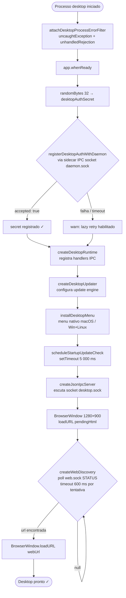
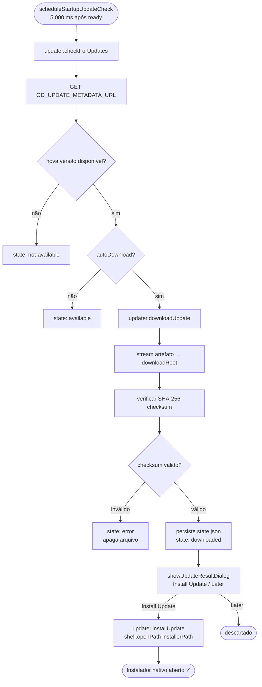
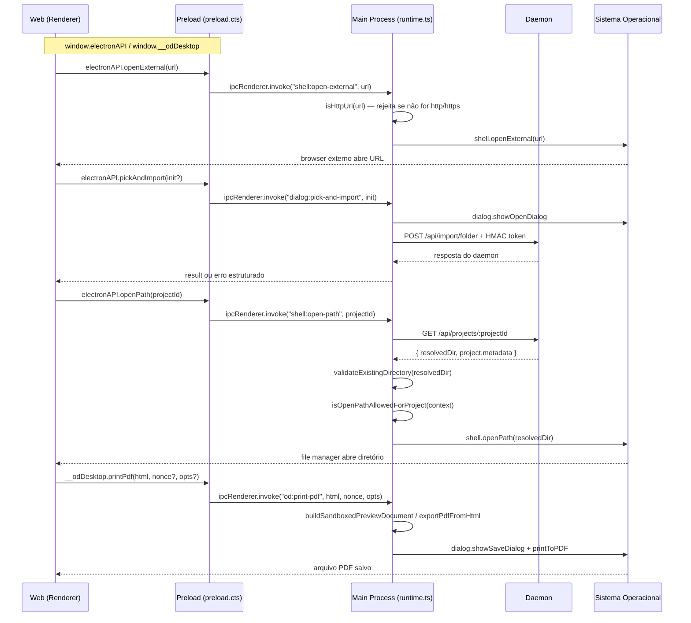
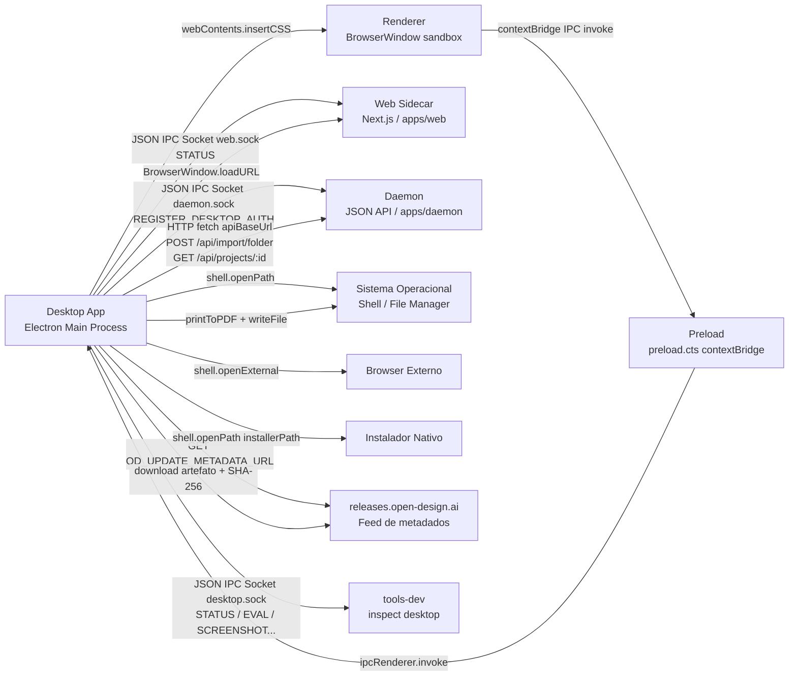

# Desktop — Especificação Técnica Visual 360°
> Documento unificado. Cobertura completa sem abreviações.

---

## 1. Variáveis de Ambiente

| Variável | Tipo | Padrão | Obrigatória | Descrição |
|---|---|---|---|---|
| `OD_TOOLS_DEV_PARENT_PID` | `number` (inteiro) | — | Não | PID do processo `tools-dev` pai. Quando presente, ativa o monitor de PID que encerra o desktop quando o pai termina. |
| `OD_UPDATE_ENABLED` | `"1"\|"0"\|"true"\|"false"\|"yes"\|"no"` | `true` se `source === "packaged"`, `false` caso contrário | Não | Habilita ou desabilita completamente o sistema de auto-update. |
| `OD_UPDATE_CHANNEL` | `"stable"\|"beta"` | Derivado do `currentVersion` (semver pre-release → `beta`) | Não | Canal de atualização. Determina qual feed de metadados é consultado. |
| `OD_UPDATE_CURRENT_VERSION` | `string` (semver) | `"0.0.0"` | Não | Versão instalada atualmente. Usada para comparar com o feed de metadados. |
| `OD_UPDATE_DOWNLOAD_ROOT` | `string` (path absoluto) | `<runtimeBase>/updates` | Não | Diretório local para armazenar artefatos de atualização baixados. Deve ser absoluto. Não pode conter `\0`. |
| `OD_UPDATE_METADATA_URL` | `string` (URL) | `https://releases.open-design.ai/<channel>/latest/metadata.json` | Não | URL do feed de metadados de atualização. Sobrepõe o padrão derivado do canal. |
| `OD_UPDATE_MODE` | `"package-launcher"\|"js-incremental"` | `"package-launcher"` | Não | Modo de atualização. `package-launcher` abre o instalador via `shell.openPath`; `js-incremental` aplica atualização JS em tempo de execução. |
| `OD_UPDATE_ARCH` | `string` | `process.arch` | Não | Arquitetura alvo para seleção do artefato de atualização (ex: `x64`, `arm64`). |
| `OD_UPDATE_PLATFORM` | `string` | `process.platform` | Não | Plataforma alvo para seleção do artefato (ex: `darwin`, `win32`, `linux`). |
| `OD_UPDATE_AUTO_CHECK` | `"1"\|"0"\|...` | Igual a `OD_UPDATE_ENABLED` | Não | Habilita verificação automática de atualização 5 s após startup. |
| `OD_UPDATE_AUTO_DOWNLOAD` | `"1"\|"0"\|...` | `"true"` | Não | Quando `true`, inicia o download automático ao encontrar nova versão. |
| `OD_UPDATE_AUTO_OPEN` | `"1"\|"0"\|...` | `"false"` | Não | Quando `true`, abre o instalador automaticamente após download. |
| `OD_UPDATE_OPEN_DRY_RUN` | `"1"\|"0"\|...` | `"false"` | Não | Quando `true`, simula a abertura do instalador sem executá-lo (modo dry-run para testes). |

> **Nota sobre stamp de processo:** O desktop não lê variáveis de stamp diretamente — recebe os 5 campos obrigatórios (`app`, `mode`, `namespace`, `ipc`, `source`) via flags CLI `--od-stamp-*` injetadas pelo orquestrador sidecar.

---

## 2. Workflows

### 2.1 Inicialização do App Desktop



### 2.2 Atualização do App



### 2.3 Importação de Pasta via Picker

```mermaid
sequenceDiagram
    participant R as Renderer
    participant P as Preload
    participant M as Main Process
    participant D as Daemon

    R->>P: window.electronAPI.pickAndImport(init?)
    P->>M: ipcRenderer.invoke("dialog:pick-and-import", init)
    M->>M: dialog.showOpenDialog({ properties: ["openDirectory"] })
    Note over M: baseDir = filePaths[0].trim()
    M->>M: mintImportToken(desktopAuthSecret, baseDir)<br/>HMAC-SHA256, nonce+exp+sig, TTL 60 s
    M->>D: POST /api/import/folder<br/>Header: X-OD-Desktop-Import-Token: &lt;token&gt;<br/>Body: { baseDir, name?, skillId?, designSystemId? }
    alt sucesso
        D-->>M: 200 { project, conversationId, entryFile }
        M-->>R: { ok: true, response: body }
    else 503 DESKTOP_AUTH_PENDING
        D-->>M: 503 { error: { code: "DESKTOP_AUTH_PENDING" } }
        M->>D: REGISTER_DESKTOP_AUTH via sidecar IPC socket
        D-->>M: { accepted: true }
        M->>M: mintImportToken NOVO (novo nonce + nova exp)
        M->>D: POST /api/import/folder (retry único)
        D-->>M: 200 { project, conversationId, entryFile }
        M-->>R: { ok: true, response: body }
    else erro (4xx / rede / 2º 503)
        D-->>M: erro HTTP ou falha de rede
        M-->>R: { ok: false, reason: "...", details?: body }
    end
```

### 2.4 Comunicação Desktop ↔ Web (IPC)



---

## 3. JTBDs (Jobs To Be Done)

| ID | Persona | Quando... | Quero... | Para que... | Prioridade |
|---|---|---|---|---|---|
| JTBD-01 | Designer | Abro o Open Design pela primeira vez | Vejo a interface web carregando rapidamente sem configuração | Posso começar a trabalhar sem fricção técnica | P0 |
| JTBD-02 | Designer | Tenho uma pasta de projeto local com arquivos de design | Importar essa pasta inteira via interface gráfica | O daemon possa indexar e processar meus arquivos | P0 |
| JTBD-03 | Designer | Clico em um link externo de documentação dentro do app | O link abra no meu browser padrão, não num popup interno | A navegação seja previsível e o app mantenha foco | P1 |
| JTBD-04 | Designer | Preciso entregar um deck como PDF | Exportar diretamente do app com formatação correta (1920×1080) | O cliente receba o arquivo pronto para apresentação | P1 |
| JTBD-05 | Designer | Preciso ver os arquivos do meu projeto no Finder/Explorer | Revelar o diretório do projeto no file manager do SO | Possa acessar e editar arquivos diretamente | P1 |
| JTBD-06 | Operador | Existe uma nova versão do Open Design disponível | Ser notificado e instalar a atualização com um clique | O app esteja sempre na versão mais segura e completa | P0 |
| JTBD-07 | Dev/QA | Preciso inspecionar estado interno do desktop durante testes | Usar o controle `tools-dev inspect desktop` via sidecar IPC | Automatizar validação de UI sem interface manual | P1 |
| JTBD-08 | Operador | O daemon reinicia durante uma sessão ativa | A próxima tentativa de importação de pasta funcione sem reiniciar o desktop | A sessão não seja interrompida por restart de backend | P1 |
| JTBD-09 | Designer | Estou em fullscreen no macOS e fecho a janela | O Space do macOS não fique como "fantasma" órfão | A experiência de gestão de espaços de trabalho seja fluida | P2 |
| JTBD-10 | Designer | Faço download de um arquivo PPTX pelo app | O diálogo "Save As" nativo apareça antes do download | Possa escolher onde salvar o arquivo | P2 |
| JTBD-11 | Equipe de segurança | Um renderer comprometido tenta importar uma pasta arbitrária | A operação seja bloqueada pelo gate HMAC no main process | Zero vetores de escalada de privilégio via renderer | P0 |
| JTBD-12 | Operador | O processo `tools-dev` pai encerra inesperadamente | O desktop encerre automaticamente sem processos zumbis | O ambiente de dev fique limpo | P1 |

---

## 4. Casos de Uso

### UC-01: Abrir o Open Design pela primeira vez

**Ator:** Usuário final (Designer)  
**Pré-condição:** App instalado. `tools-dev` ou `apps/packaged` já iniciou daemon e web.

**Fluxo Principal:**
1. Usuário abre o app (clica no ícone ou executa `tools-dev`).
2. `runDesktopMain` é chamado com o stamp sidecar.
3. `attachDesktopProcessErrorFilter` instala filtros de exceção.
4. `app.whenReady()` resolve — Electron está pronto.
5. `registerDesktopAuthWithDaemon` tenta até 6 vezes (delays 120–1500 ms) registrar o secret HMAC no daemon.
6. `createDesktopRuntime` registra handlers IPC e cria `BrowserWindow` (1280×900, sandbox habilitado).
7. BrowserWindow carrega `pendingHtml` (tela "Waiting for web runtime URL…").
8. `createWebDiscovery` faz polling no socket `web.sock` com `timeoutMs: 600`.
9. Ao receber `WebStatusSnapshot.url`, BrowserWindow carrega a URL web.
10. CSS macOS é injetado via `webContents.insertCSS` (drag regions).
11. Interface web aparece para o usuário.

**Fluxo Alternativo — daemon lento:**  
Na etapa 5, se todas as 6 tentativas falharem, o desktop continua com aviso em `console.warn`. A primeira importação de pasta ativa o retry lazy.

**Pós-condição:** BrowserWindow exibe a UI web completa. Socket IPC do desktop está escutando em `desktop.sock`.

---

### UC-02: Importar um arquivo de design via picker de pasta

**Ator:** Designer  
**Pré-condição:** App aberto, daemon registrou o secret HMAC do desktop.

**Fluxo Principal:**
1. Usuário clica em "Import Folder" na UI web.
2. Renderer chama `window.electronAPI.pickAndImport({ name?, skillId?, designSystemId? })`.
3. Preload envia IPC `dialog:pick-and-import` para o main process.
4. Main process exibe `dialog.showOpenDialog({ properties: ['openDirectory'] })`.
5. Usuário seleciona a pasta. `baseDir = filePaths[0].trim()`.
6. Main process minta token HMAC: `nonce~exp~signature` (TTL 60 s, HMAC-SHA256).
7. Main process executa `POST /api/import/folder` com header `X-OD-Desktop-Import-Token`.
8. Daemon valida token, importa pasta e retorna `{ project, conversationId, entryFile }`.
9. Main process retorna `{ ok: true, response: body }` ao renderer.
10. UI exibe o projeto importado.

**Fluxo Alternativo — DESKTOP_AUTH_PENDING:**  
Na etapa 8, se daemon responde `503 DESKTOP_AUTH_PENDING`, main process chama `registerDesktopAuthWithDaemon` novamente, minta token fresco (novo nonce + nova exp) e repete o POST uma única vez.

**Fluxo Alternativo — usuário cancela picker:**  
Etapa 4 retorna `canceled: true`. Main process retorna `{ ok: false, canceled: true }` ao renderer.

**Pós-condição:** Projeto disponível na UI. `metadata.fromTrustedPicker: true` gravado pelo daemon.

---

### UC-03: Receber e instalar atualização automática

**Ator:** Operador / Sistema (auto-check)  
**Pré-condição:** `OD_UPDATE_ENABLED=true`, `OD_UPDATE_AUTO_CHECK=true`. App aberto há > 5 s.

**Fluxo Principal:**
1. `scheduleStartupUpdateCheck` dispara após 5 000 ms.
2. `updater.checkForUpdates()` consulta `OD_UPDATE_METADATA_URL`.
3. Feed indica nova versão; `autoDownload: true` → `updater.downloadUpdate()`.
4. Artefato é baixado em `downloadRoot/`, checksum SHA-256 verificado.
5. `state.json` é gravado com `state: "downloaded"` e metadados do artefato.
6. `showUpdateResultDialog` exibe: "A new Open Design version has been downloaded."
7. Usuário clica "Install Update".
8. `updater.installUpdate()` → `shell.openPath(installerPath)`.
9. Instalador nativo abre. Usuário substitui o app.

**Fluxo Alternativo — versão atual:**  
Etapa 3: feed informa `not-available`. Diálogo "Open Design is up to date." é exibido ao usuário se ele clicou manualmente em "Check for Updates".

**Fluxo Alternativo — checksum inválido:**  
Etapa 4: SHA-256 não confere. Arquivo é apagado. `state: "error"` com mensagem de detalhe.

**Pós-condição:** Nova versão instalada ou usuário informado do estado atual.

---

### UC-04: Abrir link externo de dentro do app

**Ator:** Designer  
**Pré-condição:** App aberto. URL de destino é `http:` ou `https:`.

**Fluxo Principal:**
1. Renderer chama `window.electronAPI.openExternal(url)`.
2. Preload envia IPC `shell:open-external` para o main process.
3. Main process valida: `isHttpUrl(url)` — aceita apenas `http:` / `https:`.
4. `shell.openExternal(url)` abre URL no browser padrão do SO.
5. Main process retorna `true` ao renderer.

**Fluxo Alternativo — URL não-HTTP:**  
Etapa 3: validação falha. Main process retorna `false`. Nenhuma ação no SO.

**Fluxo Alternativo — `setWindowOpenHandler`:**  
Se a navegação for iniciada via `window.open` no renderer, `isAllowedChildWindowUrl` decide:  
- URL da mesma origin → navegação normal.  
- `http:`/`https:` diferente → `shell.openExternal` + `deny`.  
- `blob:` → `allow` (downloads).  
- `od:` (packaged) → `allow` como child BrowserWindow.  
- `about:blank` → `allow` (PDF export fallback).  
- Qualquer outra → `deny`.

**Pós-condição:** URL aberta no browser externo. BrowserWindow permanece no mesmo estado.

---

### UC-05: Imprimir/exportar artefato como PDF

**Ator:** Designer  
**Pré-condição:** App aberto. Renderer tem HTML do artefato a exportar.

**Fluxo Principal (deck 1920×1080):**
1. Renderer chama `window.__odDesktop.printPdf(html, nonce, { deck: true })`.
2. Preload envia IPC `od:print-pdf` para o main process.
3. Main process valida nonce HMAC (se `nonce` presente) — previne replay de HTML arbitrário.
4. `exportPdfFromHtml` exibe `dialog.showSaveDialog` com filtro `.pdf`.
5. Usuário escolhe nome e local de destino.
6. BrowserWindow oculta (1920×900, sandbox, sem `nodeIntegration`) é criado.
7. HTML é carregado via `loadURL("data:text/html;...")` com CSS de impressão para deck (`DECK_PRINT_CSS`).
8. `waitForPrintableContent` aguarda renderização.
9. `window.webContents.printToPDF({ pageSize: { width: 13.33, height: 7.5 } })` gera o PDF.
10. Arquivo é gravado em `save.filePath`.
11. BrowserWindow oculto é destruído. Retorna `{ ok: true, path }`.

**Fluxo Alternativo — documento (não deck):**  
Etapas 6–9 usam dimensão 1440×900 e tamanho de página inferido pelo conteúdo (`inferPageSize`).

**Fluxo Alternativo — usuário cancela Save dialog:**  
Etapa 5: retorna `{ canceled: true, ok: true }`. Nenhum arquivo criado.

**Pós-condição:** Arquivo PDF salvo no local escolhido pelo usuário.

---

## 5. FAZ / NÃO FAZ

| ✅ FAZ | ❌ NÃO FAZ |
|---|---|
| Descobrir URL do web runtime via socket IPC sidecar | Implementar UI própria — toda interface vem de `apps/web` |
| Criar e gerenciar `BrowserWindow` com sandbox habilitado | Expor APIs Node.js ao renderer (`nodeIntegration: false`) |
| Registrar secret HMAC com o daemon antes de qualquer import | Aceitar `baseDir` arbitrário vindo do renderer diretamente |
| Abrir links externos no browser do SO via `shell.openExternal` | Navegar para URLs externas dentro do próprio BrowserWindow |
| Exportar HTML como PDF usando `printToPDF` do Electron | Aceitar HTML de fontes não confiáveis sem validação de nonce |
| Gerenciar auto-update (check, download, verify, install) | Aplicar patches de código em runtime fora do modo `js-incremental` |
| Injetar CSS de drag region para macOS titlebar nativa | Modificar CSS da aplicação web além das drag regions |
| Mostrar diálogo "Save As" nativo para downloads PPTX | Fazer download automático de arquivos sem confirmar local |
| Revelar pasta do projeto no file manager via `shell.openPath` | Expor caminhos absolutos ao renderer — só recebe `projectId` |
| Monitorar PID do processo pai (`tools-dev`) e encerrar junto | Manter-se vivo após o pai encerrar em modo dev |
| Filtrar `setTypeOfService EINVAL` sem crash no main process | Suprimir exceções reais — apenas o erro harmless do undici |
| Construir e atualizar menu nativo (macOS + Windows/Linux) | Fornecer menu via HTML/CSS (usa menu nativo do SO) |
| Fechar janela de fullscreen macOS de forma segura | Forçar saída de fullscreen sem aguardar evento do SO |
| Expor `isDesktop: true` via `window.__odDesktop` | Expor informações de sistema além do sinalizador `isDesktop` |
| Reportar status via sidecar IPC para `tools-dev inspect desktop` | Emitir telemetria externa além dos logs locais |
| Suportar dois canais de release (`stable` / `beta`) | Suportar canais cruzados (stable recebendo beta) |
| Verificar checksum SHA-256 de artefatos antes de instalar | Instalar artefatos sem verificação de integridade |

---

## 6. User Inputs → System Outputs → Outcomes

| User Input | IPC Channel / Ação | System Output | Outcome Esperado |
|---|---|---|---|
| Abrir o app (clique no ícone) | — / `runDesktopMain` | BrowserWindow 1280×900 com UI web carregada | Usuário vê a interface completa do Open Design |
| Clicar "Import Folder" na UI | `dialog:pick-and-import` | Picker de pasta nativo → POST daemon com HMAC | Projeto importado e visível na UI |
| Selecionar pasta no picker | `dialog:pick-and-import` (resolução) | `{ project, conversationId, entryFile }` do daemon | Conversa de design iniciada sobre o projeto |
| Cancelar picker de pasta | `dialog:pick-and-import` (cancel) | `{ ok: false, canceled: true }` | UI exibe toast de cancelamento, sem ação |
| Clicar em link externo na UI | `shell:open-external` | `shell.openExternal(url)` → SO | Browser padrão abre o link; app mantém foco |
| Clicar "Print PDF" / "Export PDF" | `od:print-pdf` | `dialog.showSaveDialog` + `printToPDF` | Arquivo `.pdf` salvo no local escolhido |
| Clicar "Reveal in Finder/Explorer" | `shell:open-path` | `GET /api/projects/:id` + `shell.openPath(resolvedDir)` | File manager abre a pasta do projeto |
| Clicar "Check for Updates" no menu | — / `updater.checkForUpdates()` | Consulta `OD_UPDATE_METADATA_URL` | Diálogo informa: atualização disponível ou app em dia |
| Clicar "Install Update" no diálogo | — / `updater.installUpdate()` | `shell.openPath(installerPath)` | Instalador nativo abre; usuário conclui atualização |
| Clicar "Later" no diálogo de update | — / descarta snapshot | Nenhuma ação | Estado permanece `downloaded`; menu mantém "Install Update" habilitado |
| Download de arquivo `.pptx` na UI | — / `attachDownloadSaveAsDialog` | `item.setSaveDialogOptions()` | Diálogo "Save As" nativo aparece antes do download |
| Fechar janela (macOS fullscreen) | — / `hideWindowExitingFullscreen` | Aguarda evento `leave-full-screen` antes de fechar | Space macOS não fica como fantasma órfão |
| Clicar "Minimize" | — / `BrowserWindow.minimize()` | Janela minimizada na barra de tarefas | Comportamento nativo do SO |
| Forçar encerramento via `SIGINT/SIGTERM` | — / `process.on('SIGINT')` | `shutdown()` → `app.quit()` → `process.exit(0)` | Todos os resources liberados; processo encerra limpo |
| Encerramento do processo pai (tools-dev) | — / `attachParentMonitor` | `beforeShutdown()` → `process.exit(0)` | Desktop encerra automaticamente junto com o pai |
| `tools-dev inspect desktop eval` | Sidecar IPC `EVAL` | `BrowserWindow.webContents.executeJavaScript(expression)` | Resultado da expressão retornado ao inspetor |
| `tools-dev inspect desktop screenshot` | Sidecar IPC `SCREENSHOT` | `webContents.capturePage()` → salva PNG | Arquivo de screenshot gerado no caminho especificado |
| `tools-dev inspect desktop status` | Sidecar IPC `STATUS` | `DesktopStatusSnapshot + DesktopUpdateStatusSnapshot` | JSON com estado atual do desktop e updater |

---

## 7. CRUD / Operações

### IPC Channels — Operações Completas

#### 7.1 Canais Renderer → Main (via `contextBridge`)

| Canal IPC | API no Renderer | Payload de Entrada | Payload de Retorno | Descrição |
|---|---|---|---|---|
| `shell:open-external` | `window.electronAPI.openExternal(url)` | `url: string` | `Promise<boolean>` (`true` se aberto) | Abre URL no browser externo. Rejeita não-HTTP. |
| `dialog:pick-and-import` | `window.electronAPI.pickAndImport(init?)` | `init?: { name?, skillId?, designSystemId? }` | `Promise<{ ok: true, response: unknown } \| { ok: false, canceled?, reason?, details? }>` | Picker de pasta + import HMAC-gated para o daemon. |
| `shell:open-path` | `window.electronAPI.openPath(projectId)` | `projectId: string` (`[A-Za-z0-9._-]{1,128}`) | `Promise<string>` (vazio em caso de sucesso; mensagem de erro em falha) | Revela pasta do projeto no file manager. |
| `od:print-pdf` | `window.__odDesktop.printPdf(html, nonce?, opts?)` | `html: string`, `nonce?: string`, `opts?: { deck?: boolean }` | `Promise<{ ok: true, path?: string, canceled?: true } \| { ok: false, error: string }>` | Renderiza HTML em BrowserWindow oculto e exporta como PDF. |

#### 7.2 Canais Main → Desktop IPC Server (sidecar)

| Mensagem Sidecar | Payload de Entrada | Payload de Retorno | Descrição |
|---|---|---|---|
| `STATUS` | `{ type: "STATUS" }` | `DesktopStatusSnapshot & { update: DesktopUpdateStatusSnapshot }` | Estado completo do desktop + updater para `tools-dev inspect`. |
| `EVAL` | `{ type: "EVAL", input: DesktopEvalInput }` | `DesktopEvalResult` | Executa expressão JS no webContents do BrowserWindow. |
| `SCREENSHOT` | `{ type: "SCREENSHOT", input: DesktopScreenshotInput }` | `DesktopScreenshotResult` | Captura screenshot do BrowserWindow e salva no path fornecido. |
| `CONSOLE` | `{ type: "CONSOLE" }` | `DesktopConsoleResult` | Retorna até 200 entradas de console do renderer (nível, texto, timestamp). |
| `CLICK` | `{ type: "CLICK", input: DesktopClickInput }` | `DesktopClickResult` | Clica em elemento CSS selector no BrowserWindow. |
| `EXPORT_PDF` | `{ type: "EXPORT_PDF", input: DesktopExportPdfInput }` | `DesktopExportPdfResult` | Dispara exportação PDF. |
| `UPDATE` | `{ type: "UPDATE", input: { action: DesktopUpdateAction } }` | `DesktopUpdateStatusSnapshot` | Executa ação de update: `"check"`, `"download"`, `"install"`. |
| `SHUTDOWN` | `{ type: "SHUTDOWN" }` | `{ accepted: true }` | Solicita encerramento gracioso do desktop. |

#### 7.3 Canais de Descoberta (Main → Web Sidecar)

| Mensagem | Socket | Payload | Resposta | TTL |
|---|---|---|---|---|
| `STATUS` | `web.sock` | `{ type: "STATUS" }` | `WebStatusSnapshot` (`url: string \| null`) | timeout 600 ms por poll |

#### 7.4 Canais de Auth (Main → Daemon Sidecar)

| Mensagem | Socket | Payload | Resposta |
|---|---|---|---|
| `REGISTER_DESKTOP_AUTH` | `daemon.sock` | `{ type: "REGISTER_DESKTOP_AUTH", input: { secret: string (base64) } }` | `{ accepted: true }` |

---

## 8. APIs e Protocolos

### 8.1 IPC Channels Electron — Resumo Completo

| Canal | Direção | Tipo | Payload Renderer→Main | Resposta Main→Renderer |
|---|---|---|---|---|
| `shell:open-external` | Renderer → Main | `ipcMain.handle` | `url: string` | `boolean` |
| `dialog:pick-and-import` | Renderer → Main | `ipcMain.handle` | `init: { name?, skillId?, designSystemId? } \| null` | `PickAndImportFolderResult \| { ok: false, canceled: true }` |
| `shell:open-path` | Renderer → Main | `ipcMain.handle` | `projectId: string` | `string` (vazio = ok, mensagem = erro) |
| `od:print-pdf` | Renderer → Main | `ipcMain.handle` | `(html: string, nonce?: string, opts?: PrintReadyPdfOptions)` | `DesktopExportPdfResult` |

### 8.2 Protocolo od://

Em builds **packaged**, a URL do web runtime é `od://app/` — um protocolo customizado registrado pelo Electron em `apps/packaged`. O desktop carrega essa URL no `BrowserWindow`:

- **Registro:** `protocol.registerSchemesAsPrivileged` em `apps/packaged/src/main.ts` com `{ standard: true, secure: true, supportFetchAPI: true }`.
- **Resolução:** `protocol.handle("od", ...)` serve os arquivos estáticos do build Next.js.
- **Limitação crítica:** O Node fetch nativo (undici) no main process **não** resolve `od://`. Por isso, `discoverDaemonUrl` retorna `http://127.0.0.1:<port>` e todas as chamadas `fetch` do main process usam esse URL real, não `od://app/`.
- **`isAllowedChildWindowUrl`:** `od:` é permitido como child BrowserWindow (PR #911) para fluxos de navegação em packaged.

### 8.3 Protocolo Sidecar (JSON IPC Socket)

O desktop se comunica com daemon e web via sockets POSIX (macOS/Linux) ou Named Pipes (Windows) do protocolo `@open-design/sidecar`:

**Caminhos de socket:**
- POSIX: `/tmp/open-design/ipc/<namespace>/<app>.sock`
- Windows: `\\.\pipe\open-design\ipc\<namespace>\<app>`

**Stamp de processo (5 campos obrigatórios):**

```
--od-stamp-app=desktop
--od-stamp-mode=dev|runtime
--od-stamp-namespace=<string>
--od-stamp-ipc=<socket-path>
--od-stamp-source=local|packaged
```

**Formato de mensagem:** JSON-Lines, uma mensagem por linha. Shape base:
```json
{ "type": "<SIDECAR_MESSAGE_TYPE>", "input": { ... } }
```

**Retry de registro HMAC:**

| Tentativa | Delay antes | Timeout por req |
|---|---|---|
| 0 (imediata) | 0 ms | 800 ms |
| 1 | 120 ms | 800 ms |
| 2 | 240 ms | 800 ms |
| 3 | 480 ms | 800 ms |
| 4 | 960 ms | 800 ms |
| 5 | 1 500 ms | 800 ms |

### 8.4 HTTP API — Daemon (via `apiBaseUrl`)

Chamadas `fetch` feitas **exclusivamente pelo main process**. O renderer nunca acessa diretamente.

| Endpoint | Método | Headers | Body | Resposta |
|---|---|---|---|---|
| `/api/import/folder` | `POST` | `Content-Type: application/json`, `X-OD-Desktop-Import-Token: <hmac>` | `{ baseDir, name?, skillId?, designSystemId? }` | `{ project, conversationId, entryFile }` ou `503 { error: { code: "DESKTOP_AUTH_PENDING" } }` |
| `/api/projects/:projectId` | `GET` | — | — | `{ resolvedDir: string, project: { metadata: { baseDir?, fromTrustedPicker? } } }` |

**Validação de `projectId`:** regex `^[A-Za-z0-9._-]{1,128}$` — aplicada no main process antes do `fetch`.

### 8.5 Token HMAC de Importação

```
X-OD-Desktop-Import-Token: <nonce>~<exp>~<signature>
```

| Campo | Formato | Descrição |
|---|---|---|
| `nonce` | base64url (16 bytes aleatórios) | Garante unicidade — previne replay |
| `exp` | ISO 8601 (`2024-01-01T12:00:00.000Z`) | Expiração (TTL: 60 000 ms) |
| `signature` | base64url | HMAC-SHA256 sobre `baseDir\nnonce\nexp` |
| Separador | `~` (til) | Não aparece em base64url nem ISO 8601 |

**Verificação no daemon:** valida signature, verifica `exp > now`, confirma `baseDir` coincide com o do body. Token é single-use (replay → rejeição).

### 8.6 Diagrama de Conectores



---

## 9. Configuração e JSON Files

### 9.1 Arquivos de Configuração em Runtime

| Arquivo | Localização | Propósito | Schema relevante |
|---|---|---|---|
| `state.json` | `<downloadRoot>/state.json` | Persiste estado do update já baixado entre restarts | `PersistedUpdateState` — campos: `artifact`, `checksum`, `channel`, `downloadPath`, `downloadedAt`, `metadata`, `platform`, `platformKey`, `verified: true`, `version: 1`, `updateVersion` |
| `.open-design-updater-root.json` | `<downloadRoot>/.open-design-updater-root.json` | Sentinela de ownership — confirma que o diretório pertence ao updater do Open Design | `{ version: 1 }` |
| Runtime JSON IPC files | `.tmp/<source>/<namespace>/...` | Arquivos de lock/PID do sidecar runtime | Gerenciado por `@open-design/sidecar` |

### 9.2 Configuração electron-builder

O build do desktop é gerenciado por `apps/packaged` (não `apps/desktop` diretamente). O desktop exporta apenas o main process TypeScript; o empacotamento (`electron-builder`) é responsabilidade de `apps/packaged/src/` e `tools/pack/`.

**Parâmetros de build relevantes do desktop:**
- **Target:** compilação TypeScript para `dist/main/index.js` (ESM, Node 24)
- **Preload:** `preload.cts` → CommonJS (`tsconfig.json` com `moduleResolution: NodeNext`)
- **asar:** conteúdo em ASAR no packaged; `dist/main/` incluído via `files: ["dist"]`
- **extraResources:** sidecar binários — gerenciado por `apps/packaged`
- **protocols:** `od://` registrado no `apps/packaged/src/main.ts`

### 9.3 Configuração TypeScript

```
tsconfig.json          — compila src/main/ → dist/main/ (ESM, NodeNext)
tsconfig.tests.json    — inclui tests/main/ para typecheck isolado
vitest.config.ts       — runner de testes unitários
```

**Peculiaridade:** `preload.cts` usa extensão `.cts` (CommonJS TypeScript) porque o Electron sandbox exige que o preload seja CommonJS. O `tsconfig.json` principal (ESM) exclui `.cts`; o preload é compilado separadamente com `"module": "CommonJS"`.

### 9.4 Lógicas e Cálculos

#### Lógica de Validação HMAC

```
HMAC-SHA256(secret, message) onde:
  message = baseDir + "\n" + nonce + "\n" + exp
  secret  = Buffer de 32 bytes aleatórios (gerado em runDesktopMain, único por sessão)
  nonce   = randomBytes(16).toString("base64url")
  exp     = new Date(Date.now() + 60_000).toISOString()
  token   = nonce + "~" + exp + "~" + digest.toString("base64url")
```

O daemon verifica: signature válida + `exp > now` + `baseDir === body.baseDir`. Token inválido → `403`. Token expirado → `403`. Token para `baseDir` diferente → `403`.

#### Lógica de Descoberta de URL via Sidecar

```
loop:
  webIpc = resolveAppIpcPath({ app: "web", namespace, contract })
  result = requestJsonIpc(webIpc, { type: "STATUS" }, { timeoutMs: 600 })
  if result?.url != null → retorna url
  else → aguarda PENDING_POLL_MS (120 ms) e repete
```

Enquanto a URL não é descoberta, BrowserWindow exibe HTML gerado por `createPendingHtml()` com mensagem de espera.

#### Lógica de Validação de Path (`validateExistingDirectory`)

```
1. typeof p === "string" && p.length > 0      → ok, senão: "path must be a non-empty string"
2. isAbsolute(p)                               → ok, senão: "path must be absolute"
3. realpath(p)                                 → ok, senão: "path does not exist"
4. stat(resolved).isDirectory()               → ok, senão: "path is not a directory"
5. !resolved.toLowerCase().endsWith(".app")   → ok, senão: "application bundles are not project directories"
```

#### Lógica de Canal de Update

```
defaultChannelForVersion(version):
  semver.prerelease(version) != null → "beta"
  else → "stable"

normalizeChannel(env, fallback):
  env ∈ { "stable", "beta" } → env
  env vazio/nulo → fallback
  else → throw Error("unsupported desktop update channel")
```

#### Lógica `isOpenPathAllowedForProject`

```
if context.hasBaseDir && !context.fromTrustedPicker:
  return { ok: false, reason: "project did not come from the trusted picker flow" }
return { ok: true }

onde:
  hasBaseDir = project.metadata.baseDir é string não-vazia
  fromTrustedPicker = project.metadata.fromTrustedPicker === true
```

---

## 10. Tipos e Shapes Exportados

### 10.1 `DesktopStatusSnapshot`

```typescript
{
  pid?: number;
  state: "idle" | "running" | "unknown";
  title?: string | null;
  updatedAt?: string;    // ISO 8601
  url?: string | null;
  windowVisible?: boolean;
}
```

### 10.2 `DesktopUpdaterConfig`

```typescript
{
  arch: string;
  autoCheck: boolean;
  autoDownload: boolean;
  autoOpen: boolean;
  channel: "stable" | "beta";
  currentVersion: string;
  downloadRoot: string;  // path absoluto
  enabled: boolean;
  metadataUrl: string;
  mode: "package-launcher" | "js-incremental";
  openDryRun: boolean;
  platform: string;
  source: SidecarSource;  // "local" | "packaged"
}
```

### 10.3 `PathValidationResult`

```typescript
| { ok: true; resolved: string }
| { ok: false; reason: string }
```

### 10.4 `PickAndImportFolderResult`

```typescript
| { ok: true; response: unknown }
| { ok: false; canceled?: boolean; details?: unknown; reason?: string }
```

### 10.5 `DesktopMainOptions`

```typescript
{
  beforeShutdown?: () => Promise<void>;
  discoverWebUrl?: () => Promise<string | null>;
  discoverDaemonUrl?: () => Promise<string | null>;
  update?: {
    currentVersion?: string | null;
    downloadRoot?: string | null;
  };
}
```

---

## 11. Segurança

### 11.1 Modelo de Ameaças

| Ameaça | Vetor | Mitigação |
|---|---|---|
| Renderer comprometido acessando filesystem | IPC `dialog:pick-and-import` | Picker no main process; renderer nunca vê `baseDir`; token HMAC obrigatório |
| Replay de token de importação | Header `X-OD-Desktop-Import-Token` | `nonce` único por request + `exp` (TTL 60 s) + verificação do daemon |
| Renderer nomeando `projectId` malicioso | IPC `shell:open-path` | Regex `^[A-Za-z0-9._-]{1,128}$` + `fetchResolvedProjectDir` + `validateExistingDirectory` |
| Abertura de app bundle macOS via `openPath` | `shell:open-path` | `validateExistingDirectory` rejeita paths terminando em `.app` |
| Navegação do BrowserWindow para URL maliciosa | `setWindowOpenHandler` | `isAllowedChildWindowUrl` — only-list de origins/schemes permitidos |
| Artefato de update com checksum falso | Download de update | Verificação SHA-256 obrigatória antes de `state: downloaded` |
| Injeção via `setTypeOfService EINVAL` | Undici socket internals | `attachDesktopProcessErrorFilter` — suprime apenas este erro específico |
| Projeto folder-imported sem trusted picker | `shell:open-path` | `isOpenPathAllowedForProject` verifica `fromTrustedPicker: true` |

### 11.2 Configuração do BrowserWindow

```typescript
webPreferences: {
  contextIsolation: true,   // obrigatório — isola contexto do preload
  nodeIntegration: false,   // proibido — Node.js não disponível no renderer
  sandbox: true,            // renderer isolado do SO
  preload: preloadPath,     // único ponto de comunicação renderer↔main
}
```

### 11.3 Exports Públicos para Testabilidade

Funções de segurança exportadas via `./main` para testes no `apps/packaged/tests/` sem necessitar de Electron em runtime:

- `isAllowedChildWindowUrl` — política de URL filha
- `validateExistingDirectory` — validação de path
- `fetchResolvedProjectDir` — resolução segura de projectId
- `isOpenPathAllowedForProject` — verificação trusted picker
- `signDesktopImportToken` — HMAC puro
- `pickAndImportFolder` — lógica pick+import+retry sem Electron
- `isHttpUrl` — detecção de HTTP/HTTPS

---

## 12. Dependências

### 12.1 Dependências de Produção

| Pacote | Versão | Papel |
|---|---|---|
| `@open-design/platform` | `workspace:*` | Primitivos de processo: `readProcessStamp`, stamp serialization |
| `@open-design/sidecar` | `workspace:*` | Bootstrap de runtime, transport IPC, `createJsonIpcServer`, `requestJsonIpc`, `resolveAppIpcPath` |
| `@open-design/sidecar-proto` | `workspace:*` | Constantes `APP_KEYS`, `SIDECAR_MESSAGES`, `OPEN_DESIGN_SIDECAR_CONTRACT`, tipos de snapshot e update |

### 12.2 Dependências de Desenvolvimento

| Pacote | Versão | Papel |
|---|---|---|
| `electron` | `41.3.0` | Runtime Electron — usado em `devDependencies` pois o packaged usa o Electron do `apps/packaged` |
| `typescript` | `6.0.3` | Compilador TypeScript |
| `vitest` | `^2.1.8` | Test runner para testes unitários do main process |
| `@types/node` | `24.12.2` | Tipos Node.js |
