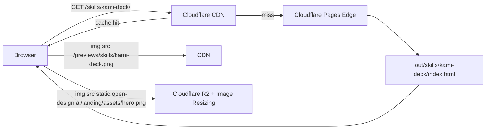
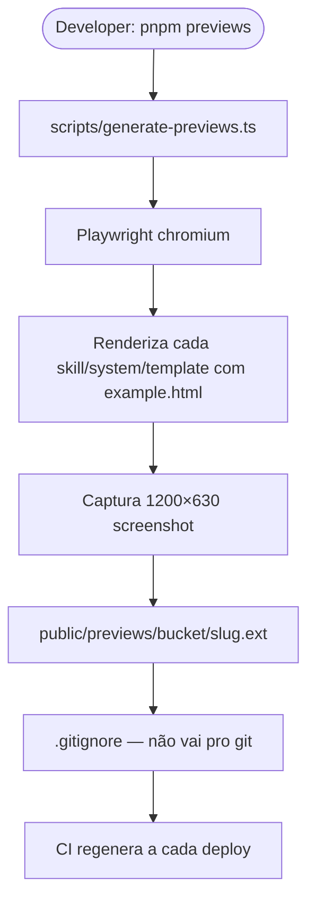
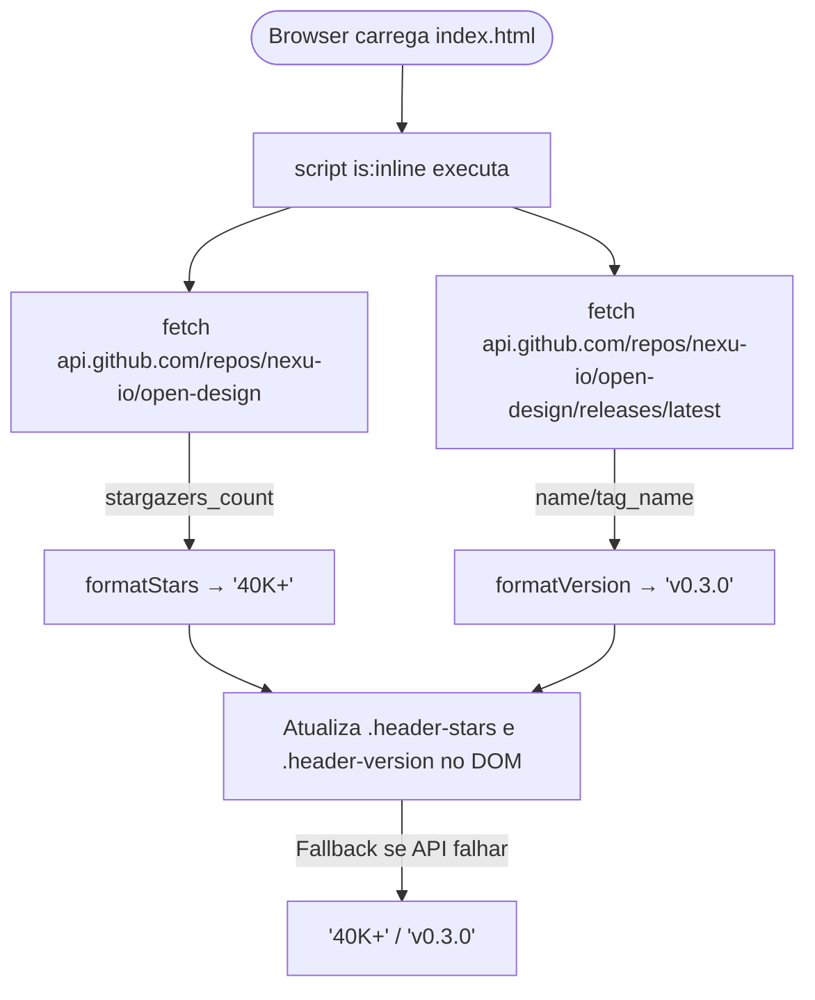
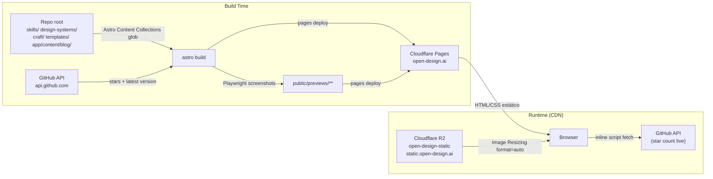

# Landing Page — Especificação Técnica Visual 360°
> Documento unificado. Cobertura completa.

## 1. Variáveis de Ambiente

| Variável | Tipo | Padrão | Obrigatória | Descrição |
|---|---|---|---|---|
| `OD_LANDING_SITE` | `string` (URL) | `https://open-design.ai` | Não | Canonical origin do site. Usado por `Astro.site`, `@astrojs/sitemap` e tags `og:url` / `<link rel="canonical">`. Deve ser sobrescrito em preview deploys (Cloudflare Pages preview, localhost). |

> Não há variáveis de runtime no browser — o site é estático. O único ponto de configuração é o origin injetado em build time.

---

## 2. Workflows (Mermaid)

### 2.1 Fluxo de Build e Deploy

```mermaid
flowchart TD
    A([Contributor edita SKILL.md / DESIGN.md / craft/*.md]) --> B[Push para main]
    B --> C{CI: Cloudflare Pages build}
    C --> D[pnpm --filter @open-design/landing-page build]
    D --> D1[astro check — typecheck]
    D1 --> D2[astro build]
    D2 --> E[Content Collections glob repo root]
    E --> E1[skills/*/SKILL.md]
    E --> E2[design-systems/*/DESIGN.md]
    E --> E3[craft/*.md]
    E --> E4[templates/live-artifacts/*/README.md]
    E --> E5[app/content/blog/*.md]
    E1 & E2 & E3 & E4 & E5 --> F[catalog.ts shape records]
    F --> G[Astro renderiza páginas estáticas]
    G --> H[out/ — HTML/CSS/JS mínimo inline]
    H --> I[CI: pnpm previews — Playwright screenshots]
    I --> J[public/previews/skills/*.png|webp]
    I --> K[public/previews/systems/*.png|webp]
    I --> L[public/previews/templates/*.png|webp]
    H & J & K & L --> M[Cloudflare Pages deploy out/]
    M --> N[(CDN global — open-design.ai)]
```

### 2.2 Fluxo de Request de Página de Catálogo



### 2.3 Fluxo de Geração de Previews



### 2.4 Fluxo de Enriquecimento do Header (runtime inline)



---

## 3. JTBDs

| ID | Persona | Quando… | Quero… | Para que… | Prioridade |
|---|---|---|---|---|---|
| J-01 | Desenvolvedor OSS | Descubro o projeto via link compartilhado | Ver rapidamente o que é o Open Design e sua proposta de valor | Decidir em segundos se vale meu tempo explorar | Alta |
| J-02 | Designer técnico | Quero adotar uma stack de design para meu agente | Navegar o catálogo de design systems disponíveis | Escolher o sistema certo para minha marca sem ler todos os DESIGN.md | Alta |
| J-03 | Contributor | Adicionei uma nova skill ao repo | Ver minha skill aparecer na landing sem configuração extra | Saber que o site é sempre sincronizado com o repo | Média |
| J-04 | Mantenedor | Quero melhorar SEO e descobribilidade | Ter sitemap correto com prioridades e lastmod por tipo de página | Aparecer bem nos motores de busca para queries de design systems | Média |
| J-05 | Mantenedor de infra | Faço preview deploy de uma feature branch | Configurar a canonical URL sem alterar o código | Evitar que preview builds contaminem índices de busca | Média |
| J-06 | Dev que usa RSS | Quero acompanhar novidades sem visitar o site | Assinar o feed RSS do blog | Receber posts novos no meu leitor favorito | Baixa |
| J-07 | Designer | Quero ver como a landing renderiza um template específico | Acessar `/templates/<slug>/` com preview e link direto ao repo | Entender o output visual antes de usar o template | Média |
| J-08 | Contributor novo | Quero entender quais craft principles o projeto segue | Navegar `/craft/` e ler cada princípio | Contribuir com código alinhado aos padrões visuais do projeto | Baixa |

---

## 4. Casos de Uso

### UC-01 — Visitar a Landing Page

**Ator:** Visitante  
**Pré-condição:** Nenhuma. Acesso público.  
**Fluxo Principal:**
1. Visitante acessa `https://open-design.ai/`.
2. Cloudflare CDN entrega `index.html` estático em cache.
3. Browser renderiza HTML com CSS inline — zero JS de framework enviado ao browser.
4. Script inline `is:inline` chama GitHub API para stars e versão.
5. DOM atualiza `.header-stars` e `.header-version` com valores ao vivo; fallback para `'40K+'` / `'v0.3.0'` se a API falhar.
6. Hero image carrega via `static.open-design.ai` com Cloudflare Image Resizing (`width=1024,quality=82,format=auto`).

**Fluxo Alternativo:** API do GitHub retorna erro 4xx/5xx → valores hardcoded permanecem sem erro visível.  
**Pós-condição:** Página completamente renderizada em < 1.5s TTI (sem JS de runtime).

---

### UC-02 — Navegar o Catálogo de Templates

**Ator:** Designer técnico  
**Pré-condição:** Nenhuma.  
**Fluxo Principal:**
1. Visitante acessa `/templates/`.
2. Página lista todos os Live Artifacts de `templates/live-artifacts/*/README.md` + skills com `od.mode: template`.
3. Cada card exibe nome, descrição, preview thumbnail (`/previews/templates/<slug>.png`) se disponível.
4. Visitante clica em card → navega para `/templates/<slug>/`.
5. Página de detalhe exibe metadata completa e link direto ao repo GitHub.

**Fluxo Alternativo:** Preview não gerado → card renderiza sem imagem, sem quebra de layout.  
**Pós-condição:** Visitante conhece os templates disponíveis e acessa o repo para uso.

---

### UC-03 — Gerar Preview Thumbnails

**Ator:** CI / Developer  
**Pré-condição:** Build do site já foi executado; `pnpm previews` disponível.  
**Fluxo Principal:**
1. `pnpm --filter @open-design/landing-page previews` executa `scripts/generate-previews.ts`.
2. Script inicializa Playwright Chromium.
3. Para cada skill/system/template com `example.html`, renderiza em viewport 1200×630.
4. Captura screenshot e salva em `public/previews/<bucket>/<slug>.<ext>`.
5. Extensão real preservada (`.png`, `.webp`, `.jpg`) para compatibilidade com pós-processamento futuro.
6. `catalog.ts` lê o diretório em build time e inclui `previewUrl` nos records.

**Fluxo Alternativo:** Skill sem `example.html` → `previewUrl: null`, sem falha.  
**Pós-condição:** Todos os thumbnails disponíveis em `public/previews/`, servidos como assets estáticos.

---

### UC-04 — Deploy no Cloudflare Pages

**Ator:** CI (push para main)  
**Pré-condição:** `wrangler` configurado; Cloudflare Pages project `open-design-landing` existente.  
**Fluxo Principal:**
1. Push para `main` dispara CI.
2. CI executa `pnpm install` e `pnpm --filter @open-design/landing-page build`.
3. `astro check` valida tipos; `astro build` produz `out/`.
4. CI executa `pnpm previews` para gerar thumbnails.
5. Cloudflare Pages Pages faz deploy do diretório `out/`.
6. `sitemap-index.xml` e `sitemap-0.xml` gerados automaticamente por `@astrojs/sitemap`.
7. CDN invalida cache; nova versão servida globalmente.

**Fluxo Alternativo:** `astro check` falha → CI abortado, deploy não ocorre.  
**Pós-condição:** Versão atualizada disponível em `https://open-design.ai` em segundos.

---

### UC-05 — Adicionar Novo Design System ao Catálogo

**Ator:** Contributor  
**Pré-condição:** Novo `design-systems/<slug>/DESIGN.md` commitado no repo.  
**Fluxo Principal:**
1. Contributor cria `design-systems/meu-sistema/DESIGN.md` com H1 e corpo Markdown.
2. Push para main.
3. Build de CI executa `getCollection('systems')` via glob `design-systems/*/DESIGN.md`.
4. `catalog.ts` parseia H1 para `name`, extrai hexcodes de cor para `palette`.
5. Nova entrada aparece em `/systems/` e `/systems/meu-sistema/` automaticamente.
6. Sitemap inclui as novas URLs com `changefreq: monthly, priority: 0.5`.

**Fluxo Alternativo:** DESIGN.md sem H1 → slug do diretório usado como nome fallback.  
**Pós-condição:** Novo sistema visível no catálogo sem alteração de código.

---

## 5. FAZ / NÃO FAZ

| ✅ FAZ | ❌ NÃO FAZ |
|---|---|
| Renderiza marketing site estático com Astro 5 | Conectar ao daemon (`apps/daemon`) ou a APIs do produto |
| Gera catálogo de skills, design systems, craft e templates a partir de globs do repo | Armazenar ou processar dados de usuários |
| Serve feed RSS do blog via `@astrojs/rss` | Importar de `@open-design/web`, `@open-design/daemon`, `@open-design/contracts` |
| Gera sitemap com prioridades e lastmod por tipo de página | Ter rotas dinâmicas SSR — output é exclusivamente `static` |
| Exibe star count e versão do GitHub via script inline (com fallback) | Usar fontes não-Google (proibido por AGENTS.md) |
| Serve thumbnails gerados offline por Playwright em `public/previews/` | Commitar PNGs de assets de imagem em `public/assets/` (ficam no R2) |
| Aplica Cloudflare Image Resizing para imagens R2 com `format=auto` | Colocar arquivos de conteúdo (SKILL.md, DESIGN.md) dentro de `app/` |
| Gera OG image estática via `/og/` (1200×630, `noindex`) | Replicar lógica de parsing de Markdown em múltiplos arquivos |
| Conta skills/systems/templates via `getCatalogCounts()` e nunca hardcoda | Introduzir runtime React no browser (React apenas em build time) |
| Mantém todo source sob `app/` (proibido criar `src/`) | Adicionar dependência de fonte não-web-safe além das permitidas |

---

## 6. User Inputs → System Outputs → Outcomes

| User Input | Ação / Endpoint | System Output | Outcome |
|---|---|---|---|
| `GET /` | Serve `out/index.html` via CDN | HTML + CSS inline + script inline | Página de marketing renderizada sem JS de framework |
| `GET /skills/` | Serve `out/skills/index.html` | Lista de todas as skills com thumbnails | Visitante descobre catálogo completo |
| `GET /skills/<slug>/` | Serve `out/skills/<slug>/index.html` | Página de detalhe da skill | Visitante lê descrição, triggers, exemplo de prompt e link ao repo |
| `GET /skills/mode/<slug>/` | Serve página de faceta de modo | Lista de skills filtradas por `od.mode` | Navegação por modo (template, brief, deck…) |
| `GET /skills/scenario/<slug>/` | Serve página de faceta de cenário | Lista de skills filtradas por `od.scenario` | Navegação por cenário de uso |
| `GET /systems/` | Serve `out/systems/index.html` | Catálogo de design systems com paletas | Visitante explora sistemas disponíveis |
| `GET /systems/<slug>/` | Serve página de detalhe do design system | Nome, categoria, tokens de cor, link ao repo | Visitante avalia sistema antes de adotar |
| `GET /systems/category/<slug>/` | Serve página de faceta de categoria | Design systems filtrados por categoria | Navegação por tipo (brand, component, editorial…) |
| `GET /craft/` | Serve catálogo de craft principles | Lista de todos os princípios de craft | Visitante entende os padrões visuais do projeto |
| `GET /craft/<slug>/` | Serve detalhe de um craft principle | Markdown renderizado + link ao repo | Visitante lê regra completa (ex: animation-discipline) |
| `GET /templates/` | Serve catálogo de Live Artifacts | Cards com thumbnail e metadados | Visitante descobre templates prontos |
| `GET /blog/` | Serve lista de posts do blog | Posts ordenados por data | Visitante acessa conteúdo editorial |
| `GET /blog/<slug>/` | Serve post individual | HTML do post com metadados SEO | Leitura completa com canonical e og:image |
| `GET /rss.xml` | Serve feed RSS gerado por `@astrojs/rss` | XML com todos os posts do blog | Leitor de RSS recebe novidades |
| `GET /sitemap-index.xml` | Serve índice de sitemap | XML com referências ao sitemap-0.xml | Crawlers indexam todas as URLs |

---

## 7. Operações de Build, Catálogo e Deploy

### Build

| Operação | Comando | Descrição |
|---|---|---|
| Typecheck | `pnpm --filter @open-design/landing-page build` (inclui `astro check`) | Valida tipos TypeScript e Astro antes de gerar output |
| Build completo | `astro build` | Gera `out/` com HTML/CSS estático a partir de content collections |
| Dev server | `astro dev --host 127.0.0.1 --port 17574` | Servidor local com HMR para desenvolvimento |
| Preview server | `astro preview --host 127.0.0.1 --port 17574` | Serve `out/` localmente após build |

### Geração de Catálogo

| Operação | Função | Arquivo | Descrição |
|---|---|---|---|
| Listar skills | `getSkillRecords()` | `app/_lib/catalog.ts` | Retorna skills ordenadas: featured (por número) → alfabético |
| Listar design systems | `getSystemRecords()` | `app/_lib/catalog.ts` | Parseia H1 e hexcodes de cor de cada DESIGN.md |
| Listar craft | `getCraftRecords()` | `app/_lib/catalog.ts` | Glob de `craft/*.md` |
| Listar templates | `getTemplateRecords()` | `app/_lib/catalog.ts` | Live Artifacts + skills com `od.mode: template` |
| Contagens | `getCatalogCounts()` | `app/_lib/catalog.ts` | `{ skills, systems, craft, templates }` — usado no hero |
| Previews disponíveis | `listPreviews(bucket)` | `app/_lib/catalog.ts` | Map de `slug → filename` a partir de `public/previews/<bucket>/` |
| Meta GitHub | `getGithubRepoMeta()` | `app/_lib/github.ts` | Stars + versão da latest release (com fallback hardcoded) |

### Deploy

| Operação | Comando | Descrição |
|---|---|---|
| Deploy produção | Push para `main` → CI | Cloudflare Pages build + deploy automático |
| Preview deploy | Push para feature branch | Cloudflare Pages preview URL com `OD_LANDING_SITE` próprio |
| Gerar thumbnails | `pnpm --filter @open-design/landing-page previews` | Playwright gera `public/previews/**` antes do deploy |

---

## 8. APIs e Endpoints

### Endpoints Servidos pela Landing Page

| Método | Path | Auth | Payload | Response | Descrição |
|---|---|---|---|---|---|
| `GET` | `/` | — | — | HTML 200 | Homepage marketing Atelier Zero |
| `GET` | `/skills/` | — | — | HTML 200 | Catálogo de skills |
| `GET` | `/skills/<slug>/` | — | — | HTML 200 ou 404 | Detalhe de uma skill |
| `GET` | `/skills/mode/<slug>/` | — | — | HTML 200 ou 404 | Faceta por `od.mode` |
| `GET` | `/skills/scenario/<slug>/` | — | — | HTML 200 ou 404 | Faceta por `od.scenario` |
| `GET` | `/systems/` | — | — | HTML 200 | Catálogo de design systems |
| `GET` | `/systems/<slug>/` | — | — | HTML 200 ou 404 | Detalhe de um design system |
| `GET` | `/systems/category/<slug>/` | — | — | HTML 200 ou 404 | Faceta por categoria |
| `GET` | `/craft/` | — | — | HTML 200 | Catálogo de craft principles |
| `GET` | `/craft/<slug>/` | — | — | HTML 200 ou 404 | Detalhe de um craft principle |
| `GET` | `/templates/` | — | — | HTML 200 | Catálogo de Live Artifacts |
| `GET` | `/templates/<slug>/` | — | — | HTML 200 ou 404 | Detalhe de um template |
| `GET` | `/blog/` | — | — | HTML 200 | Lista de posts do blog |
| `GET` | `/blog/<slug>/` | — | — | HTML 200 ou 404 | Post individual |
| `GET` | `/og/` | — | — | HTML 200 (`noindex`) | Superfície para screenshot de OG image 1200×630 |
| `GET` | `/rss.xml` | — | — | XML 200 | Feed RSS do blog |
| `GET` | `/sitemap-index.xml` | — | — | XML 200 | Índice do sitemap |
| `GET` | `/sitemap-0.xml` | — | — | XML 200 | Sitemap com todas as URLs canônicas |

### APIs Externas Consumidas

| Serviço | URL | Uso | Auth |
|---|---|---|---|
| GitHub REST API | `https://api.github.com/repos/nexu-io/open-design` | Stars (`stargazers_count`) em build time | `Accept: application/vnd.github+json` |
| GitHub REST API | `https://api.github.com/repos/nexu-io/open-design/releases/latest` | Versão da última release em build time | `Accept: application/vnd.github+json` |
| Cloudflare R2 + Image Resizing | `https://static.open-design.ai/cdn-cgi/image/<opts>/landing/assets/<name>` | Imagens do hero com resize automático | Público |

---

## 9. URLs e Conectores



---

## 10. Dados, Schemas e Configurações

### Schema de Content Collection — Skills (`skills/*/SKILL.md`)

```typescript
// app/content.config.ts — skillSchema
{
  name?: string;            // Nome legível da skill (fallback: slug do diretório)
  description?: string;     // Descrição curta
  triggers?: string[];      // Frases/keywords que ativam a skill
  od?: {
    mode?: string;          // Ex: 'template', 'brief', 'deck'
    platform?: string;      // Ex: 'vscode', 'cursor'
    scenario?: string;      // Ex: 'landing-page', 'email'
    category?: string;      // Categoria livre
    featured?: number;      // Número menor = posição mais alta no catálogo
    upstream?: string;      // URL do repositório upstream (se fork)
    default_for?: string;   // Skill padrão para um contexto
    example_prompt?: string; // Exemplo de prompt para o usuário
  };
}
```

### Schema de Record Moldado — `SkillRecord`

```typescript
// app/_lib/catalog.ts
interface SkillRecord {
  slug: string;
  name: string;
  description: string;
  triggers: ReadonlyArray<string>;
  mode?: string;
  platform?: string;
  scenario?: string;
  category?: string;
  featured?: number;
  upstream?: string;
  examplePrompt?: string;
  source: string;       // URL para o diretório no GitHub
  body: string;         // Conteúdo Markdown bruto
  previewUrl: string | null;  // '/previews/skills/<slug>.<ext>' ou null
}
```

### Schema de Content Collection — Blog (`app/content/blog/*.md`)

```yaml
# Frontmatter obrigatório
title: string
description: string
date: YYYY-MM-DD      # usado no sitemap lastmod
author?: string
tags?: string[]
```

### Configuração do Sitemap (astro.config.ts)

| Rota | `priority` | `changefreq` |
|---|---|---|
| `/` | `1.0` | `daily` |
| `/blog/` | `0.9` | `daily` |
| `/blog/<slug>/` | `0.8` | `weekly` (+ `lastmod` da frontmatter) |
| `/skills/`, `/systems/`, `/craft/` | `0.7` | `weekly` |
| Demais | `0.5` | `monthly` |
| `/og/*` | — | Excluída do sitemap (`filter`) |

### Lógica de Ordenação do Catálogo de Skills

```
1. Skills com `featured` definido primeiro (menor número = maior prioridade)
2. Skills sem `featured` após (order: Number.POSITIVE_INFINITY)
3. Desempate: ordenação alfabética por `name`
```

### Lógica de Geração de Previews

```
- Bucket: 'skills' | 'systems' | 'templates'
- Diretório de saída: public/previews/<bucket>/
- Extensão preservada: .png, .webp, .jpg, .jpeg
- Se dois arquivos com mesmo slug e extensões diferentes: primeiro em ordem
  alfabética vence (PNG antes de WebP)
- previewUrl gerado: '/previews/<bucket>/<slug>.<ext>'
- Gitignored: CI regenera a cada deploy
```

### Construção de URLs de Imagem R2

```typescript
// app/image-assets.ts
const R2_PUBLIC_ORIGIN = 'https://static.open-design.ai';
const ASSET_PREFIX = 'landing/assets';

// Asset bruto:
// https://static.open-design.ai/landing/assets/<name>

// Com Image Resizing:
// https://static.open-design.ai/cdn-cgi/image/width=<w>,quality=<q>,format=auto/
//   https://static.open-design.ai/landing/assets/<name>

// Uso: heroImage = imageAsset('hero.png', { width: 1024, quality: 82 })
// OG:  ogDefaultImage = imageAsset('hero.png', { width: 1200, quality: 86 })
```
