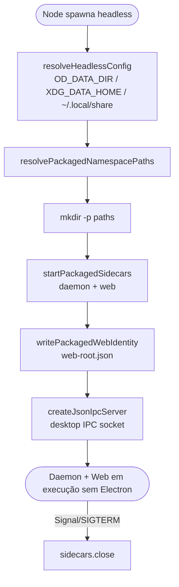
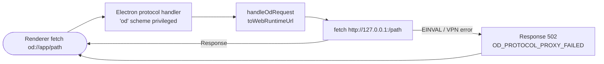
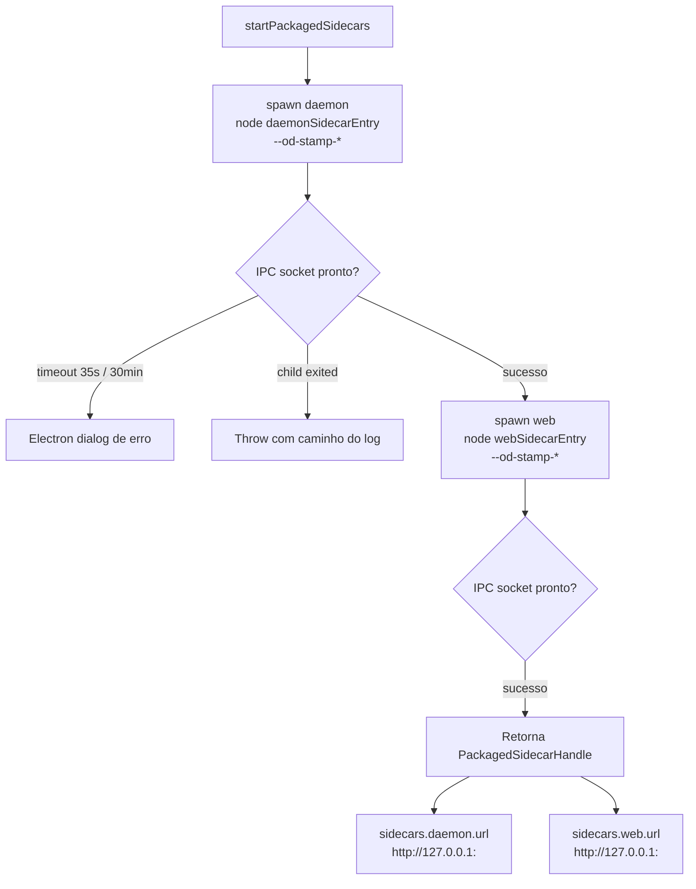
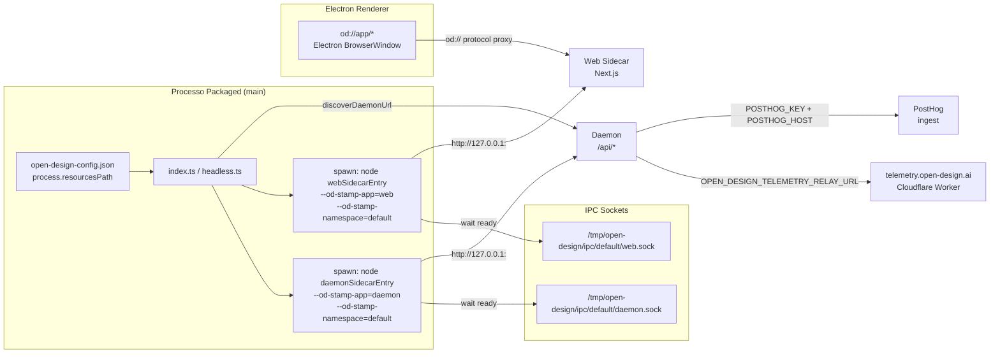

# Packaged — Especificação Técnica Visual 360°
> Documento unificado. Cobertura completa.

## 1. Variáveis de Ambiente

| Variável | Tipo | Padrão | Obrigatória | Descrição |
|---|---|---|---|---|
| `OD_PACKAGED_CONFIG_PATH` | `string` (caminho absoluto) | — | Não | Caminho explícito para `open-design-config.json`. Quando definido, sobrepõe todos os outros locais de leitura do arquivo de config. |
| `OD_PACKAGED_NAMESPACE` | `string` | Valor de `SIDECAR_DEFAULTS.namespace` | Não | Namespace de execução. Determina o subdiretório de dados/logs/runtime. Sobrepõe o valor do arquivo de config. |
| `OD_PACKAGED_ALLOW_WEB_OUTPUT_MODE_OVERRIDE` | `'1'|'true'|'yes'` | — | Não | Habilita a sobrescrita do `webOutputMode` em runtime via `OD_WEB_OUTPUT_MODE`. Desabilitado por padrão como proteção. |
| `OD_WEB_OUTPUT_MODE` | `'server'|'standalone'` | `'server'` | Não | Modo de output do web sidecar. Lido apenas se `OD_PACKAGED_ALLOW_WEB_OUTPUT_MODE_OVERRIDE` estiver ativo. |
| `OD_WEB_STANDALONE_ROOT` | `string` (caminho) | — | Não | Caminho raiz para o output standalone do Next.js. Lido quando `webOutputMode === 'standalone'`. |
| `OD_DATA_DIR` | `string` (caminho, suporta `~/`) | Plataforma-dependente | Não | Relocaliza **todos** os dados de runtime do daemon para `<dir>`. No headless entry, determina `namespaceBaseRoot`. Expande `~/` e suporta caminhos relativos ancorados em `projectRoot`. |
| `OD_RESOURCE_ROOT` | `string` (caminho) | `<dist>/../../../open-design` | Não | Caminho para recursos somente-leitura do daemon: `skills/`, `design-systems/`, `frames/`. Injetado como `OD_RESOURCE_ROOT` no spawn env do daemon sidecar. |
| `OD_LEGACY_DATA_DIR` | `string` (caminho) | — | Não | Quando definido, ativa modo de migração de dados legados com timeout de 30 min (vs. 35s padrão). |
| `OPEN_DESIGN_TELEMETRY_RELAY_URL` | `string` (URL) | `null` | Não | URL do Cloudflare Worker de telemetria. Baked em `packaged-config.json` por `tools/pack` em build time. Forwarded ao daemon sidecar como `OPEN_DESIGN_TELEMETRY_RELAY_URL`. |
| `POSTHOG_KEY` | `string` (`phc_*`) | `null` | Não | PostHog ingest key (write-only, público por design). Baked por `tools/pack` em build time. Forwarded ao daemon. |
| `POSTHOG_HOST` | `string` (URL) | `null` | Não | PostHog ingest host. Baked por `tools/pack` em build time. |
| `XDG_DATA_HOME` | `string` (caminho) | `~/.local/share` | Não | Usado no headless entry para derivar `namespaceBaseRoot` quando `OD_DATA_DIR` não está definido. |
| `OD_DESKTOP_LOG_ECHO` | `'1'|'true'|'yes'` | — | Não | Quando definido, ecoa logs do desktop para stdout além de escrever no arquivo de log. |

---

## 2. Workflows (Mermaid)

### 2.1 Fluxo de Startup — Entry Electron Completo (`index.ts`)

```mermaid
flowchart TD
    Start([Electron spawna packaged main]) --> ReadConfig[readPackagedConfig\nopen-design-config.json]
    ReadConfig --> ParseArgv[readProcessStamp argv\n→ namespace do stamp ou config]
    ParseArgv --> ResolvePaths[resolvePackagedNamespacePaths\n→ PackagedNamespacePaths]
    ResolvePaths --> EnsurePaths[ensurePackagedNamespacePaths\ncriar diretórios necessários]
    EnsurePaths --> CreateLogger[createPackagedDesktopLogger]
    CreateLogger --> AttachLogs[attachPackagedDesktopProcessLogging\nuncaughtException + unhandledRejection]
    AttachLogs --> ElectronPaths[applyPackagedElectronPathOverrides\nuserData, cache, logs → namespace-scoped]
    ElectronPaths --> WriteIdentity[writePackagedDesktopIdentity\ndesktop-root.json]
    WriteIdentity --> AppReady[app.whenReady]
    AppReady --> LaunchEnv[applyLaunchEnv\nSidecar env vars no process.env]
    LaunchEnv --> Bootstrap[bootstrapSidecarRuntime]
    Bootstrap --> StartSidecars[startPackagedSidecars\ndaemon + web]
    StartSidecars --> WaitDaemon[Wait daemon IPC ready\n35s timeout\n30min se OD_LEGACY_DATA_DIR]
    WaitDaemon --> WaitWeb[Wait web IPC ready]
    WaitWeb --> RegisterProtocol[registerOdProtocol\n'od://app/']
    RegisterProtocol --> DesktopMain[runDesktopMain\napps/desktop]
    DesktopMain --> Running([App em execução])
    Running -->|Shutdown| CloseSidecars[sidecars.close\ndaemon + web]
    CloseSidecars --> CloseIdentity[identity.close\nremove desktop-root.json]
```



### 2.2 Fluxo de Startup — Entry Headless (`headless.ts`)



### 2.3 Fluxo do Protocolo `od://`



### 2.4 Fluxo de Inicialização de Sidecars



---

## 3. JTBDs

| ID | Persona | Quando… | Quero… | Para que… | Prioridade |
|---|---|---|---|---|---|
| J-01 | Usuário final (macOS) | Baixo e abro o dmg pela primeira vez | O app inicializar daemon e web automaticamente sem configuração manual | Começar a usar o Open Design em segundos | Alta |
| J-02 | Usuário final | Recebo update automático disponível | O app baixar e instalar o update sem interromper meu trabalho | Manter minha versão atualizada sem esforço | Alta |
| J-03 | Desenvolvedor de integração | Quero abrir o Open Design a partir de outra app | Clicar num link `od://` que abre o app diretamente na URL correta | Integrar o Open Design em workflows externos | Média |
| J-04 | Admin de sistema | Instalo o app num diretório protegido sem permissão de escrita | Receber uma mensagem de erro clara com diagnóstico e solução | Corrigir a permissão sem precisar de suporte | Média |
| J-05 | Dev que usa NixOS/headless | Preciso rodar daemon+web sem Electron em servidor | Usar o headless entry que inicia os sidecars como processo Node puro | Integrar Open Design em ambientes sem GUI | Alta |
| J-06 | QA / dev | Quero rodar dois namespaces isolados simultaneamente | Namespace-scoped paths garantirem que dados/logs/runtime não colidirem | Testar múltiplas versões ou configurações em paralelo | Média |
| J-07 | Dev com VPN corporativa | Recebo erro silencioso em fetch de sidecar | Erros `setTypeOfService EINVAL` serem tratados como inofensivos | O app continuar funcionando sem diálogo de erro nativo | Baixa |
| J-08 | Mantenedor | Preciso migrar dados legados de `.od/` para novo formato | Timeout de daemon ser estendido para 30min quando `OD_LEGACY_DATA_DIR` está definido | Migração de multi-GB completar sem o packaged app matar o daemon | Alta |

---

## 4. Casos de Uso

### UC-01 — Instalar o App Packaged

**Ator:** Usuário final  
**Pré-condição:** `tools/pack` gerou artefatos (DMG/NSIS/AppImage).  
**Fluxo Principal:**
1. Usuário baixa o instalador do canal (`stable`, `beta` ou `preview`).
2. macOS: arrasta `.app` para `/Applications/`. Windows: executa NSIS installer. Linux: monta AppImage.
3. Bundle contém `open-design-config.json` em `process.resourcesPath`.
4. Primeiro launch: Electron lê `open-design-config.json`, deriva `namespace`, cria estrutura de diretórios namespace-scoped.

**Fluxo Alternativo:** Diretório alvo sem permissão de escrita → `PackagedPathAccessError` com diagnóstico detalhado exibido em diálogo Electron.  
**Pós-condição:** App instalado e pronto para primeiro launch.

---

### UC-02 — Iniciar pela Primeira Vez (Setup)

**Ator:** Usuário final  
**Pré-condição:** App instalado. `open-design-config.json` presente.  
**Fluxo Principal:**
1. Electron executa `main` → `readPackagedConfig()` lê o arquivo de config.
2. `resolvePackagedNamespacePaths(config, namespace)` deriva todos os caminhos.
3. `ensurePackagedNamespacePaths(paths)` cria: `data/`, `logs/`, `runtime/`, `cache/`, `updates/`, `user-data/`.
4. `createPackagedDesktopLogger(paths)` inicia logging em `logs/desktop/latest.log`.
5. `startPackagedSidecars(...)` spawna daemon → aguarda IPC ready (35s) → spawna web → aguarda IPC ready.
6. `registerOdProtocol(webUrl)` registra `od://` como protocolo privilegiado.
7. `runDesktopMain(...)` abre janela Electron carregando `od://app/`.

**Fluxo Alternativo:** Daemon não fica pronto em 35s → diálogo de erro com caminho do log para diagnóstico.  
**Pós-condição:** App em execução com daemon + web + desktop todos ativos.

---

### UC-03 — Abrir Link `od://`

**Ator:** Sistema operacional / app externo  
**Pré-condição:** App já está em execução com `od://` registrado.  
**Fluxo Principal:**
1. OS ou app externo dispara `od://app/some/path`.
2. Electron intercepta via `protocol.handle('od', ...)`.
3. `handleOdRequest(request, webRuntimeUrl)` converte: pathname/search/hash preservados, host substituído pelo URL real do web sidecar.
4. `fetch` interno (undici) faz request para `http://127.0.0.1:<port>/some/path`.
5. Response retornada ao renderer sem alteração de body.

**Fluxo Alternativo:** Erro de socket (ex: `setTypeOfService EINVAL` em VPN) → Response 502 com payload `{ error: 'OD_PROTOCOL_PROXY_FAILED', message, code }` em vez de crash.  
**Pós-condição:** Renderer recebe response do web sidecar via protocolo `od://`.

---

### UC-04 — Atualizar o App

**Ator:** Updater automático  
**Pré-condição:** App em execução. Nova versão disponível no canal configurado.  
**Fluxo Principal:**
1. Updater consulta feed do canal em `paths.updateRoot`.
2. Download do artefato assinado para `paths.updateRoot`.
3. Daemon sidecar persiste estado antes do shutdown.
4. `sidecars.close()` encerra daemon e web graciosamente.
5. `identity.close()` remove `desktop-root.json`.
6. Electron relança com novo binário.

**Fluxo Alternativo:** Falha de verificação de assinatura → update abortado, versão atual mantida.  
**Pós-condição:** App atualizado rodando com nova versão.

---

### UC-05 — Desinstalar

**Ator:** Usuário final  
**Pré-condição:** App instalado.  
**Fluxo Principal:**
1. macOS: arrasta app para lixeira. Windows: `Add/Remove Programs`. Linux: remove AppImage.
2. Dados de runtime permanecem em `namespaceBaseRoot/<namespace>/` (dados do usuário preservados por design).
3. Para limpeza completa: usuário remove manualmente `~/.local/share/open-design/` (Linux/headless) ou equivalente de plataforma.

**Fluxo Alternativo:** App em execução durante desinstalação → processo termina; sidecars são encerrados via `beforeShutdown`.  
**Pós-condição:** Binários removidos. Dados do usuário opcionalmente preservados.

---

## 5. FAZ / NÃO FAZ

| ✅ FAZ | ❌ NÃO FAZ |
|---|---|
| Lê `open-design-config.json` e resolve caminhos namespace-scoped | Conter lógica de produto, business logic ou UI |
| Spawna daemon e web como sidecars gerenciados com IPC wait | Registrar `od://` antes de `app.whenReady()` (protocol.registerSchemesAsPrivileged é pré-ready) |
| Registra `od://` como protocolo Electron privilegiado e faz proxy para web sidecar | Construir stamp args manualmente — usa primitivas de `@open-design/sidecar-proto` |
| Fornece entry headless para ambientes sem Electron (NixOS, servers) | Hardcodar portas de daemon ou web (portas são transientes) |
| Trata `setTypeOfService EINVAL` (VPN/macOS) como erro inofensivo | Colocar output Next.js em `OD_RESOURCE_ROOT` (apenas recursos read-only do daemon ficam lá) |
| Isola dados/logs/runtime por namespace (suporte a múltiplas instâncias) | Importar diretamente de `apps/daemon/src` ou `apps/web/src` |
| Escreve `desktop-root.json` e `web-root.json` como identity files | Compartilhar portas ou IPC sockets entre namespaces diferentes |
| Estende timeout de daemon para 30min em migração legada (`OD_LEGACY_DATA_DIR`) | Enviar segredos (Langfuse keys) no config baked — apenas `telemetryRelayUrl` vai no bundle |
| Bake `POSTHOG_KEY` (token write-only, padrão da PostHog) no config de build | Validar credentials de API no processo packaged |
| Suporta dois modos de web: `server` (SSR sidecar) e `standalone` (Next.js standalone) | Criar aliases de lifecycle raiz como `pnpm dev` ou `pnpm start` |

---

## 6. User Inputs → System Outputs → Outcomes

| User Input | Ação / Endpoint | System Output | Outcome |
|---|---|---|---|
| Launch do app | `main()` em `index.ts` | Daemon + web sidecars em execução; janela Electron aberta em `od://app/` | App totalmente operacional |
| Clique em link `od://app/design/123` | `handleOdRequest(request, webUrl)` | Proxy para `http://127.0.0.1:<port>/design/123` | Renderer navega para a rota correta do web app |
| `OD_PACKAGED_CONFIG_PATH=/tmp/custom.json` | `readPackagedConfig()` | Config lida do caminho explícito | Configuração customizada aplicada |
| `OD_PACKAGED_NAMESPACE=staging` | Resolução de namespace | Paths sob `namespaceBaseRoot/staging/` | Dados isolados do namespace padrão |
| Diretório de dados sem permissão | `verifyPackagedDataRootWritable()` | `PackagedPathAccessError` com diagnóstico completo | Diálogo de erro acionável exibido ao usuário |
| `OD_LEGACY_DATA_DIR=/old/.od` | `resolveDaemonStatusTimeoutMs()` | Timeout daemon = 30 min | Migração de dados legados completa sem kill do processo |
| `OD_DESKTOP_LOG_ECHO=1` | Logger do packaged desktop | Logs ecoados em stdout além do arquivo | Dev vê logs no terminal durante desenvolvimento |
| `OD_DATA_DIR=~/meus-dados` | Headless config | `namespaceBaseRoot` aponta para `~/meus-dados/namespaces` | Dados em localização customizada |
| Shutdown do app (janela fechada) | `beforeShutdown()` | `sidecars.close()` + `identity.close()` | Daemon e web encerrados graciosamente; identity files removidos |
| `OD_RESOURCE_ROOT=/app/resources` | Env do daemon sidecar | `OD_RESOURCE_ROOT` injetado no spawn env | Daemon lê skills/design-systems/frames do caminho correto |

---

## 7. Operações de Start/Stop, Protocolo e Configuração

### Start / Stop de Sidecars

| Operação | Função | Timeout | Descrição |
|---|---|---|---|
| Start daemon | `startPackagedSidecars` → `spawn(daemonSidecarEntry)` | 35s / 30min (legado) | Spawna daemon com stamp args; aguarda IPC socket pronto |
| Start web | `startPackagedSidecars` → `spawn(webSidecarEntry)` | Padrão sidecar | Spawna web após daemon pronto; aguarda IPC socket pronto |
| Stop gracioso | `sidecars.close()` | — | Encerra daemon e web; aguarda saída dos processos |
| Stop forçado | `stopProcesses([child])` | — | Fallback via `@open-design/platform` se close normal falhar |

### Protocolo `od://`

| Ação | Função | Descrição |
|---|---|---|
| Registrar scheme | `protocol.registerSchemesAsPrivileged` | Executado antes de `app.whenReady()`. Scheme: `od`, privileges: `secure`, `standard`, `corsEnabled`, `stream`, `supportFetchAPI` |
| Resolver URL de entrada | `packagedEntryUrl()` | Retorna `od://app/` — URL base do renderer |
| Handler de request | `handleOdRequest(request, webUrl, fetchImpl)` | Converte `od://app/<path>` → `http://127.0.0.1:<port>/<path>` e faz proxy |

### Leitura de Configuração

| Prioridade | Fonte | Condição |
|---|---|---|
| 1 | `OD_PACKAGED_CONFIG_PATH` (env var) | Quando definido; falha se arquivo não existir |
| 2 | `process.resourcesPath/open-design-config.json` | Padrão Electron packaged |
| 3 | `app.getAppPath()/open-design-config.json` | Fallback quando resourcesPath não tem config |
| 4 | `{}` (objeto vazio) | Fallback final — defaults aplicados |

---

## 8. Canais IPC e Conectores

| Canal | Tipo | Direção | Descrição |
|---|---|---|---|
| Desktop ↔ Daemon IPC | POSIX socket (`/tmp/open-design/ipc/<ns>/daemon.sock`) | Bidirecional | Packaged polling status, discoverDaemonUrl |
| Desktop ↔ Web IPC | POSIX socket (`/tmp/open-design/ipc/<ns>/web.sock`) | Bidirecional | Packaged polling status, discoverWebUrl |
| Renderer → Web Sidecar | `od://` protocol + `fetch` (undici) | Request/Response | Todo tráfego do renderer passa pelo proxy `od://` |
| Desktop → Daemon (URL) | `sidecars.daemon.url` | Leitura | Main process usa URL HTTP direta (não `od://`) para fetch para o daemon |
| `POST /api/runs/:id/tool-result` | HTTP → Daemon | Unidirecional | Web envia `tool_result` para runs em andamento no daemon |

---

## 9. URLs e Conectores



---

## 10. Dados, Schemas e Configurações

### Schema de `open-design-config.json` (RawPackagedConfig)

```typescript
// apps/packaged/src/config.ts — RawPackagedConfig
{
  appVersion?: string;                // Ex: '0.8.0'
  daemonCliEntryRelative?: string;    // Caminho relativo ao bin CLI do daemon
  daemonSidecarEntryRelative?: string; // Caminho relativo ao sidecar entry do daemon
  namespace?: string;                  // Ex: 'default', 'staging'
  namespaceBaseRoot?: string;         // Base para namespaces (abs path)
  nodeCommandRelative?: string;       // Caminho relativo ao binário Node bundled
  resourceRoot?: string;              // Abs path para skills/, design-systems/, frames/
  telemetryRelayUrl?: string;         // URL do worker de telemetria (baked por tools/pack)
  posthogKey?: string;                // 'phc_*' ingest key (público por design)
  posthogHost?: string;               // URL do PostHog host
  webSidecarEntryRelative?: string;   // Caminho relativo ao sidecar entry do web
  webStandaloneRoot?: string;         // Raiz do Next.js standalone output
  webOutputMode?: 'server' | 'standalone'; // Default: 'server'
}
```

### Schema de `PackagedNamespacePaths`

```typescript
// apps/packaged/src/paths.ts
// Base: namespaceBaseRoot/<namespace>/
{
  cacheRoot:                // <ns>/cache
  dataRoot:                 // <ns>/data  ← OD_DATA_DIR para daemon
  desktopIdentityPath:      // <ns>/runtime/desktop-root.json
  desktopLogPath:           // <ns>/logs/desktop/latest.log
  desktopLogsRoot:          // <ns>/logs/desktop/
  electronSessionDataRoot:  // <ns>/user-data/session
  electronUserDataRoot:     // <ns>/user-data
  headlessIdentityPath:     // <ns>/runtime/headless-root.json
  logsRoot:                 // <ns>/logs/
  namespaceRoot:            // namespaceBaseRoot/<namespace>
  resourceRoot:             // config.resourceRoot  (read-only resources)
  runtimeRoot:              // <ns>/runtime/
  updateRoot:               // <ns>/updates/
  webIdentityPath:          // <ns>/runtime/web-root.json
}
```

### Schema de `desktop-root.json` (PackagedDesktopRootIdentity)

```typescript
{
  appPath: string;        // Caminho do .app (macOS: resolve via executablePath)
  executablePath: string; // process.execPath
  logPath: string;        // <ns>/logs/desktop/latest.log
  namespaceRoot: string;  // <ns>/
  pid: number;            // process.pid
  ppid: number;           // process.ppid
  stamp: SidecarStamp;    // { app, ipc, mode, namespace, source }
  startedAt: string;      // ISO 8601
  updatedAt: string;      // ISO 8601
  version: 1;             // Schema version
}
```

### Schema de `SidecarStamp` (cinco campos obrigatórios)

```typescript
// @open-design/sidecar-proto
{
  app: AppKey;        // Ex: 'desktop', 'daemon', 'web'
  ipc: string;        // Caminho absoluto do socket IPC deste app
  mode: SidecarMode;  // Ex: 'runtime'
  namespace: string;  // Ex: 'default'
  source: SidecarSource; // Ex: 'packaged'
}
```

### Allowlist de Env para Child Processes

```
// Variáveis de sistema que o packaged child process recebe:
HOME, HTTP_PROXY, HTTPS_PROXY, LANG, LC_ALL, LOGNAME,
NO_PROXY, TMPDIR, USER, VP_HOME
// + todas as vars que terminam em _API_KEY ou _TOKEN
//   (quando includeProviderSecrets = true)
```

### Lógica de Detecção de Erro Inofensivo de Socket

```
isHarmlessSocketOptionError(error):
  1. Deve ser instância de Error
  2. error.message deve conter 'setTypeOfService'
  3. Se error.code presente: deve ser 'EINVAL' (qualquer outro → não é inofensivo)
  4. Se error.code ausente: error.message deve conter 'EINVAL'
  → true: log + swallow | false: deixa crashar
```

### Resolução de `namespaceBaseRoot` no Headless Entry

```
Prioridade:
1. OD_DATA_DIR → join(resolve(OD_DATA_DIR), 'namespaces')
2. XDG_DATA_HOME → join(XDG_DATA_HOME, 'open-design', 'namespaces')
3. Default → join(homedir(), '.local/share', 'open-design', 'namespaces')
```
