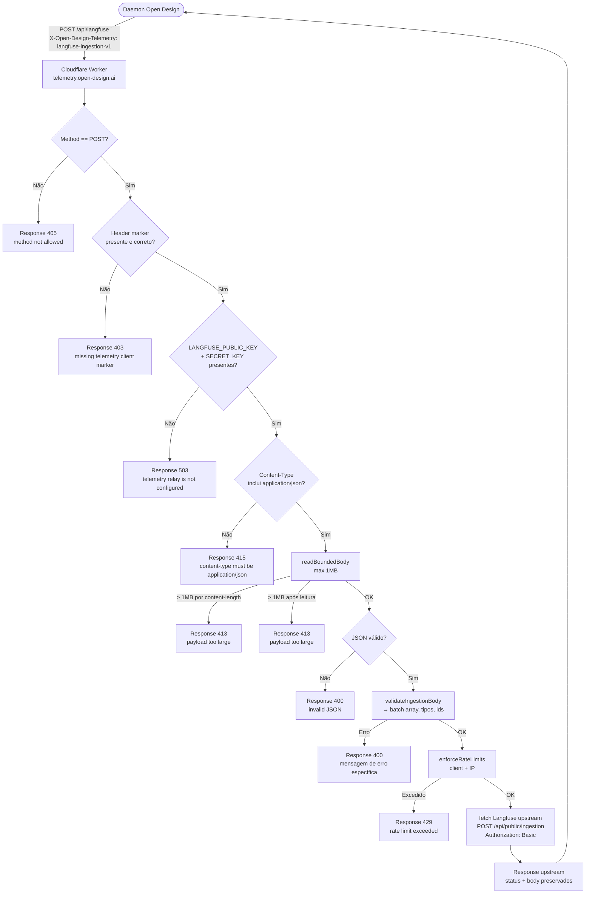
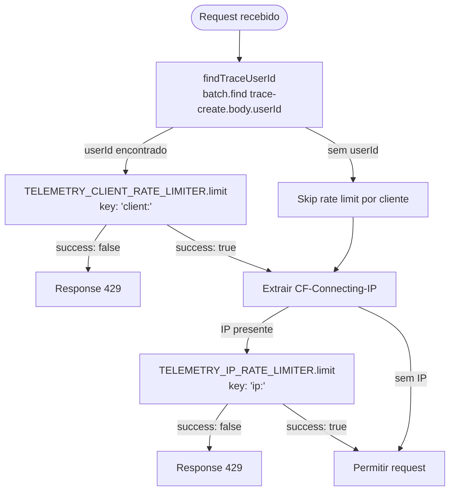
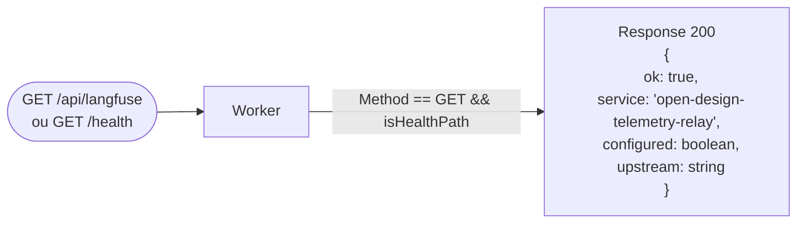
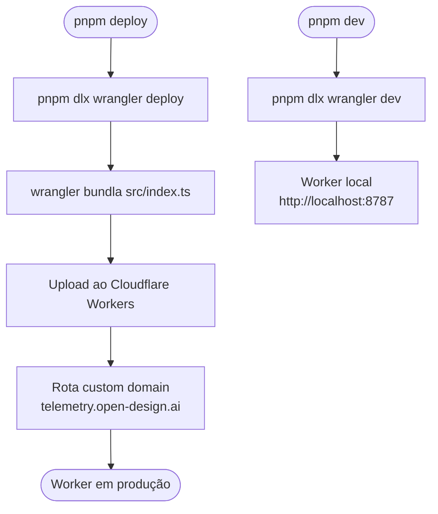

# Telemetry Worker — Especificação Técnica Visual 360°
> Documento unificado. Cobertura completa.

## 1. Variáveis de Ambiente

| Variável | Tipo | Padrão | Obrigatória | Descrição |
|---|---|---|---|---|
| `LANGFUSE_PUBLIC_KEY` | `string` | — | Sim (produção) | Chave pública do Langfuse para Basic Auth no upstream. Ausência → resposta 503. |
| `LANGFUSE_SECRET_KEY` | `string` | — | Sim (produção) | Chave secreta do Langfuse para Basic Auth no upstream. Nunca exposta nas responses. |
| `LANGFUSE_BASE_URL` | `string` (URL) | `https://us.cloud.langfuse.com` | Não | Base URL do Langfuse. Concatenado com `/api/public/ingestion` para formar o URL upstream. Trailing slashes são removidos. |
| `TELEMETRY_CLIENT_RATE_LIMITER` | `RateLimitBinding` | — | Não (degrada graciosamente) | Binding do Cloudflare Rate Limiting para limite por `userId`. Ausência → rate limit por cliente não aplicado. |
| `TELEMETRY_IP_RATE_LIMITER` | `RateLimitBinding` | — | Não (degrada graciosamente) | Binding do Cloudflare Rate Limiting para limite por IP (`CF-Connecting-IP`). Ausência → rate limit por IP não aplicado. |

> Segredos (`LANGFUSE_PUBLIC_KEY`, `LANGFUSE_SECRET_KEY`) são configurados como Cloudflare Worker Secrets via `wrangler secret put` e nunca aparecem no `wrangler.toml`.

---

## 2. Workflows (Mermaid)

### 2.1 Fluxo Principal — POST /api/langfuse



### 2.2 Fluxo de Rate Limiting



### 2.3 Fluxo de Health Check



### 2.4 Fluxo de Deploy



---

## 3. JTBDs

| ID | Persona | Quando… | Quero… | Para que… | Prioridade |
|---|---|---|---|---|---|
| J-01 | Daemon Open Design | Crio uma trace de uma sessão de usuário | Enviar batch de eventos para o Langfuse sem expor minhas credenciais ao cliente | Ter observabilidade da IA sem riscos de segurança | Alta |
| J-02 | Mantenedor | Um cliente abusivo tenta enviar milhares de eventos | Rate limit por userId bloquear automaticamente após 120 req/60s | Proteger minha conta Langfuse de custos inesperados | Alta |
| J-03 | Engenheiro de segurança | Um terceiro tenta usar o relay sem permissão | Header `X-Open-Design-Telemetry: langfuse-ingestion-v1` ser validado e 403 retornado | Impedir uso não autorizado do relay | Alta |
| J-04 | Dev que testa localmente | Preciso validar a integração de telemetria no daemon | `pnpm dev` subir o worker localmente em `localhost:8787` | Iterar rápido sem fazer deploy | Média |
| J-05 | Mantenedor de infra | Preciso saber se o worker está configurado corretamente | `GET /health` retornar `configured: true/false` com upstream URL | Diagnosticar em segundos sem inspecionar secrets | Média |
| J-06 | Daemon | Envio um payload com tipo de evento não reconhecido | Worker retornar 400 com mensagem clara sobre o tipo inválido | Saber imediatamente que meu evento precisa de correção | Alta |
| J-07 | Engenheiro de confiabilidade | Uma VPN ou proxy gera alto volume de requests do mesmo IP | Rate limit por IP bloquear após 600 req/60s antes de atingir Langfuse | Proteger upstream de picos de tráfego abusivo | Média |
| J-08 | Dev | Langfuse upstream retorna erro 4xx ou 5xx | Worker repassar o status e body exatos do Langfuse ao cliente | Depurar erros de configuração ou dados sem perda de informação | Média |

---

## 4. Casos de Uso

### UC-01 — Daemon Envia Evento de Trace

**Ator:** Daemon Open Design  
**Pré-condição:** `LANGFUSE_PUBLIC_KEY` e `LANGFUSE_SECRET_KEY` configurados no Worker. Daemon com `telemetryRelayUrl` definido.  
**Fluxo Principal:**
1. Daemon compõe batch de eventos com pelo menos um `trace-create` contendo `body.userId`.
2. POST para `https://telemetry.open-design.ai/api/langfuse` com:
   - `Content-Type: application/json`
   - `X-Open-Design-Telemetry: langfuse-ingestion-v1`
   - Body: `{ batch: [ { id, type, body }, ... ] }`
3. Worker valida header marker, credenciais, content-type, tamanho (≤ 1MB), e estrutura do batch.
4. Rate limit verificado por `userId` e por IP.
5. Worker faz POST para `https://us.cloud.langfuse.com/api/public/ingestion` com `Authorization: Basic <b64(pk:sk)>`.
6. Response do Langfuse (status + body) repassada ao daemon.

**Fluxo Alternativo:** Langfuse retorna 429 → daemon recebe 429 com body do Langfuse.  
**Pós-condição:** Eventos registrados no Langfuse para observabilidade.

---

### UC-02 — Rate Limit Ativado

**Ator:** Cliente abusivo / daemon com bug de retry  
**Pré-condição:** `TELEMETRY_CLIENT_RATE_LIMITER` e `TELEMETRY_IP_RATE_LIMITER` configurados (namespace_ids 1001 e 1002).  
**Fluxo Principal:**
1. Cliente envia mais de 120 requests em 60 segundos com mesmo `userId`.
2. `findTraceUserId` extrai `userId` do primeiro `trace-create` no batch.
3. `TELEMETRY_CLIENT_RATE_LIMITER.limit({ key: 'client:<userId>' })` retorna `{ success: false }`.
4. Worker retorna `Response 429 { error: 'rate limit exceeded' }` antes de tocar no upstream.

**Fluxo Alternativo:** `userId` ausente no batch → rate limit por IP verificado separadamente. IP limite = 600 req/60s.  
**Pós-condição:** Upstream Langfuse protegido; cliente informado para reduzir volume.

---

### UC-03 — Evento Inválido Rejeitado

**Ator:** Daemon com versão desatualizada ou bug  
**Pré-condição:** Worker em produção.  
**Fluxo Principal:**
1. Daemon envia batch com `type: 'metrics-push'` (não na allowlist).
2. `validateIngestionBody` itera o batch; encontra `batch[0].type is not allowed`.
3. Worker retorna `Response 400 { error: 'body.batch[0].type is not allowed' }`.
4. Nenhum dado enviado ao Langfuse.

**Casos de validação cobertos:**
- `body` não é objeto → 400 `body must be a JSON object`
- `batch` não é array → 400 `body.batch must be an array`
- `batch` vazio → 400 `body.batch must not be empty`
- `batch.length > 100` → 400 `body.batch has too many events`
- `batch[N]` não é objeto → 400 com índice
- `batch[N].id` ausente ou não-string → 400 com índice
- `batch[N].id.length > 200` → 400 com índice
- `batch[N].type` fora da allowlist → 400 com índice
- `batch[N].body` não é objeto → 400 com índice

**Pós-condição:** Daemon recebe erro específico com índice do evento problemático.

---

### UC-04 — Deploy do Worker

**Ator:** Mantenedor / CI  
**Pré-condição:** `wrangler` configurado; `account_id` e custom domain no `wrangler.toml`.  
**Fluxo Principal:**
1. `pnpm --filter @open-design/telemetry-worker deploy` executa `pnpm dlx wrangler deploy`.
2. Wrangler bundla `src/index.ts` com `compatibility_date: 2026-05-01`.
3. Upload para Cloudflare Workers com nome `open-design-telemetry-relay`.
4. Rota `telemetry.open-design.ai` (custom domain) atualizada.
5. Rate limiters (namespace_ids 1001 e 1002) associados via bindings do wrangler.toml.

**Fluxo Alternativo:** Secrets não configurados → Worker deploy ocorre, mas responde 503 até `wrangler secret put` executado.  
**Pós-condição:** Worker ativo em `https://telemetry.open-design.ai`.

---

### UC-05 — Monitorar Métricas do Worker

**Ator:** Mantenedor de infra  
**Pré-condição:** Worker em produção.  
**Fluxo Principal:**
1. Mantenedor acessa `GET https://telemetry.open-design.ai/health`.
2. Worker retorna `{ ok: true, service: 'open-design-telemetry-relay', configured: boolean, upstream: string }`.
3. `configured: true` indica que ambas as credenciais Langfuse estão presentes.
4. `upstream` mostra o URL final que será usado para forwarding.
5. Para métricas de volume/latência: Cloudflare Dashboard → Workers & Pages → `open-design-telemetry-relay` → Metrics.

**Pós-condição:** Estado de configuração verificado sem expor secrets.

---

## 5. FAZ / NÃO FAZ

| ✅ FAZ | ❌ NÃO FAZ |
|---|---|
| Faz relay autenticado de eventos de telemetria para o Langfuse upstream | Armazenar eventos localmente ou em KV do Cloudflare |
| Valida estrutura do batch antes de tocar no upstream (fail fast) | Fazer parse ou transformar o conteúdo dos eventos (repassa rawBody) |
| Aplica rate limiting por `userId` (120 req/60s) e por IP (600 req/60s) | Expor as credenciais Langfuse ao daemon ou cliente |
| Retorna erros específicos com índice do evento problemático em batches | Filtrar ou modificar campos dos eventos no batch |
| Preserva status code e body exatos do Langfuse upstream na response | Implementar retry logic — responsabilidade do daemon |
| Responde 503 quando secrets não configurados (fail safe) | Logar conteúdo dos eventos (privacidade dos dados do usuário) |
| Health endpoint (`GET /api/langfuse` e `GET /health`) sem autenticação | Aceitar outros tipos de evento além da allowlist definida |
| Limita payload a 1MB e batch a 100 eventos | Processar tipos de HTTP além de GET (health) e POST (ingestion) |
| Remove trailing slashes da LANGFUSE_BASE_URL antes de concatenar path | Aceitar requests sem o header marker `X-Open-Design-Telemetry` |
| Degrada graciosamente quando bindings de rate limit ausentes | Bloquear requests de health check com validação de marker |

---

## 6. User Inputs → System Outputs → Outcomes

| User Input | Ação / Endpoint | System Output | Outcome |
|---|---|---|---|
| `POST /api/langfuse` (válido) | `handleRequest` → `enforceRateLimits` → `fetch upstream` | Response do Langfuse (200/207/etc.) | Eventos registrados no Langfuse |
| `POST /api/langfuse` sem header marker | `handleRequest` → check header | `403 { error: 'missing telemetry client marker' }` | Request rejeitado antes de qualquer validação de payload |
| `POST /api/langfuse` sem credenciais configuradas | `handleRequest` → `hasLangfuseCredentials` | `503 { error: 'telemetry relay is not configured' }` | Request rejeitado; mantenedor sabe que secrets faltam |
| `POST /api/langfuse` com `Content-Type: text/plain` | `handleRequest` → check content-type | `415 { error: 'content-type must be application/json' }` | Cliente informa content-type correto |
| `POST /api/langfuse` com body > 1MB | `readBoundedBody` | `413 { error: 'payload too large' }` | Payload abusivo rejeitado antes de consumir memória |
| `POST /api/langfuse` com `batch: []` | `validateIngestionBody` | `400 { error: 'body.batch must not be empty' }` | Batch vazio rejeitado |
| `POST /api/langfuse` com `batch.length > 100` | `validateIngestionBody` | `400 { error: 'body.batch has too many events' }` | Batch excessivamente grande rejeitado |
| `POST /api/langfuse` com tipo inválido | `validateIngestionBody` | `400 { error: 'body.batch[N].type is not allowed' }` | Evento inválido rejeitado com índice |
| `POST /api/langfuse` excedendo rate limit por userId | `enforceRateLimits` → CLIENT_RATE_LIMITER | `429 { error: 'rate limit exceeded' }` | Upstream protegido; cliente deve recuar |
| `POST /api/langfuse` excedendo rate limit por IP | `enforceRateLimits` → IP_RATE_LIMITER | `429 { error: 'rate limit exceeded' }` | Flood por IP bloqueado |
| `GET /api/langfuse` | `handleRequest` → GET health path | `200 { ok, service, configured, upstream }` | Status de configuração verificado |
| `GET /health` | `handleRequest` → GET health path | `200 { ok, service, configured, upstream }` | Alias de health check |
| `DELETE /api/langfuse` | `handleRequest` → method check | `405 { error: 'method not allowed' }` | Métodos não suportados rejeitados |

---

## 7. CRUD / Operações

### Operações de Ingestion

| Operação | Endpoint | Descrição |
|---|---|---|
| Ingerir batch de eventos | `POST /api/langfuse` | Valida, rate-limita e faz forward para Langfuse |
| Health check | `GET /api/langfuse` ou `GET /health` | Retorna status de configuração do worker |

### Operações de Rate Limiting

| Operação | Binding | Key | Limite |
|---|---|---|---|
| Limite por cliente | `TELEMETRY_CLIENT_RATE_LIMITER` (namespace 1001) | `client:<userId>` | 120 req / 60s |
| Limite por IP | `TELEMETRY_IP_RATE_LIMITER` (namespace 1002) | `ip:<CF-Connecting-IP>` | 600 req / 60s |

### Operações de Deploy

| Operação | Comando | Descrição |
|---|---|---|
| Deploy produção | `pnpm --filter @open-design/telemetry-worker deploy` | Bundla e faz upload para Cloudflare |
| Dev local | `pnpm --filter @open-design/telemetry-worker dev` | Worker local via `wrangler dev` |
| Configurar secrets | `pnpm dlx wrangler secret put LANGFUSE_PUBLIC_KEY` | Injeta secret no Worker sem expô-lo no código |
| Testes | `pnpm --filter @open-design/telemetry-worker test` | Vitest run |

---

## 8. APIs e Endpoints

| Método | Path | Auth | Header obrigatório | Payload | Response | Descrição |
|---|---|---|---|---|---|---|
| `GET` | `/api/langfuse` | — | — | — | `200 { ok, service, configured, upstream }` | Health check. `configured` indica se ambas as Langfuse credentials estão presentes. |
| `GET` | `/health` | — | — | — | `200 { ok, service, configured, upstream }` | Alias do health check. |
| `POST` | `/api/langfuse` | `LANGFUSE_PUBLIC_KEY` + `LANGFUSE_SECRET_KEY` (via Basic Auth no upstream) | `X-Open-Design-Telemetry: langfuse-ingestion-v1` | `{ batch: Event[] }` (JSON, ≤ 1MB, ≤ 100 eventos) | Upstream Langfuse response ou erro estruturado | Ingestion de eventos de telemetria. |
| `*` | `*` (outros) | — | — | — | `405 { error: 'method not allowed' }` | Qualquer outro método rejeitado. |

### Upstream Chamado

| Método | URL | Auth | Payload | Response |
|---|---|---|---|---|
| `POST` | `${LANGFUSE_BASE_URL}/api/public/ingestion` | `Authorization: Basic base64(pk:sk)` | Raw body recebido (não modificado) | Repassada integralmente ao cliente |

---

## 9. URLs e Conectores

```mermaid
graph LR
    subgraph "Daemon Open Design"
        DaemonCode["daemon\ntelemetry client"] -->|"POST /api/langfuse\nX-Open-Design-Telemetry: langfuse-ingestion-v1\nContent-Type: application/json"| Worker
    end

    subgraph "Cloudflare Workers"
        Worker["open-design-telemetry-relay\ntelemetry.open-design.ai"]
        RL1["Rate Limiter\nCLIENT\nns:1001\n120/60s"]
        RL2["Rate Limiter\nIP\nns:1002\n600/60s"]
        Worker -->|key: client:userId| RL1
        Worker -->|key: ip:CF-IP| RL2
    end

    subgraph "Langfuse"
        Langfuse["us.cloud.langfuse.com\n/api/public/ingestion"]
    end

    Worker -->|"POST Authorization: Basic <b64>\nraw body"| Langfuse
    Langfuse -->|status + body| Worker
    Worker -->|status + body| DaemonCode

    Infra[Mantenedor] -->|"GET /health"| Worker
    Wrangler[wrangler deploy / wrangler secret put] -->|deploy + secrets| Worker
```

---

## 10. Dados, Schemas e Configurações

### Schema do Payload de Ingestion

```typescript
// Payload POST /api/langfuse — validado por validateIngestionBody()
interface IngestionPayload {
  batch: IngestionEvent[];  // Obrigatório. Array não-vazio. Máximo: 100 eventos.
}

interface IngestionEvent {
  id: string;               // Obrigatório. String não-vazia. Máximo: 200 caracteres.
  type: AllowedEventType;   // Obrigatório. Deve ser um dos 5 tipos permitidos.
  body: Record<string, unknown>; // Obrigatório. Objeto JSON. Conteúdo livre.
}

type AllowedEventType =
  | 'trace-create'
  | 'span-create'
  | 'generation-create'
  | 'event-create'
  | 'score-create';
```

### Limites do Payload

| Parâmetro | Valor | Verificação |
|---|---|---|
| Tamanho máximo do body | 1.048.576 bytes (1 MB) | Por `content-length` header + por tamanho real após leitura |
| Número máximo de eventos no batch | 100 | `batch.length > MAX_BATCH_EVENTS` |
| Tamanho máximo do campo `id` | 200 caracteres | `event.id.length > 200` |
| Tamanho máximo do campo `userId` (para rate limiting) | 200 caracteres (truncado) | `userId.slice(0, 200)` |

### Allowlist de Tipos de Evento

```typescript
const ALLOWED_EVENT_TYPES = new Set([
  'trace-create',       // Criação de trace (raiz de uma sessão de observabilidade)
  'span-create',        // Span de execução dentro de uma trace
  'generation-create',  // Evento de geração de LLM
  'event-create',       // Evento genérico de instrumentação
  'score-create',       // Score/avaliação associado a uma trace
]);
```

### Lógica de Rate Limiting

```
Algoritmo: Cloudflare Rate Limiting (sliding window, namespace_id baseado)

Rate Limiter por CLIENTE:
  - Binding: TELEMETRY_CLIENT_RATE_LIMITER (namespace_id: 1001)
  - Key: 'client:<userId>'
  - userId: extraído do primeiro evento 'trace-create' com body.userId string
  - Limite: 120 requests por 60 segundos
  - Comportamento se binding ausente: skip (degrada graciosamente)

Rate Limiter por IP:
  - Binding: TELEMETRY_IP_RATE_LIMITER (namespace_id: 1002)
  - Key: 'ip:<CF-Connecting-IP>'
  - IP: header 'CF-Connecting-IP' (injetado pelo Cloudflare)
  - Limite: 600 requests por 60 segundos
  - Comportamento se binding ausente ou sem IP: skip

Ordem de verificação: CLIENT primeiro → IP segundo
Primeiro limite ativado retorna 429 imediatamente (short-circuit)
```

### Construção da URL Upstream Langfuse

```typescript
// Lógica: resolveLangfuseUrl(env)
const base = (env.LANGFUSE_BASE_URL?.trim() || 'https://us.cloud.langfuse.com')
  .replace(/\/+$/, '');  // Remove trailing slashes
const upstream = `${base}/api/public/ingestion`;
// Default: https://us.cloud.langfuse.com/api/public/ingestion
```

### Construção do Header de Autenticação Upstream

```typescript
// basicAuthHeader(publicKey, secretKey)
// 1. Encode 'pk:sk' como UTF-8 bytes
// 2. Converte para binary string
// 3. btoa() para base64
// 4. Retorna 'Basic <base64>'
// Note: usa TextEncoder + loop manual em vez de Buffer
//       (compatibilidade com Cloudflare Workers runtime)
```

### Configuração `wrangler.toml`

```toml
name = "open-design-telemetry-relay"
account_id = "64ad4569ffd912432d6b86d5656484c4"
main = "src/index.ts"
compatibility_date = "2026-05-01"
workers_dev = false

routes = [
  { pattern = "telemetry.open-design.ai", custom_domain = true }
]

[vars]
# Var pública (não-secret) — URL base do Langfuse
LANGFUSE_BASE_URL = "https://us.cloud.langfuse.com"

# Secrets (via wrangler secret put — não aparecem aqui):
# LANGFUSE_PUBLIC_KEY
# LANGFUSE_SECRET_KEY

[[ratelimits]]
name = "TELEMETRY_CLIENT_RATE_LIMITER"
namespace_id = "1001"
  [ratelimits.simple]
  limit = 120
  period = 60

[[ratelimits]]
name = "TELEMETRY_IP_RATE_LIMITER"
namespace_id = "1002"
  [ratelimits.simple]
  limit = 600
  period = 60
```

### Constantes do Worker

```typescript
const DEFAULT_LANGFUSE_BASE_URL = 'https://us.cloud.langfuse.com';
const MAX_BODY_BYTES = 1024 * 1024;    // 1 MB
const MAX_BATCH_EVENTS = 100;
const RELAY_MARKER_HEADER = 'X-Open-Design-Telemetry';
const RELAY_MARKER_VALUE = 'langfuse-ingestion-v1';
```

### Respostas de Erro — Tabela Completa

| HTTP Status | Condição | `error` |
|---|---|---|
| `400` | Body não é objeto JSON | `'body must be a JSON object'` |
| `400` | `batch` não é array | `'body.batch must be an array'` |
| `400` | `batch` está vazio | `'body.batch must not be empty'` |
| `400` | `batch.length > 100` | `'body.batch has too many events'` |
| `400` | `batch[N]` não é objeto | `'body.batch[N] must be an object'` |
| `400` | `batch[N].id` inválido (ausente/vazio/não-string) | `'body.batch[N].id must be a string'` |
| `400` | `batch[N].id.length > 200` | `'body.batch[N].id is too long'` |
| `400` | `batch[N].type` fora da allowlist | `'body.batch[N].type is not allowed'` |
| `400` | `batch[N].body` não é objeto | `'body.batch[N].body must be an object'` |
| `400` | JSON malformado | `'invalid JSON'` |
| `403` | Header marker ausente ou valor incorreto | `'missing telemetry client marker'` |
| `405` | Método HTTP não é GET ou POST | `'method not allowed'` |
| `413` | Payload > 1MB | `'payload too large'` |
| `415` | `Content-Type` não contém `application/json` | `'content-type must be application/json'` |
| `429` | Rate limit excedido (client ou IP) | `'rate limit exceeded'` |
| `503` | `LANGFUSE_PUBLIC_KEY` ou `SECRET_KEY` ausentes | `'telemetry relay is not configured'` |
