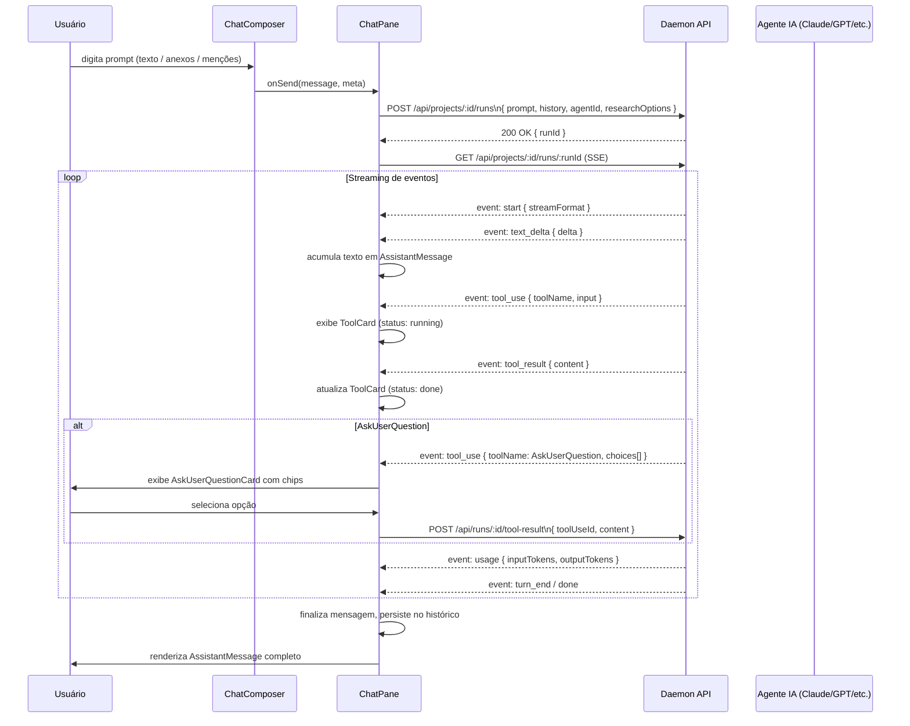
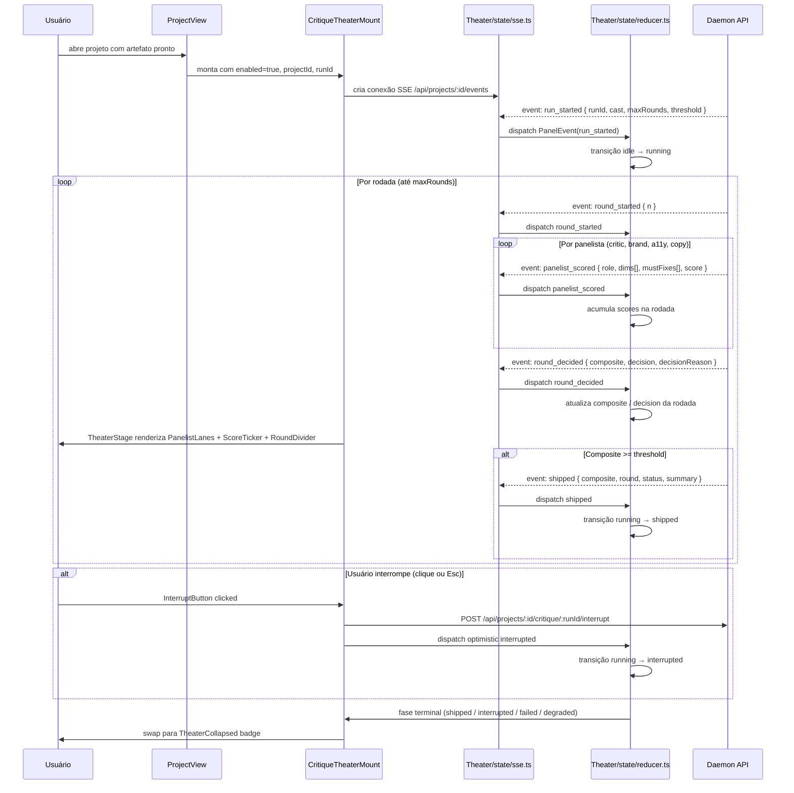
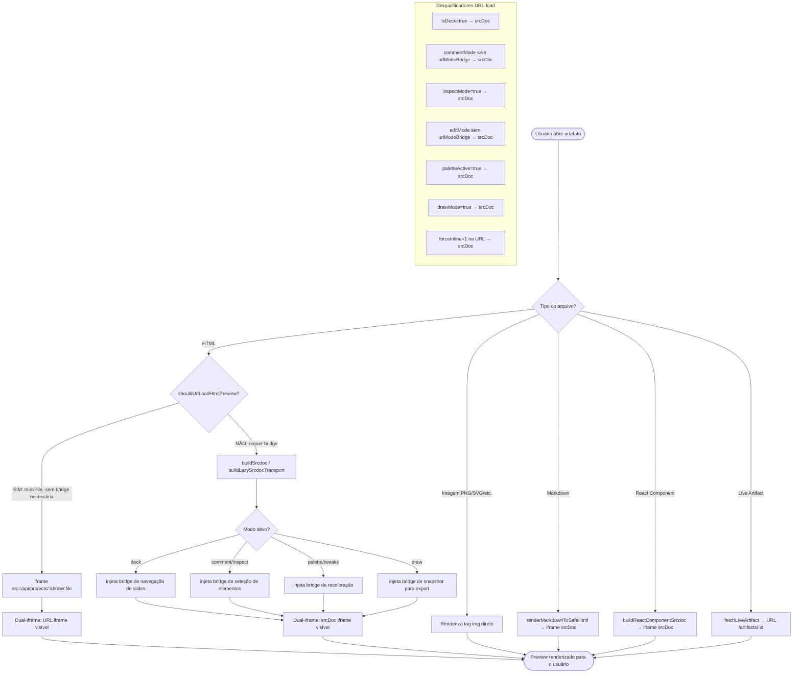
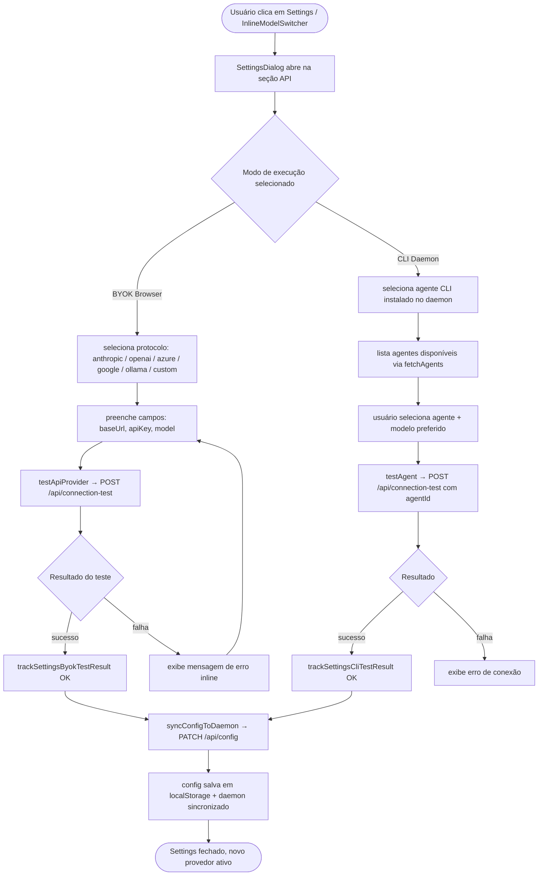
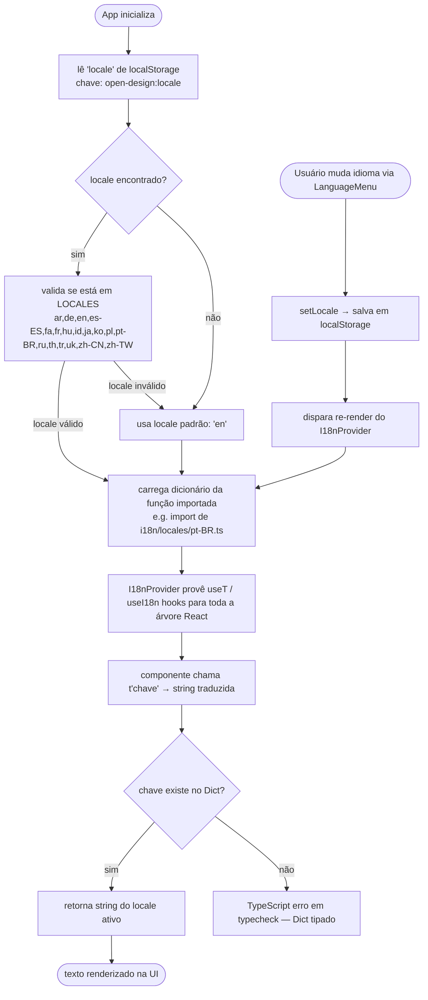
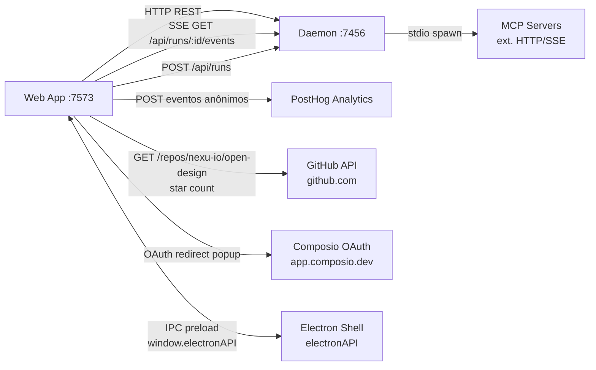
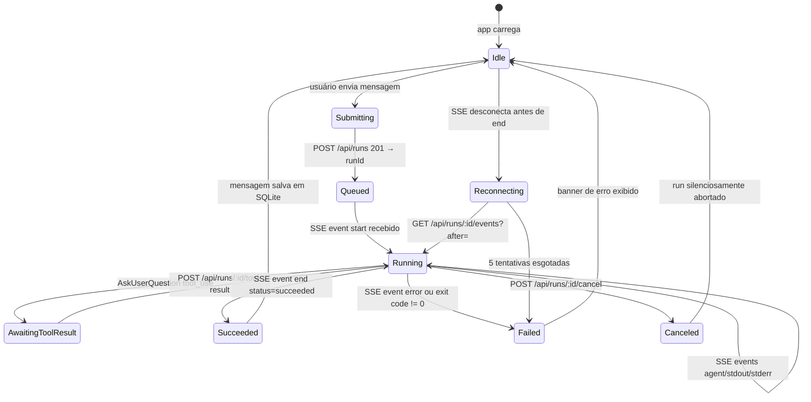

# Web App — Especificação Técnica Visual 360°`n> Documento unificado. Cobertura completa sem abreviações.`n`n
# Web App — Especificação Visual 360° (Parte A)

> **Escopo:** `apps/web` — Next.js 16 App Router + React 18 SPA  
> **Versão:** 0.7.0  
> **Última revisão:** 2026-05-19

---

## 1. Variáveis de Ambiente

| Variável | Tipo | Padrão | Obrigatória | Descrição |
|---|---|---|---|---|
| `OD_PORT` | `number` | `7456` | Não | Porta do daemon Express local. Usada pelo `next.config.ts` para montar rewrites dev (`/api/*`, `/artifacts/*`, `/frames/*`) e pelo sidecar como `SIDECAR_ENV.DAEMON_PORT`. |
| `OD_WEB_PORT` | `number` | `0` (livre) | Não | Porta em que o servidor Next.js (modo `server`/`standalone`) escuta. Gerenciado pelo sidecar via `SIDECAR_ENV.WEB_PORT`. |
| `OD_WEB_OUTPUT_MODE` | `'server' \| 'standalone' \| undefined` | `undefined` | Não | Seleciona o modo de output do Next.js. `undefined`/vazio → export estático; `server` → SSR gerenciado pelo sidecar web; `standalone` → servidor standalone rastreado. |
| `OD_WEB_PROD` | `'1' \| undefined` | `undefined` | Não | Quando `'1'`, força o `distDir` padrão de produção (`out` ou `.next`) ignorando `OD_WEB_DIST_DIR`. Usado no pipeline de empacotamento. |
| `OD_WEB_DIST_DIR` | `string` | `'out'` (prod estático) / `'.next'` (dev/server) | Não | Caminho relativo ou absoluto do diretório de output do Next.js. Absoluto é convertido para relativo a partir de `WEB_ROOT`. |
| `OD_WEB_TSCONFIG_PATH` | `string` | `undefined` | Não | Caminho para um `tsconfig.json` alternativo usado apenas em desenvolvimento (`next dev`). Ignorado em build de produção. |
| `OD_HOST` | `string` | `'127.0.0.1'` | Não | Host de escuta do sidecar web. Deve conter apenas caracteres `[a-zA-Z0-9._\-:[\]@]`; caso contrário, o sidecar lança erro. |
| `OD_WEB_STANDALONE_ROOT` | `string` | — | Não | Caminho para a raiz do servidor standalone (`output: 'standalone'`). Usado pelo sidecar para localizar o `server.js` gerado pelo Next.js. |
| `OD_STANDALONE_PARENT_PID` | `number` | — | Não | PID do processo pai no modo standalone. O sidecar encerra-se se esse PID desaparecer. |
| `OD_STANDALONE_STARTUP_TIMEOUT_MS` | `number` | — | Não | Tempo máximo (ms) aguardado para o servidor standalone subir antes de o sidecar declarar falha. |
| `OD_TOOLS_DEV_PARENT_PID` | `number` | — | Não | PID do processo `tools-dev`. O sidecar web encerra-se se esse PID desaparecer (gestão de ciclo de vida em dev). |
| `OD_SIDECAR_BASE` | `string` | — | Não | Caminho base para dados do sidecar (stamps, IPC). Gerenciado pelo `@open-design/sidecar`. |
| `OD_SIDECAR_IPC_BASE` | `string` | — | Não | Diretório base para sockets IPC POSIX (ex.: `/tmp/open-design/ipc/<namespace>/`). |
| `OD_SIDECAR_IPC_PATH` | `string` | — | Não | Caminho absoluto do socket IPC específico deste sidecar web. |
| `OD_SIDECAR_NAMESPACE` | `string` | — | Não | Namespace de isolamento do runtime (ex.: `default`, `test-xyz`). Separa dados e sockets de múltiplas instâncias concorrentes. |
| `OD_SIDECAR_SOURCE` | `string` | — | Não | Identificador de origem do sidecar (`packaged`, `tools-dev`, etc.). Parte do stamp de processo. |
| `OD_DAEMON_CLI_PATH` | `string` | — | Não | Caminho para o binário CLI do daemon. Usado pelo sidecar para iniciar o daemon filho quando necessário. |
| `NODE_ENV` | `'development' \| 'production' \| 'test'` | `'production'` | Não | Padrão do Node/Next.js. Controla o cálculo de `isProd` e, junto com `OD_WEB_OUTPUT_MODE`, determina se o build é estático ou server. |

---

## 2. Workflows

### 2.1 Fluxo de Chat com Agente de IA



### 2.2 Fluxo de Design Jury (Critique Theater)



### 2.3 Fluxo de Renderização de Artefato (File Viewer)



### 2.4 Fluxo de Configuração de Provedor de IA



### 2.5 Fluxo de Internacionalização (i18n)



---

## 3. JTBDs

| ID | Persona | Quando... | Quero... | Para que... | Prioridade |
|---|---|---|---|---|---|
| JTBD-01 | Designer | estou iniciando um novo projeto de UI | conversar com um agente de IA usando linguagem natural para descrever o design que tenho em mente | obter um protótipo HTML funcional sem escrever código | Alta |
| JTBD-02 | Designer | tenho um artefato gerado pelo agente | visualizar a prévia renderizada em iframe ao lado do histórico de chat | revisar o resultado sem sair do contexto da conversa | Alta |
| JTBD-03 | Designer | quero refinar o visual de um artefato | usar a paleta de tweaks para ajustar cores e tipografia ao vivo | iterar rapidamente sem reabrir o chat | Alta |
| JTBD-04 | Designer | não tenho certeza se meu design está correto | acionar o Design Jury (Critique Theater) para receber crítica de múltiplos panelistas especializados | tomar decisões de design embasadas em critérios objetivos | Alta |
| JTBD-05 | Product Manager | quero trocar o design system do produto | selecionar um design system diferente (ex.: Apple → Arc) e ver o artefato reestilizado | validar como o produto ficaria com uma nova identidade visual | Média |
| JTBD-06 | Developer | preciso exportar o artefato para entregar ao time de engenharia | exportar como HTML autocontido, JSX, PDF ou ZIP | integrar o output diretamente no repositório de código | Alta |
| JTBD-07 | Designer | estou usando o app em outro idioma | mudar o idioma da interface para pt-BR, ja, zh-CN ou outros 18 locales | trabalhar no idioma que me é mais natural | Média |
| JTBD-08 | Designer | meu time usa ferramentas padrão do mercado (OpenAI, Azure, Google) | configurar minha própria API key no Settings sem depender de infra centralizada | ter controle sobre custos e privacidade do meu conteúdo | Alta |
| JTBD-09 | Designer / PdM | quero rever uma sessão de Design Jury antiga | reproduzir o transcript `.ndjson.gz` offline sem conectar ao daemon | auditar decisões passadas ou apresentar resultados em reuniões | Média |
| JTBD-10 | Developer | preciso adicionar anotações de revisão sobre um artefato renderizado | ativar o modo de anotação (draw overlay) e desenhar sobre o iframe | comunicar feedback visual preciso ao designer sem exportar prints | Média |
| JTBD-11 | Designer | quero mostrar o design em tela cheia para stakeholders | abrir o PreviewModal em fullscreen com controles de export | fazer apresentações sem distrações de UI | Média |
| JTBD-12 | Developer / Designer | preciso editar pontualmente um artefato gerado | usar o ManualEditPanel para aplicar um diff patch no código do artefato | corrigir pequenos erros sem reiniciar o agente | Baixa |

---

## 4. 5 Casos de Uso Principais

### UC-01: Conversar com Agente de IA para Criar Design

- **Ator:** Designer, Developer
- **Pré-condição:** Projeto criado; ao menos um provedor de IA configurado (BYOK ou CLI daemon).
- **Fluxo Principal:**
  1. Usuário abre um projeto existente ou cria um novo via `NewProjectModal`.
  2. `ProjectView` monta `ChatPane` com o histórico existente (ou vazio).
  3. Usuário digita o prompt no `ChatComposer`; pode anexar arquivos, mencionar skills/plugins via `/`.
  4. `ChatComposer` dispara `onSend`; `ChatPane` chama `POST /api/projects/:id/runs`.
  5. Daemon cria um run e retorna `{ runId }`.
  6. `ChatPane` abre stream SSE (`GET /api/projects/:id/runs/:runId`).
  7. Eventos `text_delta` acumulam-se em `AssistantMessage` (streaming em tempo real).
  8. Eventos `tool_use`/`tool_result` rendem `ToolCard`s inline.
  9. Agente escreve arquivos; `ProjectView` detecta via SSE de projeto (`file-changed`) e atualiza `FileViewer`.
  10. Evento `done`/`turn_end` finaliza o streaming; mensagem persiste no histórico.
- **Fluxo Alternativo:**
  - Se o agente emite `AskUserQuestion`, `AskUserQuestionCard` exibe chips para o usuário responder; `ChatPane` envia `POST /api/runs/:id/tool-result` e o streaming continua.
  - Se a conexão SSE cai, `project-events.ts` reconecta com backoff exponencial (1s → 30s).
- **Pós-condição:** Artefato gerado está disponível em `FileViewer`; histórico salvo no daemon (SQLite).

---

### UC-02: Revisar Design com Design Jury

- **Ator:** Designer, Product Manager
- **Pré-condição:** Projeto com ao menos um artefato HTML gerado; Design Jury habilitado nas Settings (`open-design:config` localStorage).
- **Fluxo Principal:**
  1. Usuário clica em "Review with Design Jury" no `ProjectView`.
  2. Daemon inicia run de critique; emite `run_started` via SSE de projeto.
  3. `CritiqueTheaterMount` detecta `run_started` e monta `TheaterStage`.
  4. `TheaterStage` exibe 5 `PanelistLane`s (designer, critic, brand, a11y, copy).
  5. À medida que `panelist_scored` chega, cada lane atualiza dims, must-fixes e score.
  6. `ScoreTicker` e `RoundDivider` plotam a trajetória do composite por rodada.
  7. Ao atingir `composite >= threshold`, daemon emite `shipped`; fase muda para `shipped`.
  8. `TheaterCollapsed` exibe badge final com resumo, composite e status.
- **Fluxo Alternativo:**
  - Usuário clica em `InterruptButton` (ou pressiona Esc): dispatch otimista `interrupted` + `POST .../interrupt`. Badge muda para `interrupted`.
  - Se o daemon não consegue pontuar, emite `degraded`; `TheaterDegraded` exibe chip de erro.
- **Pós-condição:** Estado final do run (shipped/interrupted/degraded/failed) visível no badge; transcript disponível para replay via `TheaterTranscript`.

---

### UC-03: Visualizar Artefato Renderizado

- **Ator:** Designer, Developer
- **Pré-condição:** Projeto com ao menos um arquivo de artefato (HTML, imagem, markdown, React component).
- **Fluxo Principal:**
  1. Usuário clica no artefato na lista de arquivos do projeto.
  2. `FileViewer` recebe o `ProjectFile` e detecta o tipo pelo `mimeType` / extensão.
  3. Para HTML: `shouldUrlLoadHtmlPreview` decide entre `iframe src` (URL-load) e `buildSrcdoc` (srcDoc inline).
  4. No caso URL-load: `<iframe src="/api/projects/:id/raw/:file">` carrega o artefato direto.
  5. No caso srcDoc: `buildSrcdoc` injeta bridges necessárias (deck, inspect, palette, draw) e passa via `srcDoc`.
  6. Ambos os iframes ficam montados; CSS visibility troca sem flash de reload.
  7. Usuário pode abrir `PaletteTweaks`, `PreviewDrawOverlay`, `ManualEditPanel` em cima do iframe ativo.
- **Fluxo Alternativo:**
  - Usuário adiciona `?forceInline=1` à URL → `parseForceInline` retorna `true` → sempre srcDoc.
  - Artefato é React Component: `buildReactComponentSrcdoc` compila client-side e injeta via srcDoc.
- **Pós-condição:** Artefato visível e interativo no painel; modo de renderização persistido na URL.

---

### UC-04: Trocar de Design System

- **Ator:** Designer
- **Pré-condição:** Projeto aberto; ao menos dois design systems instalados no daemon.
- **Fluxo Principal:**
  1. Usuário abre `ContextChipStrip` e clica no chip de design system atual.
  2. `DesignSystemPreviewModal` abre com galeria de design systems disponíveis.
  3. Usuário seleciona o novo design system (ex.: `arc`, `claude`, `github`).
  4. Web chama `PATCH /api/projects/:id` com o novo `designSystemId`.
  5. Daemon regrava o projeto com o novo design system; SSE emite `file-changed` para arquivos do projeto.
  6. `FileViewer` recarrega o artefato com o novo token set ativo.
  7. `ContextChipStrip` atualiza o chip para exibir o novo design system.
- **Fluxo Alternativo:**
  - Design system desejado não instalado: usuário vai a `DesignSystemsTab` → instala via `POST /api/design-systems/install`.
- **Pós-condição:** Projeto associado ao novo design system; artefato re-renderizado com nova identidade visual.

---

### UC-05: Configurar Provedor de IA

- **Ator:** Designer, Developer
- **Pré-condição:** App aberto; nenhum provedor configurado ou usuário quer trocar.
- **Fluxo Principal:**
  1. Usuário abre `SettingsDialog` pelo `AvatarMenu` ou `InlineModelSwitcher`.
  2. Navega para a seção "API" (tab de execução BYOK).
  3. Seleciona o protocolo desejado (anthropic, openai, azure, google, ollama, custom).
  4. Preenche `baseUrl` (se aplicável) e `apiKey`.
  5. Seleciona o modelo via dropdown (lista de `SUGGESTED_MODELS_BY_PROTOCOL` ou custom).
  6. Clica em "Test Connection" → `testApiProvider` faz `POST /api/connection-test`.
  7. Resultado exibido inline (ícone ✓ verde ou mensagem de erro).
  8. Clica em "Save" → `syncConfigToDaemon` faz `PATCH /api/config`.
  9. Config persiste em `localStorage` e no daemon; `SettingsDialog` fecha.
- **Fluxo Alternativo:**
  - Modo CLI Daemon: usuário seleciona tab "CLI", escolhe agente disponível, testa com `testAgent`, salva.
  - Provedor xAI: `XaiOAuthControl` gerencia OAuth flow especial antes do save.
  - Media providers (imagem/vídeo): `syncMediaProvidersToDaemon` em vez de `syncConfigToDaemon`.
- **Pós-condição:** Provedor ativo persistido; próxima conversa usa o novo modelo/protocolo.

---

## 5. FAZ / NÃO FAZ

| ✅ FAZ | ❌ NÃO FAZ |
|---|---|
| Renderiza protótipos HTML via iframe (URL-load ou srcDoc inline) | Expõe API Routes Next.js próprias (`app/api/` não existe) |
| Conecta diretamente a provedores de IA no browser (BYOK) com `dangerouslyAllowBrowser` | Armazena API keys no servidor — chaves ficam apenas no `localStorage` do cliente |
| Suporta 18 locales (ar, de, en, es-ES, fa, fr, hu, id, ja, ko, pl, pt-BR, ru, th, tr, uk, zh-CN, zh-TW) | Usa Redux, Zustand ou Context API complexo para estado global |
| Proxy de `/api/*`, `/artifacts/*` e `/frames/*` para o daemon em dev via rewrites Next.js | Importa módulos internos de `apps/daemon/src` diretamente |
| Exporta artefatos como HTML, JSX, Markdown, PDF, ZIP e imagem | Implementa lógica de negócio (SQLite, agentes, sidecar) — essa responsabilidade é do daemon |
| Dual-iframe com troca por CSS visibility (sem reload flash) ao alternar modos de visualização | Reconecta SSE com retry ilimitado sem backoff — usa exponential backoff (1s → 30s) |
| Design Jury (Critique Theater) com até 5 panelistas e pontuação composite por rodada | Recomputa composite client-side a partir de scores individuais — lê o valor direto do wire |
| Suporta múltiplos modos de output: export estático, server SSR, standalone | Usa `pnpm dev` / `pnpm start` diretamente — lifecycle controlado pelo `tools-dev` |
| Persiste configuração de locale e API em `localStorage` com sync para o daemon | Tem Server Actions Next.js — toda mutação é `fetch()` client-side contra o daemon |
| Integração com PostHog para analytics de uso (evento por interação) | Usa `` direto para artefatos HTML — sempre iframe por segurança de sandbox |
| Replay offline de transcripts de Design Jury via `.ndjson.gz` | Adiciona `Co-authored-by` a commits gerados pelo agente |
| Injeta bridges postMessage para interatividade do artefato (deck, inspect, palette, draw, edit) | Suporta `apps/nextjs` (removido) — runtime web é somente `apps/web` |

---

# Web App — Especificação Visual 360° (Parte B)

> **Complemento de SPEC-A.md.** Este documento cobre fluxos de entrada/saída, CRUD completo via API do daemon, mapa de endpoints, rotas, conectores, state management e tipos TypeScript principais.

---

## 6. User Inputs → System Outputs → Outcomes Esperados

| # | User Input | Componente/Ação | System Output | Outcome Esperado |
|---|------------|-----------------|---------------|-----------------|
| 1 | Digitar mensagem + clicar enviar | `ChatComposer` → `streamViaDaemon()` | `POST /api/runs` → SSE stream de eventos | Mensagem do agente aparece incrementalmente no `ChatPane`; run salvo no daemon SQLite |
| 2 | Selecionar design system no `AgentPicker` | `DesignSystemsSection` → `setDesignSystemId()` | Persiste em `AppConfig.designSystemId` via `saveConfig()` | Próximo run envia `designSystemId` ao daemon; daemon injeta brand tokens no system prompt |
| 3 | Clicar em "New Project" | `NewProjectPanel` → `createProject()` | `POST /api/projects` com `{ id, name, skillId, designSystemId }` | Projeto criado no SQLite; navegação para `/projects/:id`; conversa inicial aberta |
| 4 | Importar pasta local | `NewProjectPanel` → `importFolderProject()` | `POST /api/import/folder` com `{ path }` | Pasta vinculada como cwd do agente; projeto aparece em `RecentProjectsStrip` |
| 5 | Importar arquivo `.claude-design.zip` | `NewProjectPanel` → `importClaudeDesignZip()` | `POST /api/import/claude-design` (multipart) | Zip extraído; `entryFile` aberto em `FileViewer`; conversa criada |
| 6 | Abrir artefato HTML no `FileViewer` | `WorkspaceTabsBar` → tab ativa → iframe srcDoc | Arquivo lido via `GET /api/projects/:id/files/:name` | Preview renderizado no iframe; bridges de palette/tweaks injetadas via postMessage |
| 7 | Clicar "Finalize Design" | `FinalizeDesignButton` → `useFinalizeProject()` | `PATCH /api/projects/:id` com `{ finalized: true }` | Projeto marcado como finalizado; UI mostra badge de finalizado |
| 8 | Ativar Critique Theater | `Theater/` → `useCritiqueTheaterEnabled` | `PATCH /api/projects/:id` com metadata `critiqueEnabled: true` | Daemon injeta heurísticas de critique no próximo run; Theater monta overlay |
| 9 | Selecionar skill via `@mention` | `ChatComposer` → `skillIds[]` | `POST /api/runs` com `skillIds` | Daemon compõe system prompt com SKILL.md da skill selecionada |
| 10 | Cancelar run em andamento | `ChatPane` → `cancelSignal.abort()` | `POST /api/runs/:id/cancel` | SSE encerrado; status do run muda para `canceled`; spinner some |
| 11 | Responder `AskUserQuestion` | `AskUserQuestionCard` → `submitChatRunToolResult()` | `POST /api/runs/:id/tool-result` com `{ toolUseId, content }` | Daemon injeta `tool_result` no stdin do claude; agente retoma execução |
| 12 | Salvar artefato HTML | `FileViewer` → `saveArtifact()` | `POST /api/artifacts/save` com `{ identifier, title, html }` | Arquivo HTML salvo em `.od/artifacts/`; URL retornada para exibição |
| 13 | Instalar plugin via marketplace | `MarketplaceView` → `installPluginSource()` | `POST /api/plugins/install` (SSE de progresso) | Plugin instalado; evento `open-design:plugins-changed` disparado; lista atualizada |
| 14 | Conectar conector Composio | `ConnectorsBrowser` → `connectConnector()` | `POST /api/connectors/:id/connect` → redirect OAuth | Janela de auth aberta; após retorno, conector aparece como `connected` |
| 15 | Mudar tema (claro/escuro/sistema) | `SettingsDialog` → `saveConfig()` | `localStorage.setItem('open-design:config', ...)` + `PUT /api/app-config` | `applyAppearanceToDocument()` aplica classe CSS; daemon sincroniza config |
| 16 | Trocar design system no projeto aberto | `DesignSystemsTab` → `patchProject()` | `PATCH /api/projects/:id` com `{ designSystemId }` | System prompt do próximo turn usa novo design system; badge atualizado no header |
| 17 | Abrir Quick Switcher (⌘P) | `QuickSwitcher` → lê `od:qs-recents:<id>` | localStorage read + `GET /api/projects/:id/files` | Modal de busca lista arquivos do projeto + recentes |
| 18 | Fazer deploy no Vercel | `DesignSpecView` → `deployProjectFile()` | `POST /api/projects/:id/deploy` com `{ fileName, providerId }` | Arquivo enviado ao Vercel via daemon; URL de deploy retornada |
| 19 | Sincronizar community pets | `SettingsDialog` → `syncCommunityPets()` | `POST /api/codex-pets/sync` | Pets baixados do repositório community; lista em Settings atualizada |
| 20 | Salvar servidores MCP | `McpClientSection` → `saveMcpServers()` | `PUT /api/mcp/servers` com lista completa | Daemon recarrega lista de servidores MCP; status atualizado na UI |
| 21 | Exportar PDF | `FinalizeDesignButton` → `exportToPdf()` | `POST /api/projects/:id/export/pdf` | PDF gerado pelo daemon (Puppeteer); blob retornado para download |
| 22 | Adicionar marketplace de plugins | `PluginsSection` → `addMarketplace()` | `POST /api/marketplaces` com `{ url }` | Marketplace adicionado; plugins disponíveis carregados automaticamente |
| 23 | Iniciar OAuth para servidor MCP | `McpClientSection` → `startMcpOAuth()` | `POST /api/mcp/oauth/start` | URL de autorização aberta no browser; aguarda callback |
| 24 | Renomear arquivo do projeto | `DesignFilesPanel` → `renameProjectFile()` | `POST /api/projects/:id/files/rename` | Arquivo renomeado no disco; tabs abertas atualizadas com novo nome |
| 25 | Importar skill de texto | `SkillsSection` → `importSkill()` | `POST /api/skills/import` com `{ name, body, triggers }` | Skill disponível no `AgentPicker` e `ChatComposer`; aparece em Settings → Skills |

---

## 7. CRUD Completo

### Matriz CRUD — Operações via Daemon API

| Recurso | CREATE | READ | UPDATE | DELETE |
|---------|--------|------|--------|--------|
| **Project** | `POST /api/projects` | `GET /api/projects`, `GET /api/projects/:id` | `PATCH /api/projects/:id` | `DELETE /api/projects/:id` |
| **Conversation** | `POST /api/projects/:id/conversations` | `GET /api/projects/:id/conversations` | `PATCH /api/projects/:id/conversations/:cid` | `DELETE /api/projects/:id/conversations/:cid` |
| **Message** | `PUT /api/projects/:id/conversations/:cid/messages/:mid` | `GET /api/projects/:id/conversations/:cid/messages` | `PUT /api/projects/:id/conversations/:cid/messages/:mid` | — |
| **Run** | `POST /api/runs` | `GET /api/runs/:id`, `GET /api/runs?projectId&conversationId&status` | — | `POST /api/runs/:id/cancel` |
| **Artifact** | `POST /api/artifacts/save` | `GET /api/live-artifacts?projectId` | `PATCH /api/live-artifacts/:id?projectId` | `DELETE /api/live-artifacts/:id?projectId` |
| **Project File** | `POST /api/projects/:id/files` | `GET /api/projects/:id/files`, `GET /api/projects/:id/files/:name` | `PUT /api/projects/:id/files/:name` | `DELETE /api/projects/:id/files/:name` |
| **Skill** | `POST /api/skills/import` | `GET /api/skills`, `GET /api/skills/:id` | `PUT /api/skills/:id` | `DELETE /api/skills/:id` |
| **Design System** | `POST /api/design-systems/import/local`, `POST /api/design-systems/import/github` | `GET /api/design-systems`, `GET /api/design-systems/:id` | `PATCH /api/design-systems/:id` | — |
| **Plugin** | `POST /api/plugins/install`, `POST /api/plugins/upload-zip`, `POST /api/plugins/upload-folder` | `GET /api/plugins`, `GET /api/plugins/:id` | `POST /api/plugins/:id/upgrade` | `POST /api/plugins/:id/uninstall` |
| **Template** | `POST /api/templates` | `GET /api/templates`, `GET /api/templates/:id` | — | `DELETE /api/templates/:id` |
| **Marketplace** | `POST /api/marketplaces` | `GET /api/marketplaces` | `POST /api/marketplaces/:id/refresh`, `PATCH /api/marketplaces/:id/trust` | `DELETE /api/marketplaces/:id` |
| **MCP Server** | `PUT /api/mcp/servers` (full replace) | `GET /api/mcp/servers` | `PUT /api/mcp/servers` | `PUT /api/mcp/servers` (omit entry) |
| **Connector** | `POST /api/connectors/:id/connect` | `GET /api/connectors`, `GET /api/connectors/:id`, `GET /api/connectors/status` | — | `DELETE /api/connectors/:id/connection` |
| **Comment** | `POST /api/projects/:id/conversations/:cid/comments` | `GET /api/projects/:id/conversations/:cid/comments` | `PATCH /api/projects/:id/conversations/:cid/comments/:cmt` | `DELETE /api/projects/:id/conversations/:cid/comments/:cmt` |
| **Tabs** | — | `GET /api/projects/:id/tabs` | `PUT /api/projects/:id/tabs` | — |
| **Deploy Config** | — | `GET /api/deploy/config` | `PUT /api/deploy/config` | — |
| **App Config** | — | `GET /api/app-config` | `PUT /api/app-config` | — |
| **Media Config** | — | `GET /api/media/config` | `PUT /api/media/config` | — |
| **Codex Pet** | `POST /api/codex-pets/sync` | `GET /api/codex-pets` | — | — |

### GETs (chamadas ao daemon)

- `GET /api/health` — verificação de liveness
- `GET /api/version` — versão/canal/plataforma do app
- `GET /api/agents` — lista de agentes disponíveis
- `GET /api/skills` — lista de skills instaladas
- `GET /api/skills/:id` — detalhe de uma skill
- `GET /api/skills/:id/files` — arquivos da skill
- `GET /api/skills/:id/example` — HTML de preview de exemplo
- `GET /api/design-templates` — catálogo de design templates
- `GET /api/design-templates/:id` — detalhe de um template
- `GET /api/design-systems` — lista de design systems
- `GET /api/design-systems/:id` — detalhe do design system
- `GET /api/design-systems/:id/preview` — HTML de preview
- `GET /api/design-systems/:id/showcase` — showcase HTML
- `GET /api/projects` — lista todos os projetos
- `GET /api/projects/:id` — detalhe do projeto
- `GET /api/projects/:id/files` — lista de arquivos do projeto
- `GET /api/projects/:id/files/:name` — conteúdo de um arquivo
- `GET /api/projects/:id/files/:name/preview` — preview estruturado (PDF/doc)
- `GET /api/projects/:id/tabs` — estado das tabs abertas
- `GET /api/projects/:id/conversations` — lista de conversas
- `GET /api/projects/:id/conversations/:cid/messages` — mensagens da conversa
- `GET /api/projects/:id/conversations/:cid/comments` — comentários da preview
- `GET /api/projects/:id/deployments` — histórico de deploys
- `GET /api/runs/:id` — status de um run
- `GET /api/runs?projectId=&conversationId=&status=active` — runs ativos
- `GET /api/runs/:id/events?after=:lastEventId` — stream SSE de eventos
- `GET /api/live-artifacts?projectId=:id` — lista de live artifacts
- `GET /api/live-artifacts/:id?projectId=:pid` — detalhe do live artifact
- `GET /api/live-artifacts/:id/preview?projectId=:pid` — HTML renderizado
- `GET /api/live-artifacts/:id/refreshes?projectId=:pid` — log de refreshes
- `GET /api/templates` — lista de templates de projeto
- `GET /api/templates/:id` — detalhe do template
- `GET /api/plugins` — plugins instalados
- `GET /api/prompt-templates` — templates de prompt (imagem/vídeo)
- `GET /api/prompt-templates/:surface/:id` — detalhe de um prompt template
- `GET /api/marketplaces` — marketplaces registrados
- `GET /api/connectors` — conectores disponíveis
- `GET /api/connectors/status` — status de autenticação por conector
- `GET /api/connectors/discovery` — catálogo de conectores via Composio
- `GET /api/connectors/:id` — detalhe do conector
- `GET /api/mcp/servers` — servidores MCP salvos + templates
- `GET /api/mcp/oauth/status?serverId=:id` — status OAuth de um servidor MCP
- `GET /api/app-config` — configuração global do app (daemon-side)
- `GET /api/media/config` — credenciais de providers de mídia
- `GET /api/connectors/composio/config` — config Composio do daemon
- `GET /api/analytics/config` — configuração PostHog (habilitado/chave)
- `GET /api/deploy/config?providerId=:id` — configuração de deploy
- `GET /api/deploy/cloudflare-pages/zones` — zonas Cloudflare disponíveis
- `GET /api/codex-pets` — pets gerados pelo skill hatch-pet

### POSTs

- `POST /api/runs` — criar run (inicia agente)
- `POST /api/runs/:id/cancel` — cancelar run em andamento
- `POST /api/runs/:id/tool-result` — enviar resposta de tool para claude
- `POST /api/projects` — criar projeto
- `POST /api/projects/:id/conversations` — criar conversa
- `POST /api/projects/:id/plugins/install-folder` — instalar plugin de pasta gerada
- `POST /api/projects/:id/plugins/publish-github` — publicar plugin no GitHub
- `POST /api/projects/:id/plugins/contribute-open-design` — contribuir plugin
- `POST /api/projects/:id/deploy` — deploy de arquivo no Vercel/Cloudflare
- `POST /api/projects/:id/deployments/:did/check-link` — verificar link de deploy
- `POST /api/projects/:id/export/pdf` — exportar projeto como PDF
- `POST /api/projects/:id/files` — criar arquivo no projeto
- `POST /api/projects/:id/files/rename` — renomear arquivo
- `POST /api/import/folder` — importar pasta local como projeto
- `POST /api/import/claude-design` — importar zip Claude Design
- `POST /api/artifacts/save` — salvar artefato HTML
- `POST /api/live-artifacts/:id/refresh?projectId=:pid` — atualizar live artifact
- `POST /api/templates` — criar template a partir de projeto
- `POST /api/skills/import` — importar skill de texto
- `POST /api/design-systems/import/local` — importar design system local
- `POST /api/design-systems/import/github` — importar design system do GitHub
- `POST /api/plugins/install` — instalar plugin por source (SSE)
- `POST /api/plugins/upload-zip` — upload de zip de plugin
- `POST /api/plugins/upload-folder` — upload de pasta de plugin
- `POST /api/plugins/:id/upgrade` — atualizar plugin (SSE)
- `POST /api/plugins/:id/uninstall` — desinstalar plugin
- `POST /api/plugins/:id/share-project` — criar projeto de share de plugin
- `POST /api/marketplaces` — adicionar marketplace
- `POST /api/marketplaces/:id/refresh` — recarregar catálogo do marketplace
- `POST /api/connectors/:id/connect` — iniciar auth do conector
- `POST /api/connectors/:id/authorization/cancel` — cancelar auth pendente
- `POST /api/connectors/auth-configs/prepare` — preparar auth config Composio
- `POST /api/mcp/oauth/start` — iniciar OAuth para servidor MCP
- `POST /api/mcp/oauth/disconnect` — desconectar OAuth de servidor MCP
- `POST /api/codex-pets/sync` — sincronizar community pets

### PUT/PATCH

- `PUT /api/projects/:id/conversations/:cid/messages/:mid` — salvar mensagem
- `PATCH /api/projects/:id` — atualizar campos do projeto
- `PATCH /api/projects/:id/conversations/:cid` — atualizar título/metadados da conversa
- `PUT /api/projects/:id/tabs` — salvar estado de tabs abertas
- `PATCH /api/projects/:id/conversations/:cid/comments/:cmt` — atualizar status de comentário
- `PUT /api/skills/:id` — atualizar body da skill
- `PATCH /api/skills/:id` — atualizar campos de uma skill (instalada)
- `PATCH /api/design-systems/:id` — atualizar design system
- `PUT /api/mcp/servers` — salvar lista completa de servidores MCP
- `PUT /api/deploy/config` — salvar configuração de deploy
- `PUT /api/app-config` — salvar configuração global
- `PUT /api/media/config` — salvar credenciais de providers de mídia
- `PATCH /api/marketplaces/:id/trust` — alterar nível de confiança do marketplace
- `PATCH /api/live-artifacts/:id?projectId=:pid` — atualizar título/status/pinned/preview do artifact

### DELETEs

- `DELETE /api/projects/:id` — deletar projeto
- `DELETE /api/projects/:id/conversations/:cid` — deletar conversa
- `DELETE /api/projects/:id/files/:name` — deletar arquivo do projeto
- `DELETE /api/templates/:id` — deletar template
- `DELETE /api/skills/:id` — deletar skill
- `DELETE /api/connectors/:id/connection` — desconectar conector
- `DELETE /api/marketplaces/:id` — remover marketplace
- `DELETE /api/live-artifacts/:id?projectId=:pid` — deletar live artifact
- `DELETE /api/projects/:id/conversations/:cid/comments/:cmt` — deletar comentário

---

## 8. APIs Consumidas — Endpoints do Daemon

| # | Método | Endpoint | Parâmetros / Body | Response Esperada | Componente/Provider |
|---|--------|----------|-------------------|-------------------|---------------------|
| 1 | GET | `/api/health` | — | `200 OK` | `registry.ts:daemonIsLive()` |
| 2 | GET | `/api/version` | — | `{ version: AppVersionInfo }` | `registry.ts:fetchAppVersionInfo()` |
| 3 | GET | `/api/agents` | — | `{ agents: AgentInfo[] }` | `registry.ts:fetchAgents()` |
| 4 | GET | `/api/skills` | — | `{ skills: SkillSummary[] }` | `registry.ts:fetchSkills()` |
| 5 | GET | `/api/skills/:id` | — | `SkillDetail` | `registry.ts:fetchSkill()` |
| 6 | GET | `/api/skills/:id/files` | — | `{ files: SkillFileEntry[] }` | `registry.ts:fetchSkillFiles()` |
| 7 | GET | `/api/skills/:id/example` | — | HTML text | `registry.ts:fetchSkillExample()` |
| 8 | POST | `/api/skills/import` | `{ name, body, description?, triggers? }` | `{ skill: SkillSummary }` | `registry.ts:importSkill()` |
| 9 | PUT | `/api/skills/:id` | `{ name?, body, description?, triggers? }` | `{ skill: SkillSummary }` | `registry.ts:updateSkill()` |
| 10 | DELETE | `/api/skills/:id` | — | `{ ok: true }` | `registry.ts:deleteSkill()` |
| 11 | GET | `/api/design-templates` | — | `{ designTemplates: SkillSummary[] }` | `registry.ts:fetchDesignTemplates()` |
| 12 | GET | `/api/design-templates/:id` | — | `SkillDetail` | `registry.ts:fetchDesignTemplate()` |
| 13 | GET | `/api/design-systems` | — | `{ designSystems: DesignSystemSummary[] }` | `registry.ts:fetchDesignSystems()` |
| 14 | GET | `/api/design-systems/:id` | — | `DesignSystemDetail` | `registry.ts:fetchDesignSystem()` |
| 15 | GET | `/api/design-systems/:id/preview` | — | HTML text | `registry.ts` |
| 16 | POST | `/api/design-systems/import/local` | `ImportLocalDesignSystemRequest` | `ImportLocalDesignSystemResponse` | `registry.ts:importLocalDesignSystem()` |
| 17 | POST | `/api/design-systems/import/github` | `ImportGitHubDesignSystemRequest` | `ImportGitHubDesignSystemResponse` | `registry.ts:importGitHubDesignSystem()` |
| 18 | GET | `/api/prompt-templates` | — | `{ promptTemplates: PromptTemplateSummary[] }` | `registry.ts:fetchPromptTemplates()` |
| 19 | GET | `/api/prompt-templates/:surface/:id` | surface: `image\|video` | `{ promptTemplate: PromptTemplateDetail }` | `registry.ts:fetchPromptTemplate()` |
| 20 | GET | `/api/projects` | — | `{ projects: Project[] }` | `state/projects.ts:listProjects()` |
| 21 | POST | `/api/projects` | `{ id, name, skillId, designSystemId, pendingPrompt?, pluginId? }` | `{ project, conversationId }` | `state/projects.ts:createProject()` |
| 22 | GET | `/api/projects/:id` | — | `{ project: Project }` | `state/projects.ts:getProject()` |
| 23 | PATCH | `/api/projects/:id` | `ProjectPatch` | `{ project: Project }` | `state/projects.ts:patchProject()` |
| 24 | DELETE | `/api/projects/:id` | — | `200 OK` | `state/projects.ts:deleteProject()` |
| 25 | GET | `/api/projects/:id/files` | — | `{ files: ProjectFile[] }` | `registry.ts:fetchProjectFiles()` |
| 26 | POST | `/api/projects/:id/deploy` | `{ fileName, providerId, cloudflarePages? }` | `WebDeployProjectFileResponse` | `registry.ts:deployProjectFile()` |
| 27 | GET | `/api/projects/:id/deployments` | — | `{ deployments: WebDeploymentInfo[] }` | `registry.ts:fetchProjectDeployments()` |
| 28 | GET | `/api/projects/:id/conversations` | — | `{ conversations: Conversation[] }` | `state/projects.ts:listConversations()` |
| 29 | POST | `/api/projects/:id/conversations` | `{ title? }` | `{ conversation: Conversation }` | `state/projects.ts:createConversation()` |
| 30 | PATCH | `/api/projects/:id/conversations/:cid` | `Partial<Conversation>` | `{ conversation: Conversation }` | `state/projects.ts:patchConversation()` |
| 31 | GET | `/api/projects/:id/conversations/:cid/messages` | — | `{ messages: ChatMessage[] }` | `state/projects.ts:listMessages()` |
| 32 | PUT | `/api/projects/:id/conversations/:cid/messages/:mid` | `ChatMessage` | `200 OK` | `state/projects.ts:saveMessage()` |
| 33 | POST | `/api/runs` | `ChatRequest` | `{ runId: string }` | `daemon.ts:streamViaDaemon()` |
| 34 | GET | `/api/runs/:id/events` | `?after=lastEventId` | SSE stream (`ChatSseEvent`) | `daemon.ts:consumeDaemonRun()` |
| 35 | POST | `/api/runs/:id/cancel` | — | `200 OK` | `daemon.ts:cancelRun()` |
| 36 | POST | `/api/runs/:id/tool-result` | `{ toolUseId, content, isError? }` | `{ ok: boolean }` | `daemon.ts:submitChatRunToolResult()` |
| 37 | GET | `/api/runs` | `?projectId&conversationId&status=active` | `{ runs: ChatRunStatusResponse[] }` | `daemon.ts:listActiveChatRuns()` |
| 38 | POST | `/api/artifacts/save` | `{ identifier, title, html }` | `{ url, path }` | `daemon.ts:saveArtifact()` |
| 39 | GET | `/api/live-artifacts` | `?projectId=:id` | `{ liveArtifacts: LiveArtifactSummary[] }` | `registry.ts:fetchLiveArtifacts()` |
| 40 | PATCH | `/api/live-artifacts/:id` | `{ title, status, pinned, preview, slug?, document? }` | `{ liveArtifact: LiveArtifact }` | `registry.ts:updateLiveArtifact()` |
| 41 | POST | `/api/live-artifacts/:id/refresh` | `?projectId=:pid` | `LiveArtifactRefreshResult` | `registry.ts:refreshLiveArtifact()` |
| 42 | GET | `/api/plugins` | — | `{ plugins: InstalledPluginRecord[] }` | `state/projects.ts:listPlugins()` |
| 43 | POST | `/api/plugins/install` | `{ source }` | SSE (`PluginInstallEvent`) | `state/projects.ts:installPluginSource()` |
| 44 | GET | `/api/mcp/servers` | — | `{ servers: McpServerConfig[], templates: McpTemplate[] }` | `state/mcp.ts:fetchMcpServers()` |
| 45 | PUT | `/api/mcp/servers` | `{ servers: McpServerConfig[] }` | `McpServersResponse` | `state/mcp.ts:saveMcpServers()` |
| 46 | POST | `/api/mcp/oauth/start` | `{ serverId }` | `StartMcpOAuthResponse` | `state/mcp.ts:startMcpOAuth()` |
| 47 | GET | `/api/connectors` | — | `{ connectors: ConnectorDetail[] }` | `registry.ts:fetchConnectors()` |
| 48 | POST | `/api/connectors/:id/connect` | — | `{ connector, auth }` | `registry.ts:connectConnector()` |
| 49 | GET | `/api/app-config` | — | `AppConfig (daemon portion)` | `state/config.ts:fetchDaemonConfig()` |
| 50 | PUT | `/api/media/config` | `MediaProviderDaemonWriteRequest` | `200 OK` | `state/config.ts:syncMediaProvidersToDaemon()` |

---

## 9. URLs, Rotas e Conectores

### 9.1 Rotas do Next.js App Router (Client-Side via `router.ts`)

> O web app usa SPA com `window.history.pushState` e um roteador customizado (`src/router.ts`). Não há App Router do Next.js — as rotas são resolvidas em memória por `parseRoute()`.

| Rota (path) | Tipo de Rota | Componente Principal | Descrição |
|-------------|-------------|---------------------|-----------|
| `/` | Home | `HomeView` | Landing com criação de projeto, recentes, pets |
| `/projects` | Home sub-view | `EntryShell` → `DesignsTab` | Lista completa de projetos |
| `/projects/:projectId` | Projeto | `ProjectView` | Workspace de um projeto específico |
| `/projects/:id/conversations/:cid` | Projeto + conversa | `ProjectView` (conversa ativa) | Deep-link para conversa específica |
| `/projects/:id/conversations/:cid/files/:name` | Projeto + conversa + arquivo | `ProjectView` (FileViewer aberto) | Deep-link com arquivo aberto |
| `/projects/:id/files/:name` | Projeto + arquivo | `ProjectView` (FileViewer aberto) | Deep-link direto para arquivo |
| `/automations` ou `/tasks` | Home sub-view | `TasksView` | Routines/automações agendadas |
| `/plugins` | Home sub-view | `PluginsView` | Plugins instalados |
| `/design-systems` | Home sub-view | `DesignSystemsSection` | Design systems importados |
| `/integrations` | Home sub-view | `IntegrationsView` | Conexões OAuth (Composio, MCP) |
| `/marketplace` | Marketplace | `MarketplaceView` | Catálogo de plugins do marketplace |
| `/marketplace/:pluginId` | Marketplace detalhe | `PluginDetailView` | Detalhe e instalação de um plugin |

### 9.2 Diagrama de Conectores



### 9.3 Integrações Externas

| Serviço | Propósito | SDK / Método | Variável de Env / Config |
|---------|-----------|-------------|--------------------------|
| **PostHog** | Analytics de produto (eventos anônimos) | `posthog-js` via `src/analytics/client.ts` | Config lida de `GET /api/analytics/config` (chave gerenciada pelo daemon) |
| **GitHub API** | Exibição de contagem de stars no badge | `fetch('https://api.github.com/repos/nexu-io/open-design')` | Nenhuma — unauthenticated, rate-limited |
| **Anthropic API** | Inferência de modelos Claude (direto do browser quando `mode !== 'daemon'`) | `src/providers/anthropic.ts` | `AppConfig.apiKey`, `AppConfig.baseUrl` |
| **OpenAI API** | Inferência de modelos GPT (modo openai-compatible) | `src/providers/openai-compatible.ts` | `AppConfig.apiKey`, `AppConfig.baseUrl` |
| **Composio** | OAuth de conectores para automação | Popup OAuth + `POST /api/connectors/:id/connect` | `AppConfig.composio.apiKey` → daemon |
| **Vercel** | Deploy de artefatos HTML | `POST /api/projects/:id/deploy` (daemon chama Vercel API) | Token gerenciado pelo daemon via `GET /api/deploy/config` |
| **Cloudflare Pages** | Deploy alternativo de artefatos | `POST /api/projects/:id/deploy` com `providerId=cloudflare-pages` | Token + `zoneId` gerenciados pelo daemon |
| **ElevenLabs** | Text-to-speech para mídia | `src/providers/elevenlabs-voices.ts` | `AppConfig.mediaProviders.elevenlabs.apiKey` |
| **Ollama** | Modelos locais (LLM via Ollama compatible) | `src/providers/ollama-compatible.ts` | `AppConfig.baseUrl` (ex: `http://localhost:11434`) |
| **Azure OpenAI** | Inferência via Azure | `src/providers/azure-compatible.ts` | `AppConfig.baseUrl`, `AppConfig.apiKey` |
| **Google Gemini** | Inferência via Google | `src/providers/google-compatible.ts` | `AppConfig.apiKey` |

---

## 10. State Management e Dados

### 10.1 Estrutura de State do Chat



### 10.2 localStorage — Configurações Persistidas

| Chave | Tipo | Padrão | Descrição |
|-------|------|--------|-----------|
| `open-design:config` | `AppConfig` (JSON) | Ver `DEFAULT_CONFIG` | Toda a configuração do app: API key, modelo, tema, providers de mídia, pet, notificações, orbit. Migrado na versão `CONFIG_MIGRATION_VERSION = 1` |
| `od:qs-recents:<projectId>` | `string[]` (JSON) | `[]` | Até 6 arquivos recentemente abertos por projeto no Quick Switcher (⌘P) |
| `open-design:gh-stars` | `{ count: number, ts: number }` | `null` | Cache TTL=1h da contagem de stars do GitHub (evita rate limit) |
| `open-design:analytics.anonymous_id` | `string` (UUID) | Gerado na primeira visita | ID anônimo persistente para PostHog; sobrevive entre sessões |
| `open-design:critique-theater-enabled` | JSON com flags por projeto | `{}` | Estado de ativação do Critique Theater por projeto; gerenciado em `useCritiqueTheaterEnabled` |

> **sessionStorage:** `open-design:analytics.session_id` — UUID de sessão para PostHog; apagado ao fechar a aba.

### 10.3 Componentes e Responsabilidades

| Componente | Props Principais | Estado Local | Responsabilidade |
|------------|-----------------|--------------|-----------------|
| `App.tsx` | — | `config`, `projects`, `agents`, `skills`, `designSystems`, `route` | Raiz da aplicação; hidratação inicial; roteamento de nível superior |
| `EntryView` | `config`, `projects`, `agents`, `skills`, `onCreateProject` | `activeTab`, `searchQuery` | Shell de entrada: Home, Projects, Tasks, Plugins, Design Systems, Integrations |
| `ProjectView` | `projectId`, `config`, `agents`, `skills` | `conversations`, `activeConversation`, `tabs`, `openTabs` | Workspace principal: ChatPane + FileViewer + tabs de arquivos |
| `ChatPane` | `projectId`, `conversationId`, `agentId`, `config` | `messages`, `runId`, `streamState`, `pendingToolUse` | Gerencia o ciclo de vida de runs; renderiza histórico de mensagens e composser |
| `ChatComposer` | `onSend`, `disabled`, `attachments` | `draft`, `mentionPopover`, `contextChips` | Input de mensagem com @mention de skills, upload de arquivos, modelos |
| `AssistantMessage` | `message: ChatMessage` | — | Renderiza markdown, tool cards, TodoCard, AskUserQuestionCard, live artifact badges |
| `ToolCard` | `event: AgentEvent`, `runId?` | `answerState` (para AskUserQuestion) | Renderiza tool_use/tool_result com collapse/expand; AskUserQuestion com chips |
| `FileViewer` | `projectId`, `fileName`, `renderMode` | `iframeRef`, `srcDocActive` | Gerencia dois iframes (url-load + srcDoc); injeta bridges via postMessage |
| `DesignFilesPanel` | `projectId`, `files`, `activeFile` | — | Lista de arquivos do projeto com ações (abrir, renomear, deletar) |
| `SettingsDialog` | `config`, `onSave` | `section`, `autosaving` | Diálogo de configurações: API, Modelos, Appearance, Skills, Pets, Notificações, MCP |
| `AgentPicker` | `agents`, `skills`, `designSystems`, `selected` | `open` | Popover de seleção de agente + skill + design system para a sessão |
| `MarketplaceView` | `plugins`, `onInstall` | `query`, `selectedPlugin` | Grade de plugins do marketplace com search e filtros |
| `Theater/` | `projectId`, `conversationId` | `critiqueEnabled`, `overlay` | Critique Theater: ativa análise visual do agente sobre o preview |
| `NewProjectModal` / `NewProjectPanel` | `skills`, `designSystems`, `templates` | `name`, `selectedSkill`, `form` | Wizard de criação de projeto com opções de skill/design system/template |
| `WorkspaceTabsBar` | `openTabs`, `activeTab`, `onTabSelect` | — | Barra de tabs de arquivos abertos com fechar e reordenar |
| `PetOverlay` | `pet: PetConfig`, `config` | `phase`, `animating` | Overlay do pet Codex com sprite animado e orbit briefing |
| `ConnectorsBrowser` | `connectors`, `onConnect` | `busy` | Lista conectores Composio com status e botão de conectar/desconectar |
| `McpClientSection` | `servers`, `onSave` | `editing`, `oauthBusy` | Editor de servidores MCP com OAuth e teste de conexão |
| `LiveArtifactBadges` | `projectId`, `artifacts` | — | Badges inline no chat indicando live artifacts do projeto |
| `QuickSwitcher` | `projectId`, `files` | `query`, `recents` | Modal ⌘P para abrir arquivo rapidamente; usa recents do localStorage |

### 10.4 Tipos TypeScript Principais (Contratos)

Tipos definidos em `src/types.ts` e `@open-design/contracts`:

```typescript
// Tipos de projeto e conversa
interface Project {
  id: string;
  name: string;
  path: string;
  skillId: string | null;
  designSystemId: string | null;
  finalized?: boolean;
  pendingPrompt?: string | null;
  customInstructions?: string | null;
  metadata?: ProjectMetadata;
  linkedDirs?: string[];
  createdAt: number;
  updatedAt: number;
}

interface Conversation {
  id: string;
  projectId: string;
  title?: string;
  createdAt: number;
  updatedAt: number;
}

interface ChatMessage {
  id: string;
  role: 'user' | 'assistant';
  content: string;
  events?: AgentEvent[];
  createdAt?: number;
}

// Tipos de agente e run
type AgentEvent =
  | { kind: 'text'; text: string }
  | { kind: 'thinking'; text: string }
  | { kind: 'status'; label: string; detail?: string }
  | { kind: 'tool_use'; id: string; name: string; input: unknown }
  | { kind: 'tool_result'; toolUseId: string; content: string; isError: boolean }
  | { kind: 'usage'; inputTokens?: number; outputTokens?: number; costUsd?: number; durationMs?: number }
  | { kind: 'live_artifact'; action: string; projectId: string; artifactId: string; title?: string }
  | { kind: 'live_artifact_refresh'; phase: string; projectId: string; artifactId: string; refreshId: string }
  | { kind: 'raw'; line: string };

type ChatRunStatus = 'queued' | 'running' | 'succeeded' | 'failed' | 'canceled';

// Request enviado ao daemon
interface ChatRequest {
  agentId: string;
  message: string;          // transcript colapsado
  currentPrompt: string;    // último user turn
  projectId: string | null;
  conversationId: string | null;
  assistantMessageId: string | null;
  clientRequestId: string | null;
  skillId: string | null;
  skillIds: string[];
  designSystemId: string | null;
  attachments: string[];
  commentAttachments: ChatCommentAttachment[];
  model: string | null;
  reasoning: string | null;
  research?: ResearchOptions;
}

// Configuração do app (localStorage + daemon)
interface AppConfig {
  mode: 'daemon' | 'direct';
  apiKey: string;
  baseUrl: string;
  model: string;
  apiProtocol: ApiProtocol;
  agentId: string | null;
  skillId: string | null;
  designSystemId: string | null;
  theme: 'light' | 'dark' | 'system';
  accentColor: string;
  mediaProviders: Record<string, MediaProviderCredentials>;
  pet: PetConfig;
  notifications: NotificationsConfig;
  orbit: OrbitConfig;
  onboardingCompleted: boolean;
}

// Live artifact
interface LiveArtifact {
  id: string;
  projectId: string;
  title: string;
  status: 'draft' | 'published';
  pinned: boolean;
  preview?: { kind: 'html'; url: string };
  document?: Record<string, unknown>;
  slug?: string;
}

// Arquivo de projeto
interface ProjectFile {
  name: string;
  kind: 'file' | 'directory';
  size: number | null;
  updatedAt?: number;
}

// Tabs abertas
interface OpenTabsState {
  tabs: string[];   // nomes de arquivo
  active: string | null;
}
```

### 10.5 JSON Files e Datasets

| Arquivo | Localização | Propósito |
|---------|-------------|-----------|
| `i18n/locales/en.ts` | `src/i18n/locales/en.ts` | Strings do locale inglês (base) — exporta objeto `Dict` |
| `i18n/locales/pt-BR.ts` | `src/i18n/locales/pt-BR.ts` | Strings em português brasileiro |
| `i18n/locales/*.ts` | `src/i18n/locales/` | 19 locales: ar, de, en, es-ES, fa, fr, hu, id, it, ja, ko, pl, pt-BR, ru, th, tr, uk, zh-CN, zh-TW |
| `i18n/types.ts` | `src/i18n/types.ts` | Interface `Dict` tipada — toda chave de i18n deve existir aqui e em todos os 19 locales |
| `media/models` (re-exportado) | `src/media/models.ts` | Lista de `MEDIA_PROVIDERS` com id, label, defaultBaseUrl — JSON estático |
| `state/config.ts` (`KNOWN_PROVIDERS`) | `src/state/config.ts` | Array de `KnownProvider` com label, protocol, baseUrl, model, models[] — lookup de providers conhecidos |
| `modelOptions.tsx` | `src/components/modelOptions.tsx` | Opções de modelo por agente para o `InlineModelSwitcher` |
| `pnpm-workspace.yaml` | raiz do monorepo | Define os workspaces — não é JSON mas descreve relações de pacotes |

---

*Última atualização: 19/05/2026 — extraído de `daemon.ts`, `registry.ts`, `state/projects.ts`, `state/mcp.ts`, `state/config.ts`, `router.ts` e `src/components/`.*
